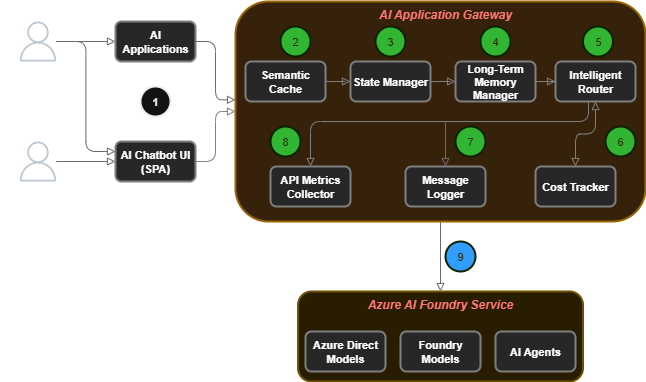
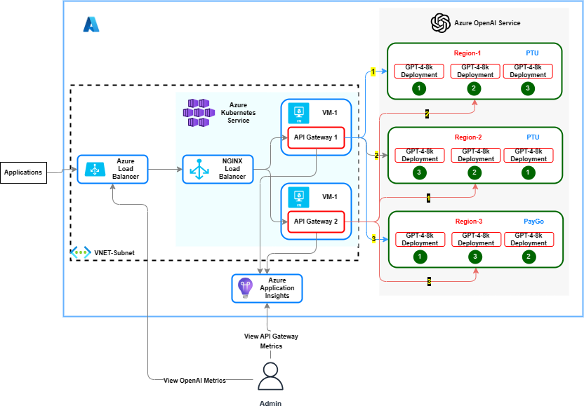
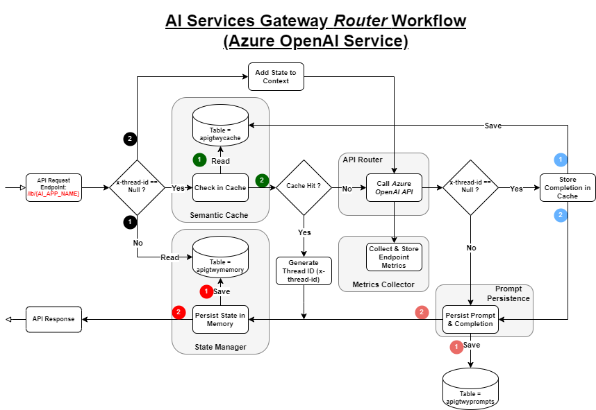
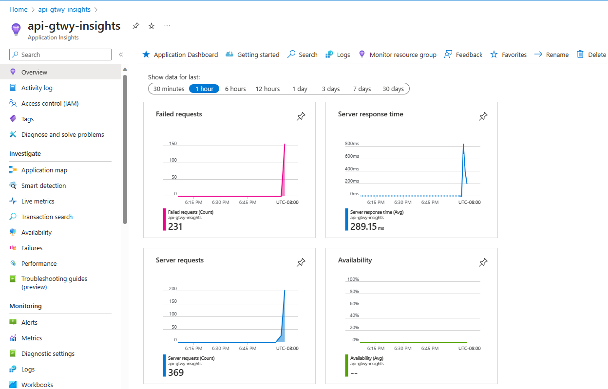
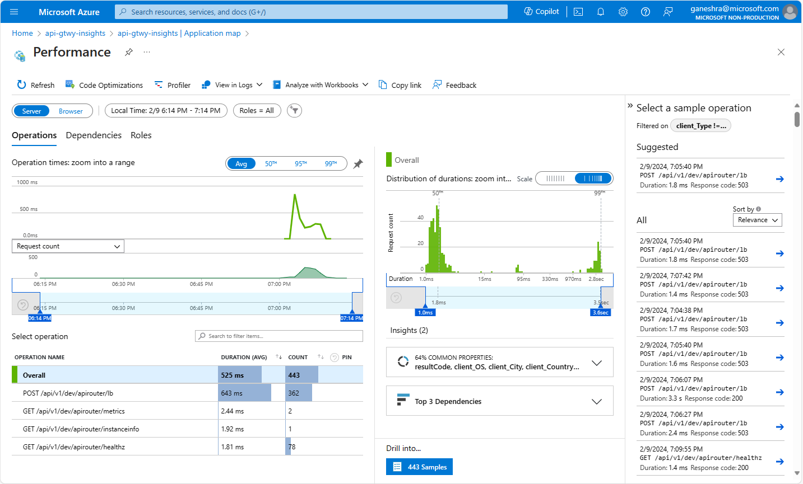
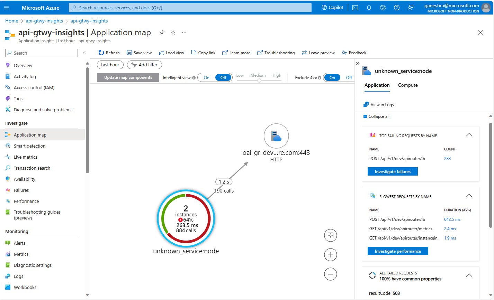
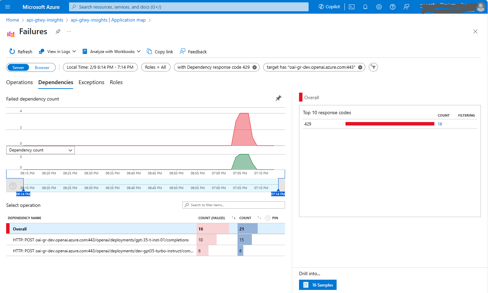
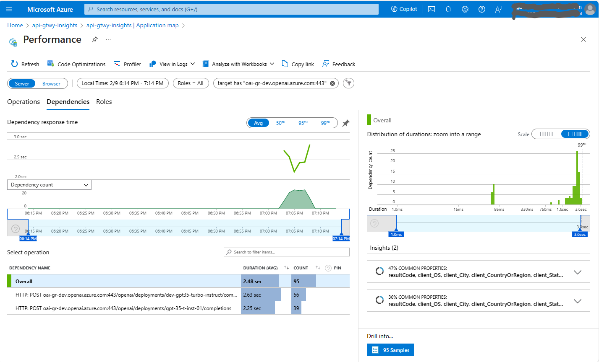

# An Azure *AI Services API Gateway*

If you're seeking the essential components for rapid implementation and deployment of **AI Information Assistant (a.k.a AI Chatbot)** solutions on Azure, the *AI Services API Gateway* is your go-to resource to expedite the development process and transition smoothly from pilot phase to full-scale production.

This *solution accelerator* is designed to deliver 80-90% of the core functionality essential for constructing and deploying AI Solutions and Chatbots. Most notably, it facilitates the use of a shared, minimal infrastructure component set, allowing for the smooth roll out of numerous AI Chatbots/Solutions on the same foundational infrastructure.

Recipe | Components | Functional Architecture (**)
------ | ---------- | ----------------------------
***AI Information Assistant*** | 1. Chatbot User Interface <br> 2. **Semantic Caching** <br> 3. **State Management** <br> 4. **API Traffic Routing** <br> 5. Azure OpenAI Service <br> 6. Azure AI Search (RAG/OYD) <br> 7. **Prompt Persistence** <br> 8. **API Metrics Collection** | 

** Components marked by green circles are out of box features.

### Supported Features At A Glance

Feature/Capability | Azure AI Service | Description
------------------ | ---------------- | -----------
**Unified Management Plane** | All | AI Services API Gateway provides a unified management plane for a) Sharing AI Service deployment endpoints among multiple AI Applications and b) Tracking AI Service API metrics such as throughput and latency for each AI Application.  The gateway is *AI Application Aware* meaning Azure AI Service endpoints can be configured separately for each *AI Application*.  This not only allows AI service deployments to be shared among multiple AI Applications but also facilitates metrics collection and request routing for each specific AI use case.
**Shared Infrastructure Model** | All | The Gateway simplifies and streamlines the deployment of multiple AI Solutions (Chatbots) by utilizing a shared infrastructure backbone. This approach allows for deploying the infrastructure once and subsequently scaling it to build and deploy numerous AI Chatbots.
**Intelligent Traffic Routing** | Azure OpenAI Service | **Circuit Breaker**: The Gateway can be configured with multiple Azure AI Service deployment URI's (a.k.a backend endpoints). When a backend endpoint is busy/throttled (returns http status code 429), the gateway will function as a *circuit-breaker* and automatically switch to the next configured endpoint in its backend priority list.  In addition, the gateway will also keep track of throttled endpoints and will not direct any traffic to them until they are available again.<br> **Rate Limiting**: Users can set up a *RPM Limit* for each OpenAI backend endpoint for any AI Application. When multiple AI Applications use the same endpoint, the gateway will enforce rate limiting and throttle excessive requests by returning http 429 status codes. This is especially useful for distributing model processing capacity (PTU deployment) evenly across different AI Applications.<br> **Traffic Splitting**: The Gateway provides the flexibility to split AI application traffic between multiple Azure AI Service deployment endpoints. In the case of Azure OpenAI Service, the AI application traffic can be split among multiple *Paygo* (tokens per minute) and *Provisioned Throughput Unit* (reserved capacity) model deployments.
**Streaming API responses** | Azure Open AI Service<br>Chat Completions API | The AI Services API Gateway fully supports the response *streaming* feature provided by Azure OpenAI Chat Completions API.  This function is seamlessly integrated with semantic caching, state management and traffic routing features.
**Semantic Caching** | Azure OpenAI Service | This feature is seamlessly integrated into AI Services API Gateway and can be used to cache OpenAI Service prompts and responses. Cache hits are evaluated based on semantic similarity and the configured algorithm. With semantic caching, runtime performance of LLM/AI applications can be improved by up to 40%. This solution leverages the vectorization and semantic search features supported by the widely popular *PostgreSQL* open source database.
**Conversational State Management** | Azure OpenAI Service (Chat Completion API only) | AI Chatbots must maintain context during end user sessions so they can reference previous user inputs, ensuring coherent and contextually relevant conversations.  This feature manages the conversational state and can effortlessly scale to support anywhere from 10 to hundreds of concurrent user sessions for multiple AI applications simultaneously. Additionally, it can function independently or in tandem with the *Semantic Caching* feature to enhance performance.
**Prompt Persistence** | Azure OpenAI Service | This optional feature can be used to persist OpenAI Service *Prompts* (inputs) and *Completions* (responses) in a relational database table. With this feature, customers can analyze prompts and accordingly adjust the similarity distance for the chosen vector search algorithm to maximize performance (increase throughput).  This feature can also be used to introspect the prompt and completion tokens associated with a particular API request (Request ID) and troubleshoot content filteration issues quickly. The gateway currently supports PostgreSQL database as the persistence provider.
**Dynamic Server Configuration** | All | The Gateway exposes a separate reconfig (/reconfig) endpoint to allow dynamic reconfiguration of backend endpoints. Backend endpoints can be reconfigured anytime even when the server is running thereby limiting AI application downtime.
**API Metrics Collection** | All | The Gateway continously collects backend API metrics and exposes them thru the metrics (/ metrics) endpoint.  Users can analyze the throughput and latency metrics and reconfigure the gateway's backend endpoint priority list to effectively route/shift the AI Application workload to the desired backend endpoints based on available and consumed capacity.
**Observability and Traceability** | All | The AI Services Gateway is instrumented with Azure Application Insights SDK. When this setting is enabled, detailed telemetry information on Azure OpenAI and dependent services is collected and sent to Azure Monitor.
**Client SDK's and AI Application (LLM) Frameworks** | Azure OpenAI Service | The AI Services Gateway server supports [Azure OpenAI](https://learn.microsoft.com/en-us/azure/ai-services/openai/how-to/switching-endpoints) Client SDK.  The gateway has also been tested to work with [Prompt Flow](https://github.com/microsoft/promptflow) and [Langchain](https://python.langchain.com/docs/integrations/llms/azure_openai/) LLM frameworks.
**Robust Runtime** | All | The AI Services Gateway is powered by tried and true Nodejs runtime.  Nodejs uses a single threaded event loop to asynchronously serve requests. It is built on Chrome V8 engine and extremely performant. The server can easily scale to handle 10's ... 1000's of concurrent requests simultaneously.

### Usage scenarios

The AI Services Gateway can be used in the following scenarios.
1. **Rapid deployment of AI Chatbots (or AI Information Assistants)**
   
   The AI Services Gateway solution provides core features such as *Semantic Caching*, *State Management*, *Traffic Routing* and *API Metrics Collection* right out of the box, which are crucial for implementing conversational AI applications such as AI Chatbots.

2. **Capturing Azure AI Service API usage metrics and estimating capacity for AI applications/workloads**

   For each AI Application, the AI Services Gateway collects Azure AI Service endpoint usage metrics.  The metrics are collected for each AI application based on pre-configured time intervals. In the case of Azure OpenAI Service, the collected metrics include *Tokens per minute* (TPM) and *Requests per minute* (RPM). These metrics can then be used to estimate *Provisioned Throughput Units* for each OpenAI workload.

3. **Intelligently route AI Application requests to Azure AI Service deployments/backends**

   For each AI Application, the AI Services Gateway functions as an intelligent router and distributes AI Service API traffic among multiple backend endpoints.  The gateway keeps track of unavailable/busy backend endpoints and automatically redirects traffic to available endpoints thereby distributing the API traffic load evenly and not overloading a given endpoint with too many requests.  

   The gateway currently supports proxying requests to the following Azure AI Services.
     - Azure OpenAI Service (Full API support)
     - Azure AI Search (Full API support)
     - Azure AI Language (Limited API support - Entity Linking, Language detection, Key phrase extraction, NER, PII, Sentiment analysis and opinion mining only)
     - Azure AI Translator (Limited API support - Text Translation only)
     - Azure AI Content Safety (Limited API support - Analyze Text and Analyze Image only)

### Feature/Capability Support Matrix

Feature/Capability | Configurable (Yes/No) | Azure OpenAI Service | Azure AI Search | Azure AI Language | Azure AI Translator | Azure AI Content Safety |
------------------ | --------------------- | -------------------- | --------------- | ----------------- | ------------------- | ----------------------- |
**Semantic Cache** | Yes | Yes <br> - Completions API <br> - Chat Completions API | No | No | No | No
**State Management** | Yes | Yes <br> - Chat Completions API | No | No | No | No
**API Router** | Yes | Yes | Yes | Yes | Yes | Yes
**Prompt Persistence** | Yes | Yes | No | No | No | No
**Metrics Collection** | No | Yes | Yes | Yes | Yes | Yes

### Reference Architecture



### AI Services API Router workflow for Azure OpenAI Service



### Bill Of Materials
The AI Services API Gateway is designed from the grounds up to be a cost-effective solution and has a minimal service footprint. For details on the Azure services needed to deploy this solution, please see the accompanying table below.

Environment | Azure Services | Notes
----------- | -------------- | -----
Development<br>Testing | - Azure Linux VM (Minimum 2vCPUs; 8GB Memory)<br>- Azure Database for PostgreSQL Server (2-4 vCores; 8-16GB Memory; 1920-2880 max. iops) | - The gateway can be run as a standalone server or can be containerized and run on the Linux VM.
Pre-Production<br>Production | - Azure Linux VM (4-8 vCPUs; 8-16GB Memory)<br>- Azure Database for PostgreSQL Server (4-8 vCores; 16-32GB Memory; 2880-4320 max iops)<br>- The gateway can be deployed on a Azure Kubernetes Service cluster or as an application on Azure Container Apps. | - The Linux VM can be used as a jumpbox for locally testing the gateway server, connecting to the kubernetes cluster, managing resources on Azure etc.

### Prerequisites
1.  An Azure **Resource Group** with **Owner** *Role* permission.  All Azure resources can be deloyed into this resource group.
2.  A **GitHub** Account to fork and clone this GitHub repository.
3.  Review [Overview of Azure Cloud Shell](https://docs.microsoft.com/en-us/azure/cloud-shell/overview).  **Azure Cloud Shell** is an interactive, browser accessible shell for managing Azure resources.  You will be using the Cloud Shell to create the Jumpbox VM (Linux VM).
4.  This project assumes readers are familiar with Linux, Git SCM, Linux Containers (*docker engine*) and Kubernetes.  If you are new to any of these technologies, go thru the resources below.
    - [Introduction to Git SCM](https://git-scm.com/docs/gittutorial)
    - [Git SCM Docs](https://git-scm.com/book/en/v2)
    - [Docker Overview](https://docs.docker.com/engine/docker-overview/)
    - [Kubernetes Overview](https://kubernetes.io/docs/tutorials/kubernetes-basics/)
5. (Optional) Download and install [Postman App](https://www.getpostman.com/apps), a REST API Client used for testing the AI Services Gateway.

Readers are advised to refer to the following on-line resources as needed.
- [Azure CLI](https://learn.microsoft.com/en-us/cli/azure/install-azure-cli?view=azure-cli-latest)
- [Creating an Azure Linux VM](https://learn.microsoft.com/en-us/azure/virtual-machines/linux/quick-create-cli)
- [Docker](https://docs.docker.com/)
- [Azure OpenAI Service](https://learn.microsoft.com/en-us/azure/ai-services/openai/)
- [Azure Database for PostgreSQL](https://learn.microsoft.com/en-us/azure/postgresql/)
- [Vector Search for PostgreSQL](https://github.com/pgvector/pgvector)
- [Azure Kubernetes Service](https://docs.microsoft.com/en-us/azure/aks/)
- [Azure Container Registry](https://docs.microsoft.com/en-us/azure/container-registry/)
- [Helm 3.x](https://docs.helm.sh/)
- [Azure Monitor OpenTelemetry](https://learn.microsoft.com/en-us/azure/azure-monitor/app/opentelemetry-enable?tabs=aspnetcore)
- [Azure Load Testing](https://learn.microsoft.com/en-us/azure/load-testing/)

## Disclaimer:
- The software (AI Services Gateway) is provided "as is" without warranty of any kind, express or implied, including but not limited to the warranties of merchantability, fitness for a particular purpose, and non infringement.  In no event shall the authors or copyright holders be liable for any claim, damages, or other liability, whether in an action of contract, tort, or otherwise, arising from, out of, or in connection with the software or the use or other dealings in the software. Use at your own risk.
- Currently, the Gateway does not secure the exposed API's by means of security tokens or API keys. Therefore, it's use should be limited to private virtual network deployments on Azure.  However, the gateway can be seamlessly integrated behind an application gateway or a firewall appliance (WAF) that offers advanced and robust security capabilities.

### Deployment Options
Deploy the AI Services API Gateway in a pre-production environment first and configure the desired features by setting the configuration parameters to appropriate values. The pre-production environment should be as close as possible to an actual production environment. Rigorously validate the features of routing, caching, state management, and persistence to confirm their optimal functionality as anticipated.

The Sections below describe the steps to configure and deploy the Gateway on Azure.  Although, there are multiple deployment options available on Azure, we will only describe the top two options recommended for production deployments.

**Recommended for Usage Scenarios 1 and 2**

- Containerize the Gateway and deploy it on a standalone *Virtual Machine*. Refer to Sections **A** and **B** below.

**Recommended for Usage Scenario 3**

1. Containerize the AI Services API Gateway and deploy it on a serverless container platform such as *Azure Container Apps*.

   We will not be describing the steps for this option here.  Readers can follow the deployment instructions described in Azure Container Apps documentation [here](https://learn.microsoft.com/en-us/azure/container-apps/tutorial-code-to-cloud?source=recommendations&tabs=bash%2Ccsharp&pivots=acr-remote).
2. Containerize the AI Services API Gateway and deploy it on a container platform such as *Azure Kubernetes Service*. Refer to Sections **B** and **E** below.

### Important Notes

> Please review the sections below before proceeding to Section **A**.

**Gateway Router/Load Balancer**

It is important to understand how the Gateway's load balancer distributes incoming API requests among configured Azure OpenAI backends (model deployment endpoints). Please read below.

- The Gateway will strictly follow the priority order when forwarding OpenAI API requests to backends. Lower numeric values equate to higher priority. This implies, the gateway will forward requests to backends with priority of '0', '1' and then go in that order.  Priorities assigned to OpenAI backends can be viewed by invoking the *instanceinfo* endpoint - `/instanceinfo`. 
- When a backend endpoint is busy or throttled (returns http status code = 429), the gateway will mark this endpoint as unavailable and **record** the 'retry-after' seconds value returned in the OpenAI API response header.  The gateway will not forward/proxy any more API requests to this backend until retry-after seconds has elapsed thereby ensuring the backend (OpenAI endpoint) doesn't get overloaded with too many requests.
- When all configured backend endpoints are busy or throttled (return http status code = 429), the gateway will return the **lowest** 'retry-after' seconds value returned by one of the *throttled* OpenAI backends. This value (in seconds) will be returned in the Gateway response header 'retry-after'.  Client applications should ideally wait the no. of seconds returned in the 'retry-after' response header before making a subsequent API call.
- For as long as all the backend endpoints are busy/throttled, the Gateway will perform global rate limiting and continue to return the **lowest** 'retry-after' seconds in it's response header ('retry-after').

**Semantic Caching and Retrieval**

Cached completions are retrieved based on semantic text similarity algorithm and distance threshold configured for each AI Application.  Caching and retrieval of Azure OpenAI Service responses (completions) can be enabled at 3 levels. 

1. Global Setting

   To enable caching of OpenAI Service responses/completions, the environment variable *API_GATEWAY_USE_CACHE* must be set to "true".  If this variable is empty or not set, caching and retrieval of OpenAI Service completions (responses) will be disabled for all configured AI Applications.
2. AI Application

   To enable caching at AI Application level, the configuration attribute *cacheSettings.useCache* must be set to "true".  If this variable is empty or not set (or set to "false"), caching and retrieval of OpenAI Service completions (responses) will be disabled for the AI Application (only).
3. API Gateway (HTTP) Request

   Caching and retrieval of completions can be disabled for each individual API Gateway request by passing in a query parameter *use_cache* and setting its value to *false* (eg., `?use_cache=false`).  Setting this parameter value to "true" has no effect.

Prior to turning on *Semantic Caching* feature for an AI Application (in Production), please review the following notes.

- The semantic caching feature utilizes an Azure OpenAI *embedding* model to vectorize prompts.  Any of the three embedding models offered by Azure OpenAI Service can be used to vectorize/embedd prompt data.  The embedding models have a request token size limit of 8K and output dimension of 1536 tokens. This implies, any request payload containing more than 8K tokens (prompt) will likely be truncated and result in faulty search results.
- By default, *pgvector* extension performs exact nearest neighbor search which provides excellent recall. However, search performance is likely to take a hit (degrade) as the number of records in the table go above 1K. To trade some recall for query performance, its recommended to add an index and use approximate nearest neighbor search.  *pgvector* extension supports two index types - *HNSW* and *IVFFlat*.  Between the two, HNSW has better query performance. Refer to the snippet below to add an HNSW index to the *apigtwycache* table.  Use `psql` to add the index.
  ```bash
  # Create HNSW index for cosine similarity distance function.
  #
  => CREATE INDEX ON apigtwycache USING hnsw (embedding vector_cosine_ops) WITH (m = 16, ef_construction = 64);
  #
  # To use L2 distance, set the distance function to 'vector_l2_ops'. Similarly, for IP distance function use 'vector_ip_ops'.
  ```
- During functional tests, setting the cosine similarity score threshold to a higher value *> 0.95* was found to deliver more accurate search results. 
- The *Inner Product* distance function has not been thoroughly tested with sample data.  Prior to using this function, it is advised to run functional tests and verify results.

**Invalidating Cached Entries**

- When semantic caching and retrieval is enabled at the global level (*API_GATEWAY_USE_CACHE=true*), the Gateway periodically runs a cache entry invalidator process on a pre-configured schedule.  If no schedule is configured, the cache invalidator process is run on a default schedule every 45 minutes.  This default schedule can be overridden by setting the environment variable *API_GATEWAY_CACHE_INVAL_SCHEDULE* as described in Section **A** below.
- For each AI Application, cached entries can be invalidated (deleted) by setting the configuration attribute *cacheSettings.entryExpiry*. This attribute must be set to a value that conforms to PostgreSQL *Interval* data type. If this attribute value is empty or not set, cache entry invalidation will be skipped.  Refer to the documentation [here](https://www.postgresql.org/docs/current/datatype-datetime.html#DATATYPE-INTERVAL-INPUT) to configure the cache invalidation interval to an appropriate value.

**Conversational State Management**

When interacting with AI Chatbots and information assistants, maintaining conversational continuity and context is crucial for generating accurate relevant responses to user's questions. Memory management for user sessions can be configured as follows.

1. Configure global setting

   To enable memory management at the API Gateway level, first set the environment variable *API_GATEWAY_STATE_MGMT* to "true".  If this env variable is empty or not set, memory (state) management will be disabled for all AI Applications.
2. Configure AI Application setting

   To enable memory management for an AI Application, the attribute *memorySettings.useMemory* must be set to "true" in the router configuration file.  If this attribute is empty or set to "false", memory management for user sessions will be disabled.

Prior to turning on *Conversational State Management* feature for an AI Application (in Production), please review the following notes.

- Conversational state management feature is only supported for Azure OpenAI Chat Completion API.
- When memory management is enabled for an AI application, the AI Services Gateway will return a custom http header `x-thread-id` in the API response.  This custom header will contain a unique value (GUID) representing a Thread ID.  To initiate a new user session and have the AI Services Gateway manage the conversational context, client applications must send this value in the http request header `x-thread-id`, in subsequent API calls.  The Thread ID represents an end user's session with an AI Chatbot/Assistant application.  A client application can end a user session at any time by not sending this custom http header in the API request.
- Use the *memorySettings.msgCount* attribute to specify the number of end user interactions (messages) to persist for each user session. Once the number of saved user interactions reaches this max. value (specified by this attribute), the memory manager component will discard the oldest message and only keep the most recent messages.  For each user session, the first user interaction (message) will always be retained by the memory manager.
- Use the *memorySettings.entryExpiry* attribute to specify the expiry time for user sessions.  After a user's session expires, API requests containing the expired Thread ID in the http header will receive an exception stating the session has expired.
- To quickly test the user session state management feature, you can use the standalone nodejs application `./samples/chat-client/simple-chat-app.js`.

**Invalidating Memory Entries**

- When conversational state management feature is enabled at the global level (*API_GATEWAY_STATE_MGMT=true*), the AI Services Gateway periodically runs a memory invalidator process on a pre-configured Cron schedule.  If no schedule is configured, the memory invalidator process is run on a default schedule every 10 minutes.  This default schedule can be overridden by setting the environment variable *API_GATEWAY_MEMORY_INVAL_SCHEDULE* as described in Section **A** below.
- For each AI Application, memory entries can be invalidated (deleted) by setting the configuration attribute *memorySettings.entryExpiry*. This attribute must be set to a value that conforms to PostgreSQL *Interval* data type. If this attribute value is empty or not set, memory entry invalidation will be skipped.  Refer to the documentation [here](https://www.postgresql.org/docs/current/datatype-datetime.html#DATATYPE-INTERVAL-INPUT) to configure memory entry invalidation interval to an appropriate value.

**Persisting Prompts**

- When global environment variable *API_GATEWAY_PERSIST_PROMPTS* is set to *true*, prompts and completions along with other API request related metadata will be persisted in database table *apigtwyprompts*.
- API Request *prompts* will not be persisted under the following conditions a) All backend endpoints for a given AI Application are busy/throttled.  In this case, the Gateway will return HTTP status code 429. b) API Gateway encounters an internal error while handling a request.  In this case, the Gateway will return HTTP status code 500.
- The Gateway returns a unique (GUID) id *x-request-id* in the HTTP response header for every request.  This header value along with the *user* value sent in the API request (body) can be used to query table *apigtwyprompts* and troubleshoot issues.  For instance, these values could be used to query a request that failed due to application of a content filter (HTTP status = 400).

The remainder of this readme describes how to configure/enable specific features and deploy the AI Services API Gateway on Azure.

### A. Configure and run the AI Services API Gateway on a standalone *Virtual Machine*

Before we can get started, you will need a Linux Virtual Machine to run the AI Services Gateway. If you haven't already, provision a Virtual Machine with a Linux flavor of your choice on Azure.

1. Clone or fork this GitHub repository into a directory on the VM.

   SSH login to the Virtual Machine using a terminal window. If you intend to customize the Gateway, it's best to fork this repository into your GitHub account and then clone the repository to the VM.

2. Install Node.js.

   Refer to the installation instructions on [nodejs.org](https://nodejs.org/en/download/package-manager) for your specific Linux distribution.

3. Install PostgreSQL database server.

   > **NOTE**:
   > If you do not intend to use *Semantic Caching*, *Conversational State Management* or *Prompt Persistence* features, you can safely skip this step and go to Step 4.

   Refer to the installation instructions [here](https://learn.microsoft.com/en-us/azure/postgresql/flexible-server/quickstart-create-server-portal) to install *Azure Database for PostgreSQL*.  Create a new database and give it a suitable name.  Note down the database name, server user name and password.  Save it in a secure location as we will need this info. in a subsequent step (below).

   You can connect to the database using any one of the following options - 1) [Azure CLI](https://learn.microsoft.com/en-us/azure/postgresql/flexible-server/quickstart-create-server-cli) 2) [psql or Azure Cloud shell](https://learn.microsoft.com/en-us/azure/postgresql/flexible-server/quickstart-create-server-portal).

   Next, go to the root directory of this project repository.  Update values for the environment variables shown in the table below.  Export these environment variables.

   Environment Variable | Value
   -------------------- | -----
   VECTOR_DB_HOST | Name of Azure Database for PostgreSQL server.  You will find this info. in the *Overview* blade/tab of the PostgreSQL Server resource in Azure Portal (value of the field **Server name**).
   VECTOR_DB_PORT | 5432 (This is the default PostgreSQL Server listen port)
   VECTOR_DB_USER | Name of the database user (Saved in step above)
   VECTOR_DB_UPWD | Password of the database user (Saved in step above)
   VECTOR_DB_NAME | Name of the database (Saved in step above)

   Create the database tables using the script `./db-scripts/pg-test.js`. See command snippet below.

   ```bash
   # Make sure you are in the project's root directory.
   #
   $ node ./db-scripts/pg-test.js
   #
   ```

   Connect to the database (using *psql*) and verify the database tables were created successfully. The following two tables should have been created.

   Table Name | Description
   ---------- | -----------
   apigtwycache | This table stores vectorized prompts and completions
   apigtwyprompts | This table stores prompts and completions
   apigtwymemory | This table stores state for user sessions (threads)

4. Update the **AI Services Gateway Configuration file**.

   Edit the `./api-router-config.json` file.

   For each AI Application, 

   - Specify a unique *appId* and an optional *description*.
   - Specify the type *appType* of the backend Azure AI Service. This type must be one of the values listed in the table below.
     
     Application Type | Description
     ---------------- | -----------
     azure_language | This value denotes Azure AI Language service
     azure_translator | This value denotes Azure AI Translator service
     azure_content_safety | This value denotes Azure AI Content Safety service
     azure_search | This value denotes Azure AI Search service
     azure_oai | This value denotes Azure OpenAI service

   - Add/Update the Azure AI Service endpoints/URI's and corresponding API key values in this file.
   - (Optional) To enable caching and retrieval of OpenAI Service completions (Semantic Caching feature), specify values for attributes contained within **cacheSettings** attribute.  Refer to the table below and set appropriate values.

     Attribute Name | Description
     -------------- | -----------
     useCache | AI Services Gateway will cache OpenAI Service completions (output) based on this value.  If caching is desired, set it to *true*.  Default is *false*.
     searchType | AI Services Gateway will search and retrieve OpenAI Service completions based on a semantic text similarity algorithm.<br>This attribute is used to specify the similarity distance function/algorithm for vector search.  Supported values are a) CS (= *Cosine Similarity*).  This is the default. b) LS (= *Level2 or Euclidean distance*) c) IP (= *Inner Product*).
     searchDistance | This attribute is used to specify the search similarity threshold.  For instance, if the search type = CS, this value should be set to a value between 0 and 1.
     searchContent.term | This value specifies the attribute in the request payload which should be vectorized and used for semantic search. For OpenAI completions API, this value should be *prompt*.  For chat completions API, this value should be set to *messages*.
     searchContent.includeRoles | This attribute value should only be set for OpenAI models that expose chat completions API. Value can be a comma separated list.  Permissible values are system, user and assistant.
     entryExpiry | This attribute is used to specify when cached entries (*completions*) should be invalidated.  Specify, any valid PostgreSQL *Interval* data type expression. Refer to the docs [here](https://www.postgresql.org/docs/current/datatype-datetime.html#DATATYPE-INTERVAL-INPUT).
   - (Optional) To enable conversational state management for user chat sessions, specify values for attributes contained within **memorySettings** attribute.  Refer to the table below and set appropriate values.

     Attribute Name | Description
     -------------- | -----------
     useMemory | When this value is set to *true*, AI Services Gateway will manage state for user sessions.  Default is *false*.
     msgCount | This attribute is used to specify the number of messages (*user - assistant* interactions) to store and send to the LLM.
     entryExpiry | This attribute is used to specify when the user sessions should be invalidated.  Specify, any valid PostgreSQL *Interval* data type expression. Refer to the docs [here](https://www.postgresql.org/docs/current/datatype-datetime.html#DATATYPE-INTERVAL-INPUT).

   After making the changes, save the `./api-router-config.json` file.

   **IMPORTANT**:

   **Azure OpenAI Service**:

   The model deployment endpoints/URI's should be listed in increasing order of priority (top down). Endpoints listed at the top of the list will be assigned higher priority than those listed at the lower levels.  For each API Application, the Gateway server will traverse and load the deployment URI's starting at the top in order of priority. While routing requests to OpenAI API backends, the gateway will strictly follow the priority order and route requests to endpoints with higher priority first before falling back to low priority endpoints. 

5. Set the gateway server environment variables.

   Set the environment variables to the correct values and export them before proceeding to the next step. Refer to the table below for descriptions of the environment variables.

   Env Variable Name | Description | Required | Default Value
   ----------------- | ----------- | -------- | ------------- 
   API_GATEWAY_KEY | AI Services Gateway private key (secret) required to reconfigure backend (Azure OpenAI) endpoints | Yes | Set this value to an alphanumeric string
   API_GATEWAY_CONFIG_FILE | The gateway configuration file location | Yes | Set the full or relative path to the *AI Services Gateway Configuration file* from the project root directory.
   API_GATEWAY_NAME | Gateway instance name | Yes | Set a value such as 'Instance-01' ...
   API_GATEWAY_PORT | Gateway server listen port | No | 8000
   API_GATEWAY_ENV | Gateway environment | Yes | Set a value such as 'dev', 'test', 'pre-prod', 'prod' ...
   API_GATEWAY_LOG_LEVEL | Gateway logging level | No | Default=info.  Possible values are debug, info, warn, error, fatal.
   API_GATEWAY_METRICS_CINTERVAL | Backend API metrics collection and aggregation interval (in minutes) | Yes | Set it to a numeric value eg., 60 (1 hour)
   API_GATEWAY_METRICS_CHISTORY | Backend API metrics collection history count | Yes | Set it to a numeric value (<= 600)  
   APPLICATIONINSIGHTS_CONNECTION_STRING | Azure Monitor connection string | No | Assign the value of the Azure Application Insights resource *connection string* (from Azure Portal)
   API_GATEWAY_USE_CACHE | Global setting for enabling semantic caching feature. This setting applies to all AI Applications.| No | false
   API_GATEWAY_CACHE_INVAL_SCHEDULE | Global setting for configuring the frequency of *Cache Entry Invalidator* runs.  The schedule should be specified in *GNU Crontab* syntax. Refer to the docs [here](https://www.npmjs.com/package/node-cron). | No | "*/45 * * * *"
   API_GATEWAY_STATE_MGMT | Global setting for enabling conversational state management feature.  This setting applies to all AI Applications. | No | false
   API_GATEWAY_MEMORY_INVAL_SCHEDULE | Global setting for configuring the frequency of *Memory Invalidator* runs.  The schedule should be specified in *GNU Crontab* syntax. Refer to the docs [here](https://www.npmjs.com/package/node-cron). | No | "*/10 * * * *"
   API_GATEWAY_PERSIST_PROMPTS | Global setting for persisting prompts and completions in a database table (PostgreSQL) | No | false
   API_GATEWAY_VECTOR_AIAPP | Name of the AI application that exposes endpoints for data *embedding* model. This value is required if semantic caching feature is enabled | No | None
   API_GATEWAY_SRCH_ENGINE | The vector search engine used by semantic caching feature | No | Postgresql/pgvector

   > **NOTE**:
   > You can update and run the shell script `./set-api-gtwy-env.sh` to set and export the environment variables.

6. Run the AI Services Gateway.

   Switch to the project root directory. Then issue the command shown in the snippet below.

   ```bash
   # Use the node package manager (npm) to install the server dependencies
   $ npm install
   #
   # Start the AI Services Gateway Server
   $ npm start
   #
   ```

   You will see the API Gateway server start up message in the terminal window as shown in the snippet below.

   ```bash
   > openai-api-router@1.7.6 start
   > node ./src/server.js

   17-May-2024 04:30:48 [info] [server.js] Starting initialization of Azure AI Services API Gateway ...
   17-May-2024 04:30:48 [info] [server.js] Azure Application Insights 'Connection string' not found. No telemetry data will be sent to App Insights.
   Server(): Azure AI Services API Gateway server started successfully.
   Gateway uri: http://localhost:8000/api/v1/dev
   17-May-2024 04:30:48 [info] [server.js] AI Application backend (Azure AI Service) endpoints:
   Application ID: language-app; Type: azure_language
     Priority: 0   Uri: https://gr-dev-lang.cognitiveservices.azure.com/language/:analyze-text?api-version=2022-05-01
   Application ID: translate-app; Type: azure_translator
     Priority: 0   Uri: https://api.cognitive.microsofttranslator.com/
   Application ID: content-safety-app; Type: azure_content_safety
     Priority: 0   Uri: https://gr-dev-cont-safety.cognitiveservices.azure.com/contentsafety/text:analyze?api-version=2023-10-01
   Application ID: search-app-ak-stip-v2; Type: azure_search
     Priority: 0   Uri: https://gr-dev-rag-ais.search.windows.net/indexes/ak-stip-v2/docs/search?api-version=2023-11-01
   Application ID: search-app-ak-stip-aisrch-iv; Type: azure_search
     Priority: 0   Uri: https://gr-dev-rag-ais.search.windows.net/indexes/ak-stip-aisrch-iv/docs/search?api-version=2023-10-01-preview
   Application ID: vectorizedata; Type: azure_oai; useCache=false; useMemory=false
     Priority: 0   Uri: https://oai-gr-dev.openai.azure.com/openai/deployments/dev-embedd-ada-002/embeddings?api-version=2023-05-15
   Application ID: ai-assistant-gpt-4t-0125; Type: azure_oai; useCache=true; useMemory=true
     Priority: 0   Uri: https://oai-gr-dev.openai.azure.com/openai/deployments/gpt-4-0125/chat/completions?api-version=2024-02-01
   Application ID: aichatbotapp; Type: azure_oai; useCache=true; useMemory=true
     Priority: 0   Uri: https://oai-gr-dev.openai.azure.com/openai/deployments/dev-gpt35-turbo-16k/chat/completions?api-version=2024-02-01
   Application ID: aidocusearchapp; Type: azure_oai; useCache=true; useMemory=false
     Priority: 0   Uri: https://oai-gr-dev.openai.azure.com/openai/deployments/dev-gpt35-turbo-instruct/completions?api-version=2023-05-15
     Priority: 1   Uri: https://oai-gr-dev.openai.azure.com/openai/deployments/gpt-35-t-inst-01/completions?api-version=2023-05-15
   17-May-2024 04:30:48 [info] [server.js] Successfully loaded backend API endpoints for AI applications
   17-May-2024 04:30:48 [info] [server.js] Cache entry invalidate run schedule (Cron) - */5 * * * *
   17-May-2024 04:30:48 [info] [server.js] Memory (State) invalidate run schedule (Cron) - */2 * * * *
   17-May-2024 04:30:48 [info] [cp-pg.js] checkDbConnection(): Postgres DB connectivity OK!
   17-May-2024 04:30:48 [info] [server.js] Completions will be cached
   17-May-2024 04:30:48 [info] [server.js] Prompts will be persisted
   17-May-2024 04:30:48 [info] [server.js] Conversational state will be managed
   ```

   Leave the terminal window open.

7. Retrieve the AI Services API Gateway Instance info (/instanceinfo)

   Use a web browser to access the AI Services API Gateway *info* endpoint - `/instanceinfo`. Specify correct values for the gateway listen port and environment. See below.

   http://localhost:{API_GATEWAY_PORT}/api/v1/{API_GATEWAY_ENV}/apirouter/instanceinfo

   If you get a json response similar to the one shown in the snippet below then the Gateway server is ready to accept Azure OpenAI service requests.

   ```json
   {
     "serverName": "Gateway-Instance-01",
     "serverVersion": "1.7.6",
     "serverConfig": {
        "host": "localhost",
        "listenPort": 8000,
        "environment": "dev",
        "persistPrompts": "true",
        "collectInterval": 1,
        "collectHistoryCount": 2,
        "configFile": "./api-router-config-test.json"
     },
     "cacheSettings": {
        "cacheEnabled": true,
        "embeddAiApp": "vectorizedata",
        "searchEngine": "Postgresql/pgvector",
        "cacheInvalidationSchedule": "*/5 * * * *"
     },
     "memorySettings": {
        "memoryEnabled": "true",
        "memoryInvalidationSchedule": "*/10 * * * *"
     },
     "aiApplications": [
        {
            "applicationId": "language-app",
            "description": "Azure AI Language Service test application",
            "type": "azure_language",
            "cacheSettings": {
                "useCache": false
            },
            "endpoints": {
                "0": "https://gr-dev-lang.cognitiveservices.azure.com/language/:analyze-text?api-version=2022-05-01"
            }
        },
        {
            "applicationId": "translate-app",
            "description": "Azure AI Translator Service test application",
            "type": "azure_translator",
            "cacheSettings": {
                "useCache": false
            },
            "endpoints": {
                "0": "https://api.cognitive.microsofttranslator.com/"
            }
        },
        {
            "applicationId": "vectorizedata",
            "description": "Application that uses OAI model to generate data embeddings/vectors",
            "type": "azure_oai",
            "cacheSettings": {
                "useCache": false
            },
            "memorySettings": {
                "useMemory": false
            },
            "endpoints": {
                "0": "https://oai-gr-dev.openai.azure.com/openai/deployments/dev-embedd-ada-002/embeddings?api-version=2023-05-15"
            }
        },
        {
            "applicationId": "ai-assistant-gpt-4t-0125",
            "description": "An AI Assistant / Chatbot application",
            "type": "azure_oai",
            "cacheSettings": {
                "useCache": true,
                "searchType": "CS",
                "searchDistance": 0.95,
                "searchContent": {
                    "term": "messages",
                    "includeRoles": "system,user,assistant"
                },
                "entryExpiry": "2 minutes"
            },
            "memorySettings": {
                "useMemory": true,
                "msgCount": 5,
                "entryExpiry": "2 minutes"
            },
            "endpoints": {
                "0": "https://oai-gr-dev.openai.azure.com/openai/deployments/gpt-4-0125/chat/completions?api-version=2024-02-01"
            }
        },
        {
            "applicationId": "aichatbotapp",
            "description": "A test AI Assistant / Chatbot application",
            "type": "azure_oai",
            "cacheSettings": {
                "useCache": true,
                "searchType": "CS",
                "searchDistance": 0.98,
                "searchContent": {
                    "term": "messages",
                    "includeRoles": "user"
                },
                "entryExpiry": "2 minutes"
            },
            "memorySettings": {
                "useMemory": true,
                "msgCount": 1,
                "entryExpiry": "2 minutes"
            },
            "endpoints": {
                "0": "https://oai-gr-dev.openai.azure.com/openai/deployments/dev-gpt35-turbo-16k/chat/completions?api-version=2024-02-01"
            }
        },
        {
            "applicationId": "aidocusearchapp",
            "description": "A test AI text generation application",
            "type": "azure_oai",
            "cacheSettings": {
                "useCache": true,
                "searchType": "CS",
                "searchDistance": 0.95,
                "searchContent": {
                    "term": "prompt"
                },
                "entryExpiry": "1 day"
            },
            "endpoints": {
                "0": "https://oai-gr-dev.openai.azure.com/openai/deployments/dev-gpt35-turbo-instruct/completions?api-version=2023-05-15",
                "1": "https://oai-gr-dev.openai.azure.com/openai/deployments/gpt-35-t-inst-01/completions?api-version=2023-05-15"
            }
        }
     ],
     "containerInfo": {},
     "apiGatewayUri": "/api/v1/dev/apirouter",
     "endpointUri": "/api/v1/dev/apirouter/instanceinfo",
     "serverStartDate": "5/17/2024, 4:30:48 AM",
     "status": "OK"
   }
   ```

8. Access the AI Services Gateway load balancer/router (/lb) endpoint

   Use **Curl** or **Postman** to send a few completion / chat completion API requests to the gateway server *load balancer* endpoint - `/lb`.  Remember to substitute the correct value for *AI_APPLICATION_ID* in the URL below.  The AI Application ID value should be one of the unique *appId* values specified in Gateway configuration file `./api-router-config.json`.

   http://localhost:{API_GATEWAY_PORT}/api/v1/{API_GATEWAY_ENV}/apirouter/lb/{AI_APPLICATION_ID}

   Review the OpenAI API response and log lines output by the gateway server in the respective terminal windows.

**IMPORTANT**:

- For invoking the model deployment endpoints exposed by AI Services Gateway from a ***LangChain*** LLM application (/framework), two environment variables must be set. See below.
  - _AZURE_OPENAI_BASE_PATH_: Set the value of this variable to the Gateway load balancer / router endpoint URI (/lb). This URI can also be specified as part of the OpenAI configuration object (in code).
  - _AZURE_OPENAI_API_DEPLOYMENT_NAME_: Set the value of this variable to the *AI Application* name/ID configured in the Gateway. This value can also be specified as part of the OpenAI configuration object (in code).

  Refer to the sample script provided in `./samples/lang-chain` directory for details.

- For generating OpenAI API traffic and/or simulating API workload, one of the following methods can be used.  See below.
  - Update and use the provided shell script `./tests/test-oai-api-gateway.sh` with sample data.  For an AI Application, observe how the Gateway intelligently distributes the OpenAI API requests among multiple configured backend endpoints.
  - For simulating continuous API traffic and performing comprehensive load testing (capacity planning), use *Azure Load Testing* PaaS service.

### B. Containerize the AI Services API Gateway and deploy it on the Virtual Machine

Before getting started with this section, make sure you have installed a container runtime such as `docker` or `containerd` on the Linux VM. For installing docker engine, refer to the docs [here](https://docs.docker.com/engine/install/).

1. Build the AI Services Gateway container image.

   Review the container image build script `./Dockerfile`.  Make any required updates to the environment variables.  The environment variables can also be passed to the docker engine at build time.  To do this, you can modify the provided container build script `./scripts/build-container.sh`.  After making the updates to this build shell script, run the script to build the Gateway container image.  See command snippet below.

   ```bash
   # Run the container image build
   $ . ./scripts/build-container.sh
   #
   # List the container images.  This command should list the images on the system.
   $ docker images
   #
   ```

2. Run the containerized AI Services Gateway server instance.

   Run the Gateway container instance using the provided `./scripts/start-container.sh` shell script.  Refer to the command snippet below.

   ```bash
   # Run the AI Services Gateway container instance
   $ . ./scripts/start-container.sh
   #
   # Leave this terminal window open
   ```

3. Access the Gateway server load balancer/router (/lb) endpoint

   Use **Curl** or **Postman** to send a few completion / chat completion API requests to the gateway server *load balancer* endpoint - `/lb`.  See URL below.

   http://localhost:{API_GATEWAY_PORT}/api/v1/{API_GATEWAY_ENV}/apirouter/lb/{AI_APPLICATION_ID}

   Review the OpenAI API response and log lines output by the gateway server in the respective terminal windows.

   > **TIP**:
   > You can update and use the shell script `./tests/test-oai-api-gateway.sh` with sample data to test how the Gateway intelligently distributes the OpenAI API requests among multiple configured backend endpoints.

### C. Analyze Azure OpenAI endpoint(s) traffic metrics

1. Access the AI Services Gateway metrics endpoint and analyze OpenAI API metrics.

   Use a web browser and access the Gateway *metrics* endpoint to retrieve the backend OpenAI API metrics information.  The metrics endpoint URL - `/metrics`, is listed below.

   http://localhost:{API_GATEWAY_PORT}/api/v1/{API_GATEWAY_ENV}/apirouter/metrics
    
   A sample Json output snippet is pasted below.

   ```json
   {
     "listenPort": "8000",
     "instanceName": "Gateway-Instance-01",
     "collectionIntervalMins": 1,
     "historyCount": 5,
     "applicationMetrics": [
	{
            "applicationId": "language-app",
            "endpointMetrics": [
                {
                    "endpoint": "https://gr-dev-lang.cognitiveservices.azure.com/language/:analyze-text?api-version=2022-05-01",
                    "priority": 0,
                    "metrics": {
                        "apiCalls": 6,
                        "languageDetectionApiCalls": 1,
                        "namedEntityRecognitionApiCalls": 1,
                        "keyPhraseExtractionApiCalls": 1,
                        "entityLinkingApiCalls": 1,
                        "sentimentAnalysisApiCalls": 1,
                        "piiEntityRecognitionApiCalls": 1,
                        "failedApiCalls": 0,
                        "totalApiCalls": 6,
                        "history": {}
                    }
                }
            ]
        },
	{
            "applicationId": "vectorizedata",
            "endpointMetrics": [
                {
                    "endpoint": "https://oai-gr-dev.openai.azure.com/openai/deployments/dev-embedd-ada-002/embeddings?api-version=2023-05-15",
                    "priority": 0,
                    "metrics": {
                        "apiCalls": 319,
                        "failedApiCalls": 0,
                        "throttledApiCalls": 0,
                        "filteredApiCalls": 0,
                        "totalApiCalls": 319,
                        "kInferenceTokens": 3.135,
                        "history": {
                            "1": {
                                "collectionTime": "5/5/2024, 7:18:59 PM",
                                "collectedMetrics": {
                                    "apiCalls": 239,
                                    "failedApiCalls": 0,
                                    "throttledApiCalls": 0,
                                    "filteredApiCalls": 0,
                                    "totalApiCalls": 239,
                                    "throughput": {
                                        "kTokensPerWindow": 2.318,
                                        "requestsPerWindow": 13.908000000000001,
                                        "avgTokensPerCall": 9.698744769874477,
                                        "avgRequestsPerCall": 0.05819246861924686,
                                        "tokensPerMinute": 2318,
                                        "requestsPerMinute": 239
                                    },
                                    "latency": {
                                        "avgResponseTimeMsec": 108.7489539748954
                                    }
                                }
                            },
                            "2": {
                                "collectionTime": "5/5/2024, 7:19:59 PM",
                                "collectedMetrics": {
                                    "apiCalls": 268,
                                    "failedApiCalls": 0,
                                    "throttledApiCalls": 0,
                                    "filteredApiCalls": 0,
                                    "totalApiCalls": 268,
                                    "throughput": {
                                        "kTokensPerWindow": 2.647,
                                        "requestsPerWindow": 15.881999999999998,
                                        "avgTokensPerCall": 9.876865671641792,
                                        "avgRequestsPerCall": 0.05926119402985075,
                                        "tokensPerMinute": 2647,
                                        "requestsPerMinute": 268
                                    },
                                    "latency": {
                                        "avgResponseTimeMsec": 101.9776119402985
                                    }
                                }
                            }
                        }
                    }
                }
            ]
        },
	{
            "applicationId": "aichatbotapp",
            "cacheMetrics": {
                "hitCount": 7,
                "avgScore": 0.9999999148505135
            },
            "endpointMetrics": [
                {
                    "endpoint": "https://oai-gr-dev.openai.azure.com/openai/deployments/dev-gpt35-turbo-16k/chat/completions?api-version=2024-02-01",
                    "priority": 0,
                    "metrics": {
                        "apiCalls": 2,
                        "failedApiCalls": 0,
                        "throttledApiCalls": 0,
                        "filteredApiCalls": 0,
                        "totalApiCalls": 2,
                        "kInferenceTokens": 723,
                        "history": {
                            "0": {
                                "collectionTime": "5/5/2024, 7:35:50 PM",
                                "collectedMetrics": {
                                    "apiCalls": 0,
                                    "failedApiCalls": 0,
                                    "throttledApiCalls": 0,
                                    "filteredApiCalls": 0,
                                    "totalApiCalls": 0,
                                    "throughput": {
                                        "kTokensPerWindow": 0,
                                        "requestsPerWindow": 0,
                                        "avgTokensPerCall": 0,
                                        "avgRequestsPerCall": 0,
                                        "tokensPerMinute": 0,
                                        "requestsPerMinute": 0
                                    },
                                    "latency": {
                                        "avgResponseTimeMsec": 0
                                    }
                                }
                            },
                            "1": {
                                "collectionTime": "5/5/2024, 7:42:25 PM",
                                "collectedMetrics": {
                                    "apiCalls": 9,
                                    "failedApiCalls": 0,
                                    "throttledApiCalls": 0,
                                    "filteredApiCalls": 0,
                                    "totalApiCalls": 9,
                                    "throughput": {
                                        "kTokensPerWindow": 4.367,
                                        "requestsPerWindow": 26.201999999999998,
                                        "avgTokensPerCall": 485.22222222222223,
                                        "avgRequestsPerCall": 2.9113333333333333,
                                        "tokensPerMinute": 4367,
                                        "requestsPerMinute": 9
                                    },
                                    "latency": {
                                        "avgResponseTimeMsec": 5201.666666666667
                                    }
                                }
                            }
                        }
                    }
                }
            ]
        },
	{
            "applicationId": "aidocusearchapp",
            "cacheMetrics": {
                "hitCount": 1750,
                "avgScore": 0.9999999147483241
            },
            "endpointMetrics": [
                {
                    "endpoint": "https://oai-gr-dev.openai.azure.com/openai/deployments/dev-gpt35-turbo-instruct/completions?api-version=2023-05-15",
                    "priority": 0,
                    "metrics": {
                        "apiCalls": 0,
                        "failedApiCalls": 0,
                        "throttledApiCalls": 0,
                        "filteredApiCalls": 0,
                        "totalApiCalls": 0,
                        "kInferenceTokens": 0,
                        "history": {}
                    }
                },
                {
                    "endpoint": "https://oai-gr-dev.openai.azure.com/openai/deployments/gpt-35-t-inst-01/completions?api-version=2023-05-15",
                    "priority": 1,
                    "metrics": {
                        "apiCalls": 0,
                        "failedApiCalls": 0,
                        "throttledApiCalls": 0,
                        "filteredApiCalls": 0,
                        "totalApiCalls": 0,
                        "kInferenceTokens": 0,
                        "history": {}
                    }
                }
            ]
        }
     ],
     "successApiCalls": 17,
     "cachedApiCalls": 1757,
     "failedApiCalls": 0,
     "totalApiCalls": 1774,
     "endpointUri": "/api/v1/dev/apirouter/metrics",
     "currentDate": "5/5/2024, 7:45:55 PM",
     "status": "OK"
   }
   ```

   Azure AI Service endpoint metrics collected by the Gateway server across all AI Applications is described in the table below.

   Metric name | Description
   ----------- | -----------
   successApiCalls | Number of API calls successfully processed by the Gateway.
   cachedApiCalls | Number of API call responses served from the Gateway cache.
   failedApiCalls | Number of API calls which failed as a result of a backend exception (AI Service returned status != 200).
   totalApiCalls | Total number of API calls received by this Gateway Server instance.  Does not include API calls initiated by the Gateway.

   For each AI Application, the Gateway collects multiple metrics.  Description of **Azure OpenAI Service** metrics collected by the Gateway are provided in the tables below.

   **Cache hit metrics**

   Metric name | Description
   ----------- | -----------
   hitCount | Number of API calls where responses were served from the gateway cache
   avgScore | Average similarity search score for cached responses

   **AI Service (OpenAI) endpoint metrics**

   Metric name | Description
   ----------- | -----------
   apiCalls | Number of OpenAI API calls successfully handled by this backend endpoint in the current metrics collection interval
   failedApiCalls | Number of OpenAI API calls which failed in the current metrics collection interval
   throttledAPICalls | Number of OpenAI API calls that were throttled (Service status = 429)
   filteredAPICalls | Number of OpenAI API calls that were filtered due to harmful content or bad request (Service status = 400)
   totalApiCalls | Total number of OpenAI API calls received by this backend (OpenAI) endpoint in the current metrics collection interval
   kInferenceTokens | Total tokens (K) processed/handled by this backend (OpenAI) endpoint in the current metrics collection interval

   **AI Service (OpenAI) endpoint metrics history**

   Metric name | Description
   ----------- | -----------
   collectionTime | Start time of metrics collection interval/window
   apiCalls | Number of OpenAI API calls successfully handled by this backend/endpoint
   failedApiCalls | Number of OpenAI API calls which failed (Service status != 200)
   throttledAPICalls | Number of OpenAI API calls that were throttled (Service returned status = 429)
   filteredAPICalls | Number of OpenAI API calls that were filtered due to harmful content or bad request (Service status = 400)
   throughput.kTokensPerWindow | Total tokens (K) processed/handled by this OpenAI backend 
   throughput.requestsPerWindow | Total number of requests processed/handled by this OpenAI endpoint 
   throughput.avgTokensPerCall | Average tokens (K) processed by this OpenAI backend per API call
   throughput.avgRequestsPerCall | Average requests processed by this OpenAI backend per API call (PTU only)
   throughput.tokensPerMinute | Number of tokens processed by this endpoint per minute
   throughput.requestsPerMinute | Number of OpenAI API calls handled by this endpoint per minute
   latency.avgResponseTimeMsec | Average response time of OpenAI backend API call

2. Access AI Services Gateway and OpenAI API metrics using *Azure Application Insights*

   Login to Azure Portal and go to the **Overview** blade/tab of the Application Insights resource.  Here you can get a quick summary view of the Gateway server requests, availability, server response time and failed requests in the last 30 minutes, 1 hour .. 30 days. See screenshot below.

   

   Click on the **Performance** tab to view the average duration for each Gateway endpoint call, call counts, request and response details.  See screenshot below.

   

   Click on the **Application map** tab to view the Gateway and dependency info. (Azure OpenAI). Here you can drill down into API calls received by a) Gateway and b) Azure OpenAI deployment endpoint, and investigate failures and performance issues.
   
   

   

   

### D. Reload the AI Services API Gateway backend endpoints (Configuration)

The Gateway endpoint configuration can be updated even when the server is running. Follow the steps below.

1. Update the Gateway endpoint configuration file.

   Open the Gateway endpoint configuration json file (`api-router-config.json`) and update the OpenAI endpoints as needed.  Save this file.

2. Reload the Gateway endpoint configuration.

   Use **Curl** command in a terminal window or a web browser to access the gateway *reconfiguration* endpoint - `/reconfig`.  See URL below.
   The private key of the Gateway is required to reload the endpoint configuration.

   http://localhost:{API_GATEWAY_PORT}/api/v1/{API_GATEWAY_ENV}/apirouter/reconfig/{API_GATEWAY_KEY}

**IMPORTANT**:

- A side effect of reconfiguring the Gateway endpoints is that all current and historical metric values collected and cached by the server will be reset. Hence, if you want to retain metrics history, you should save the metrics (/metrics) endpoint output prior to reloading the updated OpenAI endpoints from the configuration file.
- It is advised to reconfigure the backend endpoints during a maintenance time window (down time) when there is minimal to no API traffic.  Reconfiguring the backend endpoints when the gateway is actively serving API requests may result in undefined behavior.

### E. Deploy the AI Services API Gateway on *Azure Kubernetes Service*

Before proceeding with this section, make sure you have installed the following services on Azure.
- An *Azure Container Registry* (ACR) instance
- An *Azure Kubernetes Cluster* (AKS) instance

The following command line tools should be installed on the Linux VM.
- Azure CLI (`az`)
- Kubernetes CLI (`kubectl`)
- Helm CLI (`helm`)

Additionally, the following resources should be deployed/configured.

- A Kubernetes ingress controller (**Ngnix**) should be deployed and running on the AKS / Kubernetes cluster.
- The AKS cluster should be attached to the ACR instance.  The cluster's managed identity should have *ACR Pull* permissions so cluster nodes can pull container images from the attached ACR.

1. Push the AI Services Gateway container image into ACR.

   Refer the script snippet below to push the Gateway container image into ACR.  Remember to substitute ACR name with the name of your container registry.

   ```bash
   # Login to the ACR instance. Substitute the correct name of your ACR instance.
   $ az acr login --name [acr-name].azurecr.io
   #
   # Tag the container image so we can push it to ACR repo.
   $ docker tag az-oai-api-gateway [acr-name].azurecr.io/az-oai-api-gateway:v1.020224
   # 
   # List container images on your VM
   $ docker images
   #
   # Push the AI Services Gateway container image to ACR repo.
   $ docker push [acr-name].azurecr.io/az-oai-api-gateway:v1.020224
   #
   ```

   Use Azure portal to verify the Gateway container image was stored in the respective repository (`az-oai-api-gateway`).

2. Deploy the Azure OpenAI API endpoints configuration.

   Create a *ConfigMap* Kubernetes resource containing the Gateway endpoint configurations.  See command snippet below.

   ```bash
   # First, create a namespace 'apigateway' where all Gateway resources will be deployed.
   $ kubectl create namespace apigateway
   #
   # List all namespaces.
   $ kubectl get ns
   #
   # Create a ConfigMap containing the Gateway endpoints. Substitute the correct location of the
   # Gateway configuration (json) file.
   #
   $ kubectl create configmap api-gateway-config-cm --from-file=[Path to 'api-router-config.json' file] -n apigateway
   #
   # List ConfigMaps.
   $ kubectl get cm -n apigateway
   #
   ```

3. Review and update the *Helm* deployment configuration file.

   Go thru the variables in `values.yaml` file and update them as needed. 

   Review/Update the following variable values.  See table below.

   Variable Name | Description | Default Value
   ----------------- | ----------- | ------------- 
   replicaCount | Number of Pod instances (gateway instances) | 1
   image.repository | ACR location of the AI Services Gateway container image. Specify the correct values for `acr-name` and `api-gateway-repo-name`. | [acr-name].azurecr.io/[api-gateway-repo-name]
   image.tag | Gateway container image tag. Specify correct value for the image tag. | v1.xxxxxx
   apigateway.name | The deployment name of Gateway server instance. | aoai-api-gateway-v1.5
   apigateway.instanceName | The name of Gateway server instance.  Can be set to any string. Use the model version as prefix or suffix to easily identify which models are served by specific gateway server instances. | aoai-api-gateway-gpt35
   apigateway.configFile | Path to Gateway configuration file | /home/node/app/files/api-router-config.json
   apigateway.secretKey | Gateway private key. This key is required for reconfiguring the gateway with updated endpoint info. | None.
   apigateway.env | Gateway environment (eg., dev, test, pre-prod, prod) | dev
   apigateway.metricsCInterval | Backend API metrics collection and aggregation interval (in minutes) | 60 minutes (1 hour)
   apigateway.metricsCHistory | Backend API metrics collection history count | 168 (Max. <= 600)  
   apigateway.appInsightsConnectionString | (Optional) To collect API request telemetry, set this value to the Azure Application Insights resource *connection string* | None.
   apigateway.useCache | Global setting to enable semantic caching | false (true/false)
   apigateway.cacheInvalSchedule | Used to specify run schedule for cache entry invalidator | "*/45 * * * *"
   apigateway.persistPrompts | Global setting to persist prompts in database table | false (true/false)
   apigateway.vectorAiApp | Used to specify name of AI application for embedding prompts. This value is required if semantic caching feature is enabled. | None
   apigateway.searchEngine | Used to specify vector search engine for semantic caching feature | Postgresql/pgvector
   database.host | PostgreSQL server/host name. Database connection parameter values are required if semantic caching or prompt persistence features are enabled | None
   database.port | PostgreSQL server listen port | 5432
   database.user | PostgreSQL database user name | None
   database.password | PostgreSQL database user password | None
   database.name | PostgreSQL database name | None

4. Assign required compute resources to AI Services Gateway pods.

   Review/Update the Pod compute resources as needed in the `values.yaml` file.

5. Deploy the AI Services Gateway on *Azure Kubernetes Service*.

   Refer to the command snippet below to deploy all Kubernetes resources for the Gateway.

   ```bash
   # Make sure you are in the project root directory!
   # Use helm chart to deploy the Gateway. Substitute the correct value for the image tag.
   #
   $ helm upgrade --install az-oai-api-gateway ./aoai-api-gtwy-chart --set image.tag=[image-tag-name] --namespace apigateway
   #
   ```

6. Verify deployment.

   First, confirm the Gateway Pod(s) is running. Refer to the command snippet below.

   ```bash
   # Make sure the AI Services Gateway pods are up and running. Output is shown below the command.
   #
   $ kubectl get pods -n apigateway
   NAME                                  READY   STATUS    RESTARTS   AGE
   aoai-api-gateway-v1-7f7bf5f75-grk6p   1/1     Running   0          11h
   ```

   Get the public IP of Nginx ingress controller (application routing system).  Refer to the command snippet below.

   ```bash
   # Get public IP (Azure LB IP) assigned to Nginx ingress controller service. Save (copy) the IP address listed under
   # column 'EXTERNAL-IP' in the command output. See below.
   #
   $ kubectl get svc -n app-routing-system
   NAME    TYPE           CLUSTER-IP     EXTERNAL-IP     PORT(S)                                      AGE
   nginx   LoadBalancer   10.0.114.112   xx.xx.xx.xx   80:30553/TCP,443:32318/TCP,10254:31744/TCP   2d
   ```

   Use a web browser to access the Gateway Server *instance information* endpoint (/instanceinfo). Substitute the public IP of the Nginx ingress controller which you copied in the previous step.  See below.

   http://{NGINX_PUBLIC_IP}/api/v1/{API_GATEWAY_ENV}/apirouter/instanceinfo

   The Json output is shown below.

   ```json
   {
     "serverName": "AOAI-API-Gateway-01",
     "serverVersion": "1.5.0",
     "serverConfig": {
        "host": "10.244.2.6",
        "listenPort": 8000,
        "environment": "dev",
        "persistPrompts": "true",
        "collectInterval": 60,
        "collectHistoryCount": 8,
        "configFile": "/home/node/app/files/api-router-config.json"
     },
     "cacheSettings": {
        "cacheEnabled": true,
        "embeddAiApp": "vectorizedata",
        "searchEngine": "Postgresql/pgvector",
        "cacheInvalidationSchedule": "*/45 * * * *"
     },
     "appConnections": [
        {
            "applicationId": "vectorizedata",
            "cacheSettings": {
                "useCache": false
            },
            "oaiEndpoints": {
                "0": "https://oai-gr-dev.openai.azure.com/openai/deployments/dev-embedd-ada-002/embeddings?api-version=2023-05-15"
            }
        },
        {
            "applicationId": "aichatbotapp",
            "cacheSettings": {
                "useCache": true,
                "searchType": "CS",
                "searchDistance": 0.95,
                "searchContent": {
                    "term": "messages",
                    "includeRoles": "system,user,assistant"
                },
                "entryExpiry": "7 days"
            },
            "oaiEndpoints": {
                "0": "https://oai-gr-dev.openai.azure.com/openai/deployments/dev-gpt35-turbo-16k/chat/completions?api-version=2023-05-15"
            }
        },
        {
            "applicationId": "aidocusearchapp",
            "cacheSettings": {
                "useCache": true,
                "searchType": "CS",
                "searchDistance": 0.95,
                "searchContent": {
                    "term": "prompt"
                },
                "entryExpiry": "1 hour"
            },
            "oaiEndpoints": {
                "0": "https://oai-gr-dev.openai.azure.com/openai/deployments/dev-gpt35-turbo-instruct/completions?api-version=2023-05-15",
                "1": "https://oai-gr-dev.openai.azure.com/openai/deployments/gpt-35-t-inst-01/completions?api-version=2023-05-15"
            }
        }
     ],
     "containerInfo": {
        "imageID": "oaiapigateway.azurecr.io/az-oai-api-gateway:v1.5.031224",
        "nodeName": "aks-nodepool1-35747021-vmss000001",
        "podName": "aoai-api-gateway-v1-7777f5d8bd-tt7kq",
        "podNamespace": "apigateway",
        "podServiceAccount": "default"
     },
     "nodejs": {
        "node": "20.11.0",
        "acorn": "8.11.2",
        "ada": "2.7.4",
        "ares": "1.20.1",
        "base64": "0.5.1",
        "brotli": "1.0.9",
        "cjs_module_lexer": "1.2.2",
        "cldr": "43.1",
        "icu": "73.2",
        "llhttp": "8.1.1",
        "modules": "115",
        "napi": "9",
        "nghttp2": "1.58.0",
        "nghttp3": "0.7.0",
        "ngtcp2": "0.8.1",
        "openssl": "3.0.12+quic",
        "simdutf": "4.0.4",
        "tz": "2023c",
        "undici": "5.27.2",
        "unicode": "15.0",
        "uv": "1.46.0",
        "uvwasi": "0.0.19",
        "v8": "11.3.244.8-node.17",
        "zlib": "1.2.13.1-motley-5daffc7"
     },
     "apiGatewayUri": "/api/v1/dev/apirouter",
     "endpointUri": "/api/v1/dev/apirouter/instanceinfo",
     "serverStartDate": "3/12/2024, 11:45:10 PM",
     "status": "OK"
   }
   ```

   Use **Curl** or **Postman** to send a few completion / chat completion API requests to the gateway server *load balancer* endpoint - `/lb`.  See URL below.

   http://{NGINX_PUBLIC_IP}/api/v1/{API_GATEWAY_ENV}/apirouter/lb/{AI_APPLICATION_ID}

   **Congratulations!**

   You have reached the end of this how-to for deploying and scaling an *AI Services API Gateway* on Azure. Please feel free to customize and use the artifacts posted in this repository to efficiently distribute AI Application traffic among multiple Azure OpenAI model deployments and elastically scale the Gateway solution.
