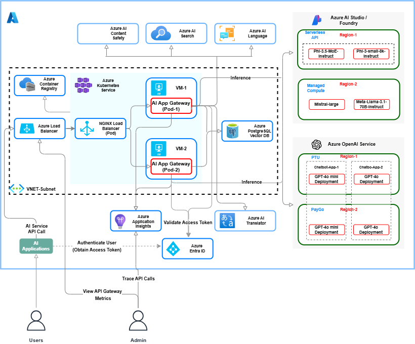

# An Azure OpenAI Service *API Gateway*
The API Gateway server can be used to distribute requests to Azure OpenAI Service deployment endpoints.  This repository describes the steps for deploying the API Gateway on Azure.

### Supported Features At A Glance

Feature/Capability | Description
------------------ | -----------
**Unified Management Plane** | API Gateway provides a single unified management plane for a) Configuring OpenAI Service endpoints for each individual AI Application and b) Serving OpenAI Service requests and tracking metrics for each AI Application.  The gateway is *AI Application Aware* and Azure OpenAI Service backend endpoints can be configured for each *AI Application* separately.  This not only allows model deployments to be shared among multiple AI Applications but also facilitates metrics collection and request routing for each individual AI application.
**Intelligent Traffic Routing** | The API Gateway can be configured with multiple Azure OpenAI Service deployment URI's (a.k.a backend endpoints). When a backend endpoint is busy/throttled (returns http status code 429), the gateway will function as a *circuit-breaker* and automatically switch to the next configured endpoint in its backend priority list.  In addition, the gateway will also keep track of throttled endpoints and will not direct any traffic to them until they are available again.
**Semantic Caching** | This feature is seamlessly integrated into API Gateway and can be used to cache OpenAI Service prompts and responses. Cache hits are evaluated based on semantic similarity and the configured algorithm. With semantic caching, runtime performance of LLM/AI applications can be improved by up to 40%. This solution leverages the vectorization and semantic search features supported by the widely popular *PostgreSQL* open source database.
**Prompt Persistence** | This optional feature can be used to persist OpenAI Service *Prompts* (inputs) in a relational database. With this feature, customers can analyze prompts and accordingly adjust the similarity distance for the chosen vector search algorithm to maximize performance (increase throughput).  The solution currently uses PostgreSQL database as the persistence provider.
**Traffic Splitting** | The Gateway provides the flexibility to split Azure OpenAI Service traffic between multiple model deployments hosted on consumption based and reserved capacity units (Provisioned Throughput Units).
**Dynamic Server Configuration** | The gateway exposes a separate reconfig (/reconfig) endpoint to allow dynamic reconfiguration of backend endpoints. Backend endpoints can be reconfigured anytime even when the server is running thereby limiting AI application downtime.
**API Metrics Collection** | The Gateway continously collects backend API metrics and exposes them thru the metrics (/ metrics) endpoint.  Users can analyze the throughput and latency metrics and reconfigure the gateway's backend endpoint priority list to effectively route/shift the AI Application workload to the desired backend endpoints based on available and consumed capacity.
**Observability and Traceability** | The API Gateway is instrumented with Azure Application Insights SDK. When this setting is enabled, detailed telemetry information on Azure OpenAI and dependent services is collected and sent to Azure Monitor.
**Robust Runtime** | The API Gateway is powered by tried and true Nodejs runtime.  Nodejs uses a single threaded event loop to asynchronously serve requests. It is built on Chrome V8 engine and extremely performant. The server can easily scale to handle 10's ... 1000's of concurrent requests simultaneously.

### Usage scenarios

The API Gateway can be used in two scenarios.
1. **Estimating capacity for Azure OpenAI workloads**

   For each AI Application (/OpenAI Workload), the API Gateway collects various backend API metrics.  The metrics are collected for pre-configured time intervals and can be used to compute the required throughput a.k.a *Tokens per minute* (TPM). TPM can then be used to estimate *Provisioned Throughput Units* for each OpenAI workload.

2. **Intelligently route AI Application requests to Azure OpenAI deployments/backends**

   For each AI Application, the API Gateway functions as an intelligent router and redirects OpenAI API traffic among multiple backend endpoints.  The gateway keeps track of unavailable/busy backend endpoints and automatically redirects traffic to available endpoints thereby distributing the API traffic load evenly and not overloading a given endpoint with too many requests.  

### Reference Architecture



### API Gateway Workflow


### Prerequisites
1.  An Azure **Resource Group** with **Owner** *Role* permission.  All Azure resources can be deloyed into this resource group.
2.  A **GitHub** Account to fork and clone this GitHub repository.
3.  Review [Overview of Azure Cloud Shell](https://docs.microsoft.com/en-us/azure/cloud-shell/overview).  **Azure Cloud Shell** is an interactive, browser accessible shell for managing Azure resources.  You will be using the Cloud Shell to create the Bastion Host (Linux VM).
4.  This project assumes readers are familiar with Linux fundamentals, Git SCM, Linux Containers (*docker engine*) and Kubernetes.  If you are new to any of these technologies, go thru the resources below.
    - [Learn Linux, 101: A roadmap for LPIC-1](https://developer.ibm.com/tutorials/l-lpic1-map/)

      Go thru the chapters in **Topic 103: GNU and UNIX commands**
    - [Introduction to Git SCM](https://git-scm.com/docs/gittutorial)
    - [Git SCM Docs](https://git-scm.com/book/en/v2)
    - [Docker Overview](https://docs.docker.com/engine/docker-overview/)
    - [Kubernetes Overview](https://kubernetes.io/docs/tutorials/kubernetes-basics/)
5.  (Windows users only) A **terminal emulator** is required to login (SSH) into the Linux VM on Azure. Download and install one of the utilities below.
    - [Putty](https://putty.org/)
    - [Git bash](https://gitforwindows.org/)
    - [Windows Sub-System for Linux](https://docs.microsoft.com/en-us/windows/wsl/install-win10)
9. (Optional) Download and install [Postman App](https://www.getpostman.com/apps), a REST API Client used for testing the API Gateway.

Readers are advised to refer to the following on-line resources as needed.
- [Azure CLI](https://learn.microsoft.com/en-us/cli/azure/install-azure-cli?view=azure-cli-latest)
- [Creating an Azure Linux VM](https://learn.microsoft.com/en-us/azure/virtual-machines/linux/quick-create-cli)
- [Docker](https://docs.docker.com/)
- [Azure OpenAI Service](https://learn.microsoft.com/en-us/azure/ai-services/openai/)
- [Azure Database for PostgreSQL](https://learn.microsoft.com/en-us/azure/postgresql/)
- [Vector Search for PostgreSQL](https://github.com/pgvector/pgvector)
- [Azure Kubernetes Service](https://docs.microsoft.com/en-us/azure/aks/)
- [Azure Container Registry](https://docs.microsoft.com/en-us/azure/container-registry/)
- [Helm 3.x](https://docs.helm.sh/)
- [Azure Monitor OpenTelemetry](https://learn.microsoft.com/en-us/azure/azure-monitor/app/opentelemetry-enable?tabs=aspnetcore)
- [Azure Load Testing](https://learn.microsoft.com/en-us/azure/load-testing/)

## Disclaimer:
- The software (API Gateway) is provided "as is" without warranty of any kind, express or implied, including but not limited to the warranties of merchantability, fitness for a particular purpose, and non infringement.  In no event shall the authors or copyright holders be liable for any claim, damages, or other liability, whether in an action of contract, tort, or otherwise, arising from, out of, or in connection with the software or the use or other dealings in the software. Use at your own risk.
- The API Gateway does not currently secure the exposed API's by means of security tokens or API keys. Hence it's usage should be limited to private virtual network deployments on Azure.  That said, the gateway can be easily deployed behind an application gateway or firewall appliance that provides advanced and sophisticated security features.

The Sections below describe the steps to configure and deploy the API Gateway on Azure.  Although, there are multiple deployment options available on Azure, we will only describe the top two options recommended for production deployments.

**Deployment options recommended for Usage Scenario 1**.
- Containerize the API Gateway and deploy it on a standalone *Virtual Machine*. Refer to Sections **A** and **B** below.

**Deployment options recommended for Usage Scenario 2**.
1. Containerize the API Gateway and deploy it on a serverless container platform such as *Azure Container Apps*.

   We will not be describing the steps for this option here.  Readers can follow the deployment instructions described in Azure Container Apps documentation [here](https://learn.microsoft.com/en-us/azure/container-apps/tutorial-code-to-cloud?source=recommendations&tabs=bash%2Ccsharp&pivots=acr-remote).
2. Containerize the API Gateway and deploy it on a container platform such as *Azure Kubernetes Service*. Refer to Sections **B** and **E** below.

### A. Configure and run the API Gateway on a standalone *Virtual Machine*

Before we can get started, you will need a Linux Virtual Machine to run the API Gateway. If you haven't already, provision a Virtual Machine with a Linux flavor of your choice.

1. Clone or fork this GitHub repository into a directory on the VM.

   SSH login to the Virtual Machine using a terminal window. If you intend to customize the API Gateway, it's best to fork this repository into your GitHub account and then clone the repository to the VM.

2. Install Node.js.

   Refer to the installation instructions on [nodejs.org](https://nodejs.org/en/download/package-manager) for your specific Linux distribution.

3. Install PostgreSQL database server.

   **NOTE**: If you do not intend to use *Semantic Caching* and/or *Prompt Persistence* features, you can safely skip this step and go to Step 4.

   Refer to the installation instructions [here](https://learn.microsoft.com/en-us/azure/postgresql/flexible-server/quickstart-create-server-portal) to install *Azure Database for PostgreSQL*.  Create a new database and give it a suitable name.  Note down the database name, server user name and password.  Save it in a secure location as we will need this info. in a subsequent step (below).

   You can connect to the database using any one of the following options - 1) [Azure CLI](https://learn.microsoft.com/en-us/azure/postgresql/flexible-server/quickstart-create-server-cli) 2) [psql or Azure Cloud shell](https://learn.microsoft.com/en-us/azure/postgresql/flexible-server/quickstart-create-server-portal).

   Next, go to the root directory of this project repository.  Updates values for the environment variables shown in the table below.  Export these environment variables.

   Environment Variable | Value
   -------------------- | -----
   VECTOR_DB_HOST | Name of Azure Database for PostgreSQL server.  You will find this info. in the *Overview* blade/tab of the PostgreSQL Server resource in Azure Portal (value of the field **Server name**).
   VECTOR_DB_PORT | 5432 (This is the default PostgreSQL Server listen port)
   VECTOR_DB_USER | Name of the database user (Saved in step above)
   VECTOR_DB_UPWD | Password of the database user (Saved in step above)
   VECTOR_DB_NAME | Name of the PostgreSQL Server (Saved in step above)

4. Update the API Gateway endpoint configuration file.

   Edit the `./api-router-config.json` file. Each AI Application should have a unique *appId*. For each AI Application, add/update the Azure OpenAI Service model deployment endpoints/URI's and corresponding API key values in this file. Save the file.

   **IMPORTANT**: The model deployment endpoints/URI's should be listed in increasing order of priority (top down). Endpoints listed at the top of the list will be assigned higher priority than those listed at the lower levels.  For each API Application, the API Gateway server will traverse and load the deployment URI's starting at the top in order of priority. While routing requests to OpenAI API backends, the gateway will strictly follow the priority order and route requests to endpoints with higher priority first before falling back to low priority endpoints. 

5. Set the gateway server environment variables.

   Set the environment variables to the correct values and export them before proceeding to the next step. Refer to the table below for descriptions of the environment variables.

   Env Variable Name | Description | Required | Default Value
   ----------------- | ----------- | -------- | ------------- 
   API_GATEWAY_KEY | API Gateway private key (secret) required to reconfigure backend (Azure OpenAI) endpoints | Yes | Set this value to an alphanumeric string
   API_GATEWAY_CONFIG_FILE | The gateway configuration file location | Yes | Set the full or relative path to the gateway configuration file from the project root directory.
   API_GATEWAY_NAME | Gateway instance name | Yes | Set a value such as 'Instance-01' ...
   API_GATEWAY_PORT | Gateway server listen port | No | 8000
   API_GATEWAY_ENV | Gateway environment | Yes | Set a value such as 'dev', 'test', 'pre-prod', 'prod' ...
   API_GATEWAY_LOG_LEVEL | Gateway logging level | No | Default=info.  Possible values are debug, info, warn, error, fatal.
   API_GATEWAY_METRICS_CINTERVAL | Backend API metrics collection and aggregation interval (in minutes) | Yes | Set it to a numeric value eg., 60 (1 hour)
   API_GATEWAY_METRICS_CHISTORY | Backend API metrics collection history count | Yes | Set it to a numeric value (<= 600)  
   APPLICATIONINSIGHTS_CONNECTION_STRING | Azure Monitor connection string | No | Assign the value of the Azure Application Insights resource *connection string* (from Azure Portal)

   **NOTE**: You can update and run the shell script `./set-api-gtwy-env.sh` to set the environment variables.

6. Run the API Gateway server.

   Switch to the project root directory. Then issue the command shown in the command snippet below.

   ```bash
   # Use the node package manager (npm) to install the server dependencies
   $ npm install
   #
   # Start the API Gateway Server
   $ npm start
   #
   ```

   You will see the gateway server start up message in the terminal window as shown in the snippet below.

   ```bash
   > openai-api-router@1.0.0 start
   > node ./src/server.js

   Server(): Azure Application Monitor OpenTelemetry configured.
   Server(): OpenAI API Gateway server started successfully.
   Gateway uri: http://localhost:8000/api/v1/dev
   Server(): AI Application backend (Azure OpenAI Service) endpoints:
   applicationId: aichatbotapp
     Priority: 0   uri: https://oai-gr-dev.openai.azure.com/openai/deployments/dev-gpt35-turbo-instruct/completions?api-version=2023-05-15
     Priority: 1   uri: https://oai-gr-dev.openai.azure.com/openai/deployments/gpt-35-t-inst-01/completions?api-version=2023-05-15
   applicationId: aidocusearchapp
     Priority: 0   uri: https://oai-gr-dev.openai.azure.com/openai/deployments/gpt-35-t-inst-01/completions?api-version=2023-05-15
   Server(): Loaded backend Azure OpenAI API endpoints for applications
   ```

   Leave the terminal window open.

7. Retrieve the API Gateway Server info (/instanceinfo)

   Use a web browser to access the API Gateway Server *info* endpoint - `/instanceinfo`. Specify correct values for the gateway listen port and environment. See below.

   http://localhost:{API_GATEWAY_PORT}/api/v1/{API_GATEWAY_ENV}/apirouter/instanceinfo

   If you get a json response similar to the one shown in the snippet below then the server is ready to accept Azure OpenAI service requests.

   ```json
   {
     "serverName": "Gateway-Instance-01",
     "serverVersion": "1.0.0",
     "envVars": {
        "apiGatewayHost": "localhost",
        "apiGatewayListenPort": 8000,
        "apiGatewayEnv": "dev",
        "apiGatewayCollectInterval": 1,
        "apiGatewayCollectHistoryCount": 2,
        "apiGatewayConfigFile": "./api-router-config.json"
     },
     "containerInfo": {},
     "nodejs": {
        "node": "20.11.0",
        "acorn": "8.11.2",
        "ada": "2.7.4",
        "ares": "1.20.1",
        "base64": "0.5.1",
        "brotli": "1.0.9",
        "cjs_module_lexer": "1.2.2",
        "cldr": "43.1",
        "icu": "73.2",
        "llhttp": "8.1.1",
        "modules": "115",
        "napi": "9",
        "nghttp2": "1.58.0",
        "nghttp3": "0.7.0",
        "ngtcp2": "0.8.1",
        "openssl": "3.0.12+quic",
        "simdutf": "4.0.4",
        "tz": "2023c",
        "undici": "5.27.2",
        "unicode": "15.0",
        "uv": "1.46.0",
        "uvwasi": "0.0.19",
        "v8": "11.3.244.8-node.17",
        "zlib": "1.2.13.1-motley-5daffc7"
     },
     "appConnections": [
        {
            "applicationId": "aichatbotapp",
            "oaiEndpoints": {
                "0": "https://oai-gr-dev.openai.azure.com/openai/deployments/dev-gpt35-turbo-instruct/completions?api-version=2023-05-15",
                "1": "https://oai-gr-dev.openai.azure.com/openai/deployments/gpt-35-t-inst-01/completions?api-version=2023-05-15"
            }
        },
        {
            "applicationId": "aidocusearchapp",
            "oaiEndpoints": {
                "0": "https://oai-gr-dev.openai.azure.com/openai/deployments/gpt-35-t-inst-01/completions?api-version=2023-05-15"
            }
        }
     ],
     "apiGatewayUri": "/api/v1/dev/apirouter",
     "endpointUri": "/api/v1/dev/apirouter/instanceinfo",
     "serverStartDate": "2/15/2024, 10:21:40 PM",
     "status": "OK"
   }
   ```

8. Access the API Gateway Server load balancer/router (/lb) endpoint

   Use **Curl** or **Postman** to send a few completion / chat completion API requests to the gateway server *load balancer* endpoint - `/lb`.  Remember to substitute the correct value for *AI_APPLICATION_ID* in the URL below.  The AI Application ID value should be one of the unique *appId* values specified in API Gateway configuration file `./api-router-config.json`.

   http://localhost:{API_GATEWAY_PORT}/api/v1/{API_GATEWAY_ENV}/apirouter/lb/{AI_APPLICATION_ID}

   Review the OpenAI API response and log lines output by the gateway server in the respective terminal windows.

**IMPORTANT**:

For generating OpenAI API traffic and/or simulating API workload, one of the following methods can be used.  See below.

- Update and use the provided shell script `./tests/test-oai-api-gateway.sh` with sample data.  For an AI Application, observe how the API Gateway intelligently distributes the OpenAI API requests among multiple configured backend endpoints.
- For simulating continuous API traffic and performing comprehensive load testing (capacity planning), use *Azure Load Testing* PaaS service.

### B. Containerize the API Gateway and deploy it on the Virtual Machine

Before getting started with this section, make sure you have installed a container runtime such as `docker` or `containerd` on the Linux VM. For installing docker engine, refer to the docs [here](https://docs.docker.com/engine/install/).

1. Build the API Gateway container image.

   Review the container image build script `./Dockerfile`.  Make any required updates to the environment variables.  The environment variables can also be passed to the docker engine at build time.  To do this, you can modify the provided container build script `./scripts/build-container.sh`.  After making the updates to this build shell script, run the script to build the API Gateway container image.  See command snippet below.

   ```bash
   # Run the container image build
   $ ./scripts/build-container.sh
   #
   # List the container images.  This command should list the images on the system.
   $ docker images
   #
   ```

2. Run the containerized API Gateway server instance.

   Run the API Gateway container instance using the provided `./scripts/start-container.sh` shell script.  Refer to the command snippet below.

   ```bash
   # Run the API Gateway container instance
   $ ./scripts/start-container.sh
   #
   # Leave this terminal window open
   ```

3. Access the API Gateway Server load balancer/router (/lb) endpoint

   Use **Curl** or **Postman** to send a few completion / chat completion API requests to the gateway server *load balancer* endpoint - `/lb`.  See URL below.

   http://localhost:{API_GATEWAY_PORT}/api/v1/{API_GATEWAY_ENV}/apirouter/lb/{AI_APPLICATION_ID}

   Review the OpenAI API response and log lines output by the gateway server in the respective terminal windows.

   **NOTE**: You can update and use the shell script `./tests/test-oai-api-gateway.sh` with sample data to test how the API Gateway intelligently distributes the OpenAI API requests among multiple configured backend endpoints.

**IMPORTANT**:

It is important to understand how the API Gateway's load balancer distributes incoming API requests among configured Azure OpenAI backends (model deployment endpoints). Please read below.

- The Gateway will strictly follow the priority order when forwarding OpenAI API requests to backends. Lower numeric values equate to higher priority. This implies, the gateway will forward requests to backends with priority of '0', '1' and then go in that order.  Priorities assigned to OpenAI backends can be viewed by invoking the *instanceinfo* endpoint - `/instanceinfo`. 
- When a backend endpoint is busy or throttled (returns http status code = 429), the gateway will mark this endpoint as unavailable and **record** the 'retry-after' seconds value returned in the OpenAI API response header.  The gateway will not forward/proxy any more API requests to this backend until retry-after seconds has elapsed thereby ensuring the backend (OpenAI endpoint) doesn't get overloaded with too many requests.
- When all configured backend endpoints are busy or throttled (return http status code = 429), the gateway will return the **lowest** 'retry-after' seconds value returned by one of the *throttled* OpenAI backends. This value (in seconds) will be returned in the API Gateway response header 'retry-after'.  Client applications should ideally wait the no. of seconds returned in the 'retry-after' response header before making a subsequent API call.
- For as long as all the backend endpoints are busy/throttled, the API Gateway will perform global rate limiting and continue to return the **lowest** 'retry-after' seconds in it's response header ('retry-after').

### C. Analyze Azure OpenAI endpoint(s) traffic metrics

1. Access the API Gateway metrics endpoint and analyze OpenAI API metrics.

   Use a web browser and access the API Gateway *metrics* endpoint to retrieve the backend OpenAI API metrics information.  The metrics endpoint URL - `/metrics`, is listed below.

   http://localhost:{API_GATEWAY_PORT}/api/v1/{API_GATEWAY_ENV}/apirouter/metrics
    
   A sample Json output snippet is pasted below.

   ```json
   {
     "listenPort": "8000",
     "instanceName": "Gateway-Instance-01",
     "collectionInterval": 1,
     "historyCount": 2,
     "applicationMetrics": [
        {
            "applicationId": "aichatbotapp",
            "endpointMetrics": [
                {
                    "endpoint": "https://oai-gr-dev.openai.azure.com/openai/deployments/dev-gpt35-turbo-instruct/completions?api-version=2023-05-15",
                    "priority": 0,
                    "metrics": {
                        "apiCalls": 3,
                        "failedCalls": 0,
                        "totalCalls": 3,
                        "kInferenceTokens": 1.158,
                        "history": {
                            "0": {
                                "collectionTime": "2/15/2024, 10:51:06 PM",
                                "collectedMetrics": {
                                    "noOfApiCalls": 10,
                                    "noOfFailedCalls": 1,
                                    "throughput": {
                                        "kTokensPerWindow": 3.944,
                                        "requestsPerWindow": 23.664,
                                        "avgTokensPerCall": 394.4,
                                        "avgRequestsPerCall": 2.3663999999999996
                                    },
                                    "latency": {
                                        "avgResponseTimeMsec": 2672.5
                                    }
                                }
                            },
                            "1": {
                                "collectionTime": "2/15/2024, 10:52:20 PM",
                                "collectedMetrics": {
                                    "noOfApiCalls": 10,
                                    "noOfFailedCalls": 1,
                                    "throughput": {
                                        "kTokensPerWindow": 4.026,
                                        "requestsPerWindow": 24.156,
                                        "avgTokensPerCall": 402.6,
                                        "avgRequestsPerCall": 2.4156000000000004
                                    },
                                    "latency": {
                                        "avgResponseTimeMsec": 2729.3
                                    }
                                }
                            }
                        }
                    }
                },
                {
                    "endpoint": "https://oai-gr-dev.openai.azure.com/openai/deployments/gpt-35-t-inst-01/completions?api-version=2023-05-15",
                    "priority": 1,
                    "metrics": {
                        "apiCalls": 1,
                        "failedCalls": 0,
                        "totalCalls": 1,
                        "kInferenceTokens": 504,
                        "history": {
                            "0": {
                                "collectionTime": "2/15/2024, 10:51:06 PM",
                                "collectedMetrics": {
                                    "noOfApiCalls": 0,
                                    "noOfFailedCalls": 1,
                                    "throughput": {
                                        "kTokensPerWindow": 0,
                                        "requestsPerWindow": 0,
                                        "avgTokensPerCall": 0,
                                        "avgRequestsPerCall": 0
                                    },
                                    "latency": {
                                        "avgResponseTimeMsec": 0
                                    }
                                }
                            },
                            "1": {
                                "collectionTime": "2/15/2024, 10:52:15 PM",
                                "collectedMetrics": {
                                    "noOfApiCalls": 1,
                                    "noOfFailedCalls": 1,
                                    "throughput": {
                                        "kTokensPerWindow": 497,
                                        "requestsPerWindow": 2982,
                                        "avgTokensPerCall": 497,
                                        "avgRequestsPerCall": 2.982
                                    },
                                    "latency": {
                                        "avgResponseTimeMsec": 8585
                                    }
                                }
                            }
                        }
                    }
                }
            ]
        },
        {
            "applicationId": "aidocusearchapp",
            "endpointMetrics": [
                {
                    "endpoint": "https://oai-gr-dev.openai.azure.com/openai/deployments/gpt-35-t-inst-01/completions?api-version=2023-05-15",
                    "priority": 0,
                    "metrics": {
                        "apiCalls": 3,
                        "failedCalls": 0,
                        "totalCalls": 3,
                        "kInferenceTokens": 1.354,
                        "history": {
                            "0": {
                                "collectionTime": "2/15/2024, 10:51:06 PM",
                                "collectedMetrics": {
                                    "noOfApiCalls": 6,
                                    "noOfFailedCalls": 1,
                                    "throughput": {
                                        "kTokensPerWindow": 2.898,
                                        "requestsPerWindow": 17.388,
                                        "avgTokensPerCall": 483,
                                        "avgRequestsPerCall": 2.898
                                    },
                                    "latency": {
                                        "avgResponseTimeMsec": 3320.1666666666665
                                    }
                                }
                            },
                            "1": {
                                "collectionTime": "2/15/2024, 10:52:17 PM",
                                "collectedMetrics": {
                                    "noOfApiCalls": 5,
                                    "noOfFailedCalls": 1,
                                    "throughput": {
                                        "kTokensPerWindow": 1.926,
                                        "requestsPerWindow": 11.556,
                                        "avgTokensPerCall": 385.2,
                                        "avgRequestsPerCall": 2.3112
                                    },
                                    "latency": {
                                        "avgResponseTimeMsec": 2745.6
                                    }
                                }
                            }
                        }
                    }
                }
            ]
        }
     ],
     "successApiCalls": 40,
     "failedApiCalls": 87,
     "totalApiCalls": 127,
     "endpointUri": "/api/v1/dev/apirouter/metrics",
     "currentDate": "2/15/2024, 10:53:37 PM",
     "status": "OK"
   }
   ```

   Description of API Gateway server instance metrics are provided in the table below.

   Metric name | Description
   ----------- | -----------
   successApiCalls | Number of backend API calls successfully handled by the API Gateway.
   failedApiCalls | Number of backend API calls which couldn't be completed. Reason here could be that all backend endpoints were busy/throttled.
   totalApiCalls | Total number of backend API calls received by this API Gateway Server instance.

   Description of backend endpoint metrics are provided in the table below.

   Metric name | Description
   ----------- | -----------
   apiCalls | Number of OpenAI API calls successfully handled by this backend endpoint in the current metrics collection interval
   failedCalls | Number of OpenAI API calls which this backend endpoint couldn't handle (failed) in the current metrics collection interval
   totalCalls | Total number of OpenAI API calls received by this backend endpoint in the current metrics collection interval
   kInferenceTokens | Total tokens (K) processed/handled by this backend OpenAI endpoint in the current metrics collection interval

   Description of backend endpoint history metrics are provided in the table below.

   Metric name | Description
   ----------- | -----------
   collectionTime | Start time of metrics collection interval/window
   noOfApiCalls | Number of OpenAI API calls successfully handled by this backend (/endpoint)
   noOfFailedCalls | Number of OpenAI API calls which this backend endpoint couldn't handle (failed) 
   throughput.kTokensPerWindow | Total tokens (K) processed/handled by this OpenAI backend 
   throughput.requestsPerWindow | Total number of requests processed/handled by this OpenAI endpoint 
   throughput.avgTokensPerCall | Average tokens (K) processed by this OpenAI backend per API call
   throughput.avgRequestsPerCall | Average requests processed by this OpenAI backend per API call
   latency.avgResponseTimeMsec | Average response time of OpenAI backend API call

2. Access API Gateway and OpenAI API metrics using *Azure Application Insights*

   Login to Azure Portal and go to the **Overview** blade/tab of the Application Insights resource.  Here you can get a quick summary view of the API Gateway server requests, availability, server response time and failed requests in the last 30 minutes, 1 hour .. 30 days. See screenshot below.

   

   Click on the **Performance** tab to view the average duration for each API Gateway endpoint call, call counts, request and response details.  See screenshot below.

   

   Click on the **Application map** tab to view the API Gateway and dependency info. (Azure OpenAI). Here you can drill down into API calls received by a) API Gateway and b) Azure OpenAI deployment endpoint, and investigate failures and performance issues.
   
   

   

   

### D. Reload the API Gateway backend endpoints (Configuration)

The API Gateway endpoint configuration can be updated even when the server is running. Follow the steps below.

1. Update the API Gateway endpoint configuration file.

   Open the API Gateway endpoint configuration json file (`api-router-config.json`) and update the OpenAI endpoints as needed.  Save this file.

2. Reload the API Gateway endpoint configuration.

   Use **Curl** command in a terminal window or a web browser to access the gateway *reconfiguration* endpoint - `/reconfig`.  See URL below.
   The private key of the API Gateway is required to reload the endpoint configuration.

   http://localhost:{API_GATEWAY_PORT}/api/v1/{API_GATEWAY_ENV}/apirouter/reconfig/{API_GATEWAY_KEY}

**IMPORTANT**:

- A side effect of reconfiguring the API Gateway endpoints is that all current and historical metric values collected and cached by the server will be reset. Hence, if you want to retain metrics history, you should save the metrics (/metrics) endpoint output prior to reloading the updated OpenAI endpoints from the configuration file.
- It is advised to reconfigure the backend endpoints during a maintenance time window (down time) when there is minimal to no API traffic.  Reconfiguring the backend endpoints when the gateway is actively serving API requests may result in undefined behavior.

### E. Deploy the API Gateway on *Azure Kubernetes Service*

Before proceeding with this section, make sure you have installed the following services on Azure.
- An *Azure Container Registry* (ACR) instance
- An *Azure Kubernetes Cluster* (AKS) instance

The following command line tools should be installed on the Linux VM.
- Azure CLI (`az`)
- Kubernetes CLI (`kubectl`)
- Helm CLI (`helm`)

Additionally, the following resources should be deployed/configured.

- A Kubernetes ingress controller (**Ngnix**) should be deployed and running on the AKS / Kubernetes cluster.
- The AKS cluster should be attached to the ACR instance.  The cluster's managed identity should have *ACR Pull* permissions so cluster nodes can pull container images from the attached ACR.

1. Push the API Gateway container image into ACR.

   Refer the script snippet below to push the API Gateway container image into ACR.  Remember to substitute ACR name with the name of your container registry.

   ```bash
   # Login to the ACR instance. Substitute the correct name of your ACR instance.
   $ az acr login --name [acr-name].azurecr.io
   #
   # Tag the container image so we can push it to ACR repo.
   $ docker tag az-oai-api-gateway [acr-name].azurecr.io/az-oai-api-gateway:v1.020224
   # 
   # List container images on your VM
   $ docker images
   #
   # Push the API Gateway container image to ACR repo.
   $ docker push [acr-name].azurecr.io/az-oai-api-gateway:v1.020224
   #
   ```

   Use Azure portal to verify the API Gateway container image was stored in the respective repository (`az-oai-api-gateway`).

2. Deploy the Azure OpenAI API endpoints configuration.

   Create a *ConfigMap* Kubernetes resource containing the API Gateway endpoint configurations.  See command snippet below.

   ```bash
   # First, create a namespace 'apigateway' where all API Gateway resources will be deployed.
   $ kubectl create namespace apigateway
   #
   # List all namespaces.
   $ kubectl get ns
   #
   # Create a ConfigMap containing the API Gateway endpoints. Substitute the correct location of the
   # API Gateway configuration (json) file.
   #
   $ kubectl create configmap api-gateway-config-cm --from-file=[Path to 'api-router-config.json' file] -n apigateway
   #
   # List ConfigMaps.
   $ kubectl get cm -n apigateway
   #
   ```

3. Review and update the *Helm* deployment configuration file.

   Go thru the variables in `values.yaml` file and update them as needed. 

   Review/Update the following variable values.  See table below.

   Variable Name | Description | Default Value
   ----------------- | ----------- | ------------- 
   replicaCount | Number of Pod instances (gateway instances) | 1
   image.repository | ACR location of the API Gateway container image. Specify the correct values for `acr-name` and `api-gateway-repo-name`. | [acr-name].azurecr.io/[api-gateway-repo-name]
   image.tag | API Gateway container image tag. Specify correct value for the image tag. | v1.xxxxxx
   name | The name of API Gateway server instance.  Can be set to any string. Use the model version as prefix or suffix to easily identify which models are served by specific gateway server instances. | aoai-api-gateway-gpt35
   secretKey | API Gateway private key. This key is required for reconfiguring the gateway with updated endpoint info. | None.
   metricsCInterval | Backend API metrics collection and aggregation interval (in minutes) | 60 minutes (1 hour)
   metricsCHistory | Backend API metrics collection history count | 168 (Max. <= 600)  
   appInsightsConnectionString | (Optional) To collect API request telemetry, set this value to the Azure Application Insights resource *connection string* | None.

4. Assign required compute resources to API Gateway pods.

   Review/Update the Pod compute resources as needed in the `values.yaml` file.

5. Deploy the API Gateway on *Azure Kubernetes Service*.

   Refer to the command snippet below to deploy all Kubernetes resources for the API Gateway.

   ```bash
   # Make sure you are in the project root directory!
   # Use helm chart to deploy the API Gateway. Substitute the correct value for the image tag.
   #
   $ helm upgrade --install az-oai-api-gateway ./aoai-api-gtwy-chart --set image.tag=[image-tag-name] --namespace apigateway
   #
   ```

6. Verify deployment.

   First, confirm the API Gateway Pod(s) is running. Refer to the command snippet below.

   ```bash
   # Make sure the API Gateway pods are up and running. Output is shown below the command.
   #
   $ kubectl get pods -n apigateway
   NAME                                  READY   STATUS    RESTARTS   AGE
   aoai-api-gateway-v1-7f7bf5f75-grk6p   1/1     Running   0          11h
   ```

   Get the public IP of Nginx ingress controller (application routing system).  Refer to the command snippet below.

   ```bash
   # Get public IP (Azure LB IP) assigned to Nginx ingress controller service. Save (copy) the IP address listed under
   # column 'EXTERNAL-IP' in the command output. See below.
   #
   $ kubectl get svc -n app-routing-system
   NAME    TYPE           CLUSTER-IP     EXTERNAL-IP     PORT(S)                                      AGE
   nginx   LoadBalancer   10.0.114.112   xx.xx.xx.xx   80:30553/TCP,443:32318/TCP,10254:31744/TCP   2d
   ```

   Use a web browser to access the API Gateway Server *instance information* endpoint (/instanceinfo). Substitute the public IP of the Nginx ingress controller which you copied in the previous step.  See below.

   http://{NGINX_PUBLIC_IP}/api/v1/{API_GATEWAY_ENV}/apirouter/instanceinfo

   The Json output is shown below.

   ```json
   {
     "serverName": "AOAI-API-Gateway-01",
     "serverVersion": "1.0.0",
     "envVars": {
        "apiGatewayHost": "10.244.4.6",
        "apiGatewayListenPort": 8000,
        "apiGatewayEnv": "dev",
        "apiGatewayCollectInterval": 1,
        "apiGatewayCollectHistoryCount": 2,
        "apiGatewayConfigFile": "/home/node/app/files/api-router-config.json"
     },
     "containerInfo": {
        "imageID": "oaiapigateway.azurecr.io/az-oai-api-gateway:v1.021524",
        "nodeName": "aks-nodepool1-35747021-vmss000001",
        "podName": "aoai-api-gateway-v1-57b5946666-7zrg2",
        "podNamespace": "apigateway",
        "podServiceAccount": "default"
     },
     "nodejs": {
        "node": "20.11.0",
        "acorn": "8.11.2",
        "ada": "2.7.4",
        "ares": "1.20.1",
        "base64": "0.5.1",
        "brotli": "1.0.9",
        "cjs_module_lexer": "1.2.2",
        "cldr": "43.1",
        "icu": "73.2",
        "llhttp": "8.1.1",
        "modules": "115",
        "napi": "9",
        "nghttp2": "1.58.0",
        "nghttp3": "0.7.0",
        "ngtcp2": "0.8.1",
        "openssl": "3.0.12+quic",
        "simdutf": "4.0.4",
        "tz": "2023c",
        "undici": "5.27.2",
        "unicode": "15.0",
        "uv": "1.46.0",
        "uvwasi": "0.0.19",
        "v8": "11.3.244.8-node.17",
        "zlib": "1.2.13.1-motley-5daffc7"
     },
     "appConnections": [
        {
            "applicationId": "aichatbotapp",
            "oaiEndpoints": {
                "0": "https://oai-gr-dev.openai.azure.com/openai/deployments/dev-gpt35-turbo-instruct/completions?api-version=2023-05-15",
                "1": "https://oai-gr-dev.openai.azure.com/openai/deployments/gpt-35-t-inst-01/completions?api-version=2023-05-15"
            }
        },
        {
            "applicationId": "aidocusearchapp",
            "oaiEndpoints": {
                "0": "https://oai-gr-dev.openai.azure.com/openai/deployments/gpt-35-t-inst-01/completions?api-version=2023-05-15"
            }
        }
     ],
     "apiGatewayUri": "/api/v1/dev/apirouter",
     "endpointUri": "/api/v1/dev/apirouter/instanceinfo",
     "serverStartDate": "2/16/2024, 6:07:55 AM",
     "status": "OK"
   }
   ```

   Use **Curl** or **Postman** to send a few completion / chat completion API requests to the gateway server *load balancer* endpoint - `/lb`.  See URL below.

   http://{NGINX_PUBLIC_IP}/api/v1/{API_GATEWAY_ENV}/apirouter/lb/{AI_APPLICATION_ID}

   **Congratulations!**

   You have reached the end of this how-to for deploying and scaling an *OpenAI API Gateway* on Azure. Please feel free to customize and use the artifacts posted in this repository to efficiently distribute AI Application traffic among multiple Azure OpenAI model deployments and elastically scale the API Gateway solution.
