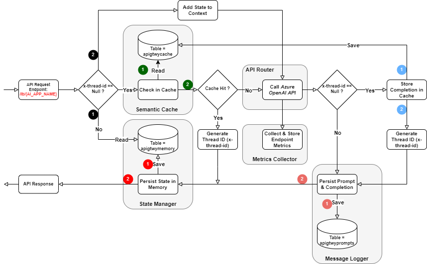

# Azure *AI Application Gateway*

> If you find this project helpful, we did greatly appreciate it if you could give it a star :star:! Your support helps keep this project alive and motivates further improvements.  Thank You!

### Release Info
Release | Date | Production Ready | Notes
------- | ---- | -------------------- | -----
**v2.7.0** | 10/14/2025 | Yes | This latest release includes support for Agent to Agent (A2A) protocol v0.3.0 & a few other feature enhancements.
**v2.6.0** | 09/18/2025 | Yes | This stable release includes new features, enhancements and several bug fixes. This release also includes preview features which have not been fully tested.
**v2.3.9** | 08/09/2025 | Yes | This stable release & has gone thru end to end regression tests.  However, this release may lack critical features introduced in later releases.

### Release Notes
Refer to [Changelog document](./CHANGELOG.md) for details on new features, enhancements and bugfixes introduced in each release.

### Overview
If you're seeking the essential components for rapid implementation and deployment of **AI Information Assistants (AI Chatbots)** on Azure or  advanced AI Solutions that expose a conversational interface, the *AI Application Gateway* is your go-to resource to expedite the development process and transition smoothly from pilot phase to full-scale production.

This *solution accelerator* is designed to deliver 80-90% of the core functionality essential for constructing and deploying AI Solutions, essentially Information Chatbots. Most notably, it accelerates the smooth roll out of numerous AI Solutions on a shared, minimal set of infrastructure components/services.

### Functional Architecture (v2.7.0)


Recipe | Components
------ | ----------
***AI Information Assistant*** | 1. AI Applications <br> 2. **Semantic Cache** <br> 3. **State Manager** <br> 4. **Long-Term Memory Manager (Personalization)** <br> 5. **Intelligent API Router** <br> 6. **API Cost Tracker (Budgeting)** <br> 7. **Feedback Analyzer** <br> 8. **API Metrics Collector** <br> 9. **Message Logger (Chat History)** <br> 10. Azure AI Foundry Service

> **Note: Components marked by green circles are out of box features.**

### Supported Features At A Glance

| Feature/Capability | Azure AI Service | Description                      |
| ------------------ | ---------------- | -------------------------------- |
| **Shared Infrastructure Model** | All | The AI Application Gateway simplifies and streamlines the deployment of multiple AI Solutions by utilizing a shared infrastructure backbone. This approach allows for deploying the infrastructure once and subsequently scaling it to build and deploy numerous AI Chatbots/Applications. |
| **Enhanced AI Application Deployments** | All | The AI Gateway is designed to be AI Application *Aware*, enabling Azure AI Service deployments to be provisioned once and seamlessly shared across multiple AI Applications. This approach simplifies infrastructure management and promotes efficient resource utilization across AI projects. |
| **Model Agnostic Endpoints** | - Azure AI Foundry Models<br>- Azure AI Agent Service | The gateway exposes each AI Application through a unified endpoint, hiding the underlying AI Service model deployment endpoints from client applications. As a result, model/agent deployment endpoints can be quickly updated without requiring any changes to client applications. |
| **Intelligent Traffic Management** | - Azure AI Foundry Models<br>- Azure AI Agent Service | The gateway provides the following API traffic management features.<br><br>**<u>Circuit Breaker</u>** Each AI Application can be configured with multiple backend endpoints, and the gateway acts as a circuit-breaker by automatically switching to the next prioritized endpoint when one is throttled (HTTP 429), while temporarily excluding throttled endpoints from traffic until they recover.<br><br>**<u>Rate Limiting</u>** Users can define RPM limits per backend endpoint. The AI Gateway enforces rate limiting by returning HTTP 429 responses to prevent overloading of an endpoint and ensure fair utilization of model capacity.<br><br>**<u>Traffic Splitting</u>** Each AI Application can be configured with any one of the built-in endpoint router implementations described below.<br>**- Priority:** (**Default**) Routes API calls based on top down order of endpoints listed in the Gateway configuration file.<br>**- Least Recently Used:** Routes API calls to endpoint that has been least recently used.<br>**- Least Active Connections:** Routes API calls to the endpoint with the fewest active connections.<br>**- Weighted Random:** Routes API calls to endpoints based on fixed weight assignments.<br>**- Feedback Weighted Random:** This decay based router adapts routing by favoring backends with recent positive feedback while gradually discounting old feedback, ensuring both responsiveness and ongoing exploration.<br>**- Latency Weighted:** Dynamically adjusts routing weights based on real-time endpoint performance, ensuring each API call is directed to the endpoint with the lowest latency for optimal responsiveness.<br>**- Payload Switch:** Routes API calls to endpoints based on the size of the HTTP request payload and configured thresholds.<br>**- Header Switch:** Routes API calls to the endpoint whose unique ID matches the value provided in the `x-endpoint-id` HTTP request header.<br>**- Model Aware:** Intelligently directs API calls to endpoints whose configured task attributes match specific phrases or terms found in the request message.<br>**- Token Aware:** Routes API requests to the most suitable endpoint by comparing the estimated token consumption of each request against the model’s maximum context size, and only directs the call if the token count is below the model's allowed maximum limit.<br>**- Time Aware:** Routes API requests to the most appropriate endpoint based on the current day of the week and time of day.<br>**- Budget Aware:** Estimates token usage with simple heuristics, calculates cost, and compares it against model-specific budget thresholds to select the most economical endpoint.<br>**- Adaptive Budget Aware:** Identifies the most cost-effective endpoint by applying the configured (built-in) routing strategy within defined budget thresholds.<br><br>**<u>Health Check Policies</u>** When enabled, the AI Gateway monitors backend endpoint latency and automatically disables an endpoint when the pre-configured response time threshold (in minutes) is exceeded. |
| **Model Budgeting (Cost Tracking)** | Azure AI Foundry Models | The AI Application Gateway calculates & stores API call costs using token counts reported by Azure AI Foundry Models, helping teams monitor usage and manage expenses effectively. This feature also helps teams stay within budget, optimize resource allocation, and make informed decisions about endpoint selection and usage. |
| **Semantic Caching** | Azure AI Foundry Models | The gateway stores model prompts and their completions in a vector cache. When a user submits a new prompt that is semantically similar to a previously cached one, the gateway returns the corresponding completion by retrieving it from the cache. This feature can improve runtime performance of LLM/AI applications by up to 40%, leveraging *PostgreSQL's* vectorization and semantic search capabilities. |
| **Conversational State Management** | Azure AI Foundry Models (Chat Completion API only) | AI Chatbots must maintain context during end user sessions so they can reference previous user inputs, ensuring coherent and contextually relevant conversations.  This feature manages conversational state, scaling to support 10 to hundreds of concurrent user sessions for multiple AI applications. It can operate independently or with *Semantic Caching* to enhance performance. |
| **Long-term Memory (Personalization)** | Azure AI Foundry Models (Chat Completion API only) | The AI Gateway supports long-term user memory, a feature that enables personalized interactions by continuously learning from user inputs over time. When enabled for an AI Application, the gateway extracts and stores relevant facts from user prompts such as preferences, context and behavioral patterns. It then uses this accumulated knowledge to tailor responses, maintain conversational continuity, and generate context-aware follow-up questions that reflect the user’s history and intent. |
| **Feedback Analytics** | Azure AI Foundry Models (Chat Completion API only) | The feature enables users to rate responses from large language models using a thumbs-up or thumbs-down system. By capturing and analyzing this feedback, it provides actionable insights into response quality (compare model performance) helping guide model selection, tuning, and deployment decisions with real-world data.
| **Message Persistence (Chat History)** | Azure AI Foundry Models | This feature allows persisting Azure OpenAI Service *Prompts* and *Completions* in a PostgreSQL database for introspection and quick troubleshooting of API requests. |
| **API Metrics Collection** | All | The Gateway continously collects backend API metrics and exposes them thru the metrics (/ metrics) endpoint.  Using this feature, users can analyze the throughput, cost, caching and latency metrics for each AI Application & optimize traffic routing. |
| **Streaming API Responses** | Azure AI Foundry Models (Chat Completions API only) | The AI Application Gateway fully supports the response *streaming* feature provided by Azure OpenAI Chat Completions API.  This function is seamlessly integrated with semantic caching, state management and traffic routing features. |
| **Secure by Design** | All | The API's exposed by the AI Application Gateway can be easily secured using Microsoft Entra ID (Default). This feature ensures only authenticated users or client applications are able to access the API endpoints. |
| **Observability and Traceability** | All | The AI Application Gateway uses the Azure Application Insights SDK to collect and send detailed telemetry on Azure OpenAI and dependent services to Azure Monitor. |
| **SDK's and AI Application (LLM) Frameworks** | Azure AI Foundry Models | The AI Application Gateway server has been tested to work with the following API's/SDK's:<br>1) [Azure OpenAI](https://learn.microsoft.com/en-us/azure/ai-services/openai/how-to/switching-endpoints)<br>2) [Agent 2 Agent Protocol v0.3.0](https://a2a-protocol.org/latest/)<br>3) [Prompt Flow](https://github.com/microsoft/promptflow)<br>4) [Langchain](https://python.langchain.com/docs/integrations/llms/azure_openai/)<br> Refer to the [Samples directory](./samples) for usage. |
| **Robust Runtime** | All | The AI Application Gateway, powered by the Node.js runtime and Chrome V8 engine, uses a single-threaded event loop for asynchronous request handling. It is highly performant and can scale to manage thousands of concurrent requests. |

### Usage scenarios

The AI Application Gateway can be used in the following scenarios.
1. **Rapid deployment of intelligent AI Chatbots (or AI Information Assistants)**
   
   The gateway provides built-in value add capabilities such as *Semantic Caching*, *State Management*, *Long-term Memory*, *Cost Tracking*, *Intelligent Traffic Routing* and *API Metrics Collection*, which are crucial for implementing scalable conversational AI applications powered by large language models and AI Agents. These features streamline and accelerate development, enhance runtime performance, and support advanced AI use cases with minimal to no overhead.

2. **Capturing Azure AI Service API usage metrics and estimating capacity for AI applications/workloads**

   For each AI Application, the gateway collects Azure AI Service API usage metrics for pre-configured time intervals. In the case of Azure AI Foundry models, the collected metrics such as *Tokens per minute* (TPM) and *Requests per minute* (RPM) can be used to estimate *Provisioned Throughput Units* for each AI workload.

3. **Intelligently route AI Application requests to Azure AI Service deployments/backends**

   For each AI Application, the gateway functions as an intelligent router and distributes AI Service API traffic among multiple backend endpoints.  The gateway also keeps track of unavailable/busy backend endpoints and automatically redirects traffic to available endpoints thereby distributing the API traffic load evenly and not overloading a given endpoint with too many requests.  

   The gateway currently supports proxying requests to the following Azure AI Services.
     - Azure AI Foundry Models, OpenAI models and models that support the *Azure AI Model Inference API*
     - Azure AI Foundry Agent Service (Experimental/In-Preview)
     - Azure AI Search (Full API support)
     - Azure AI Language (Limited API support - Entity Linking, Language detection, Key phrase extraction, NER, PII, Sentiment analysis and opinion mining only)
     - Azure AI Translator (Limited API support - Text Translation only)
     - Azure AI Content Safety (Limited API support - Analyze Text and Analyze Image only)

### Feature/Capability Support Matrix

Feature/Capability | Configurable (Yes/No) | Azure AI Foundry Models | Azure AI Foundry Agent Service | Azure AI Search | Azure AI Language | Azure AI Translator | Azure AI Content Safety |
------------------ | --------------------- | -------------------- | --------------- | ----------------- | ----------------- | ------------------- | ----------------------- |
**Semantic Cache** | Yes | Yes <br>- Completions API <br>- Chat Completions API | No | No | No | No | No |
**State Management** | Yes | Yes <br>- Chat Completions API | Yes | No | No | No | No
**Long-term Memory (Personalization)** | Yes | Yes <br>- Chat Completions API | No | No | No | No | No |
**Traffic Routing/Splitting** | Yes | Yes | Yes | Yes | Yes | Yes | Yes |
**Cost Tracking** | Yes | Yes <br>- Chat Completions API | Yes | No | No | No | No |
**Feedback Tracking** | Yes | Yes | Yes | No | No | No | No |
**Message Persistence** | Yes | Yes | Yes | No | No | No | No |
**Metrics Collection** | No | Yes | Yes | Yes | Yes | Yes | Yes |

### Reference Architecture: Single Domain AI Application Gateway


### AI Application Gateway workflow for Azure OpenAI Service



### Bill Of Materials
The AI Application Gateway is designed from the grounds up to be a cost-effective solution and has minimal services footprint. For details on the Azure services needed to deploy this solution, please see the accompanying table below.

| Environment | Azure Services | Notes
| ----------- | -------------- | -----
| - Development<br>- Testing | - Azure Linux VM (Minimum 2vCPUs; 8GB Memory)<br>- Azure Database for PostgreSQL Server (2-4 vCores; 8-16GB Memory; 1920-2880 max. iops)<br>- Azure OpenAI Service<br>- Azure AI Search<br>- Azure Storage | - The gateway can be run as a standalone server or can be containerized and run on the Linux VM.
| - Pre-Production<br>- Production | - Azure Linux VM (4-8 vCPUs; 8-16GB Memory)<br>- Azure Database for PostgreSQL Server (4-8 vCores; 16-32GB Memory; 2880-4320 max iops)<br>- Azure Kubernetes Service / Azure Container Apps.<br>- Azure Container Registry<br>- Azure OpenAI Service<br>- Azure AI Search<br>- Azure Storage | - The AI Application Gateway can be deployed on AKS or Azure Container Apps. For large scale deployments, we recommend AKS.<br>- Select the appropriate deployment type(s) and OpenAI models for Azure OpenAI Service.<br>- Select the appropriate pricing tier (S, S2, S3) for Azure AI Search service to meet your data indexing & storage requirements.<br>- The Linux VM can be used as a jumpbox for testing the gateway server locally, connecting to the kubernetes cluster, managing other Azure resources etc.

> **NOTE:**
> Other Azure AI Services may be needed to implement functions specific to your use case.

### Prerequisites
1.  An Azure **Resource Group** with **Owner** *Role* permission.  All Azure resources can be deloyed into this resource group.
2.  A **GitHub** Account to fork and clone this GitHub repository.
3.  Review [Overview of Azure Cloud Shell](https://docs.microsoft.com/en-us/azure/cloud-shell/overview).  **Azure Cloud Shell** is an interactive, browser accessible shell for managing Azure resources.  You will be using the Cloud Shell to create the Jumpbox VM (Linux VM).
4.  This project assumes readers are familiar with Linux, Git SCM, Linux Containers (*docker engine*) and Kubernetes.  If you are new to any of these technologies, go thru the resources below.
    - [Introduction to Git SCM](https://git-scm.com/docs/gittutorial)
    - [Git SCM Docs](https://git-scm.com/book/en/v2)
    - [Docker Overview](https://docs.docker.com/engine/docker-overview/)
    - [Kubernetes Overview](https://kubernetes.io/docs/tutorials/kubernetes-basics/)
5. (Optional) Download and install [Postman App](https://www.getpostman.com/apps), a REST API Client used for testing the AI Application Gateway.

Readers are advised to refer to the following on-line resources as needed.
- [Azure CLI](https://learn.microsoft.com/en-us/cli/azure/install-azure-cli?view=azure-cli-latest)
- [Creating an Azure Linux VM](https://learn.microsoft.com/en-us/azure/virtual-machines/linux/quick-create-cli)
- [Docker](https://docs.docker.com/)
- [Azure OpenAI Service](https://learn.microsoft.com/en-us/azure/ai-services/openai/)
- [Azure Database for PostgreSQL](https://learn.microsoft.com/en-us/azure/postgresql/)
- [Vector Search for PostgreSQL](https://github.com/pgvector/pgvector)
- [Azure Kubernetes Service](https://docs.microsoft.com/en-us/azure/aks/)
- [Azure Container Registry](https://docs.microsoft.com/en-us/azure/container-registry/)
- [Helm 3.x](https://docs.helm.sh/)
- [Azure Monitor OpenTelemetry](https://learn.microsoft.com/en-us/azure/azure-monitor/app/opentelemetry-enable?tabs=aspnetcore)
- [Azure Load Testing](https://learn.microsoft.com/en-us/azure/load-testing/)

## Disclaimer:
The software (AI Application Gateway) is provided "as is" without warranty of any kind, express or implied, including but not limited to the warranties of merchantability, fitness for a particular purpose, and non infringement.  In no event shall the authors or copyright holders be liable for any claim, damages, or other liability, whether in an action of contract, tort, or otherwise, arising from, out of, or in connection with the software or the use or other dealings in the software. Use at your own risk.

### Deployment Options
Deploy the AI Application Gateway in a pre-production environment first and configure the desired features by setting the configuration parameters to appropriate values. The pre-production environment should be as close as possible to an actual production environment. Rigorously test and validate the API routing, caching, state management, security and persistence features to confirm their optimal functionality as anticipated.

The Sections below describe the steps to configure and deploy the Gateway on Azure.  Although, there are multiple deployment options available on Azure, we will only describe the top two options recommended for production deployments.

**Recommended for Usage Scenarios 1 and 2**

- Containerize the Gateway and deploy it on a standalone *Virtual Machine*. Refer to Sections **A** and **B** below.

**Recommended for Usage Scenario 3**

1. Containerize the AI Application Gateway and deploy it on a serverless container platform such as *Azure Container Apps*.

   We will not be describing the steps for this option here.  Readers can follow the deployment instructions described in Azure Container Apps documentation [here](https://learn.microsoft.com/en-us/azure/container-apps/tutorial-code-to-cloud?source=recommendations&tabs=bash%2Ccsharp&pivots=acr-remote).
2. Containerize the AI Application Gateway and deploy it on a container platform such as *Azure Kubernetes Service*. Refer to Sections **B** and **E** below.

> **IMPORTANT:** Although not necessary, it is advised to quickly go thru the feature details [doc](./docs/Feature-Details.md) prior to proceeding.

The remainder of this Readme describes how to configure/enable specific features and deploy the AI Application Gateway on Azure.

### A. Configure and run the AI Application Gateway on a standalone *Virtual Machine*

Before we can get started, you will need a Linux Virtual Machine to run the AI Application Gateway. If you haven't already, provision a Virtual Machine with a Linux flavor of your choice on Azure.

1. Clone or fork this GitHub repository into a directory on the VM.

   SSH login to the Virtual Machine using a terminal window. If you intend to customize the Gateway components, it's best to fork this repository into your GitHub account and then clone the repository to the VM.

2. Install Node.js.

   Refer to the installation instructions on [nodejs.org](https://nodejs.org/en/download/package-manager) for your specific Linux distribution.

3. Install PostgreSQL database server.

   > **NOTE**:
   > If you intend to use only the *Traffic Management* features, you can skip this step and go to Step 4.

   Refer to the installation instructions [here](https://learn.microsoft.com/en-us/azure/postgresql/flexible-server/quickstart-create-server-portal) to install *Azure Database for PostgreSQL*.  Create a new database and give it a suitable name.  Note down the database name, server user name and password.  Save it in a secure location as we will need this info. in a subsequent step (below).

   You can connect to the database using any one of the following options - 1) [Azure CLI](https://learn.microsoft.com/en-us/azure/postgresql/flexible-server/quickstart-create-server-cli) 2) [psql or Azure Cloud shell](https://learn.microsoft.com/en-us/azure/postgresql/flexible-server/quickstart-create-server-portal).

   > **IMPORTANT**:
   > Before proceeding with the next steps, enable **pgvector** extension on the PostgreSQL database.  To enable this extension on *Azure Database for PostgreSQL*, refer to the documentation [here](https://learn.microsoft.com/en-us/azure/postgresql/flexible-server/how-to-use-pgvector).

   Next, go to the root directory of this project repository.  Update values for the environment variables shown in the table below.  Export these environment variables.

   Environment Variable | Value
   -------------------- | -----
   VECTOR_DB_HOST | Name of Azure Database for PostgreSQL server.  You will find this info. in the *Overview* blade/tab of the PostgreSQL Server resource in Azure Portal (value of the field **Server name**).
   VECTOR_DB_PORT | 5432 (This is the default PostgreSQL Server listen port)
   VECTOR_DB_USER | Name of the database user (Saved in step above)
   VECTOR_DB_UPWD | Password of the database user (Saved in step above)
   VECTOR_DB_NAME | Name of the database (Saved in step above)

   Create the database tables using the script `./db-scripts/pg-create-db-resources.js`. See command snippet below.

   ```bash
   # Make sure you are in the project's root directory.
   # Use 'drop-tables' option if you want to delete and recreate the tables.
   # Usage: node ./db-scripts/pg-create-db-resources.js [drop-tables]
   #
   $ node ./db-scripts/pg-create-db-resources.js
   #
   ```

   Connect to the database (using *psql*) and verify the database tables were created ok. The following tables should have been created.

   Table Name | Description
   ---------- | -----------
   aiappservers | This table stores the AI Application Gateway resource configurations
   apigtwycache | This table stores vectorized prompts and completions
   apigtwyprompts | This table stores prompts and completions
   apigtwymemory | This table stores state for user sessions (threads)
   userfacts | This table stores facts extracted from user prompts
   aiapptoolstrace | This table stores the tool execution details for multi-domain AI Applications. 

4. Update the **AI Application Gateway Configuration file**.

   <ins>***AI Gateway/Server Configuration:***</ins>

   Edit the `./api-router-config.json` file.

   Use attributes *serverId* and *serverType* to specify the AI Application Gateway server **ID/Name** (should be unique) and **Type**.

   > **NOTE:** The *serverId* and *serverType* attribute values in the configuration file should match the values of environment variables **API_GATEWAY_ID** and **API_GATEWAY_TYPE**.  Otherwise the gateway server will throw an exception and fail to start. 
   
   A gateway server can be one of two types.  Refer to the table below.

   Server Type | Description
   ----------- | -----------
   single-domain | A single domain gateway server used to deploy and manage AI Applications that use an LLM grounded with data from a single data repository (RAG appplications).
   multi-domain | A multi domain gateway server used to deploy and manage complex workflows that comprise of multiple AI agent and tool calls.   

   Next, use the *budgetConfig* attribute to configure the gateway budget classes (1..N) used for API cost tracking. Refer to the table below.
   > **NOTE:** If you are not planning to use the cost tracking feature and/or one of the budget aware gateway router implementations, you can safely skip this section and go to the *AI Application Configuration* section (below).

   | Attribute Name | Type | Required | Description |
   | -------------- | ---- | -------- | ----------- |
   | budgetName | String | Yes | The name of the budget class |
   | description | String | No | Description of the budget class |
   | models | Object[] | Yes | An array containing large language model budget definitions (cost info.) associated with the budget class. When cost tracking feature is used, a minimum of one model budget/cost definition is required. |

   The *models* attribute is an array containing model cost definitions.  Refer to the table below and configure values appropriately.

   | Attribute Name | Type | Required | Description |
   | -------------- | ---- | -------- | ----------- |
   | modelName | String | Yes | Name of the large language model |
   | description | String | No | Brief description of the model |
   | tokenPriceInfo.inputTokensCostPer1k | Number | Yes | Cost for 1K input tokens |
   | tokenPriceInfo.cachedInputTokensCostPer1k | Number | No | Cost for 1K cached prompt/input tokens |
   | tokenPriceInfo.outputTokensCostPer1k | Number | Yes | Cost for 1K output tokens |

   <ins>***AI Application Configuration:***</ins>

   For each AI Application, 

   - Specify a unique *appId* and an optional *description*.
   - Specify the type *appType* of the backend Azure AI Service. This type must be one of the values listed in the table below.
     
     Application Type | Description
     ---------------- | -----------
     azure_oai | This value denotes Azure OpenAI service Or OpenAI Service (Models)
     azure_aimodel_inf | This value denotes Azure AI Foundry Service (Models)
     azure_ai_agent | (Experimental/In-Preview) This value denotes Azure AI Foundry Agent Service
     azure_language | This value denotes Azure AI Language service
     azure_translator | This value denotes Azure AI Translator service
     azure_content_safety | This value denotes Azure AI Content Safety service
     azure_search | This value denotes Azure AI Search service

   - Use *isActive* attribute to specify if the AI Application is active or not (true/false).
   
     > **NOTE:** The AI App Gateway will not serve any requests for in-active (disabled) AI Applications.

   - Optionally, specify the backend endpoint router type *endpointRouterType*.

     > **NOTE:** Sample AI Application configuration files using different endpoint router types can be found in directory [ai-app-gateway-configs](./src/ai-app-gateway-configs). 
   
     The **built-in** routers (types) currently supported by the AI Application Gateway are listed in the table below.

     Router Type | Description
     ----------- | -----------
     **Priority** | (Default) Routes incoming API calls to the first available endpoint listed in the AI Gateway configuration.
     **LeastActiveConnections** | Directs API calls to the endpoint with the fewest active connections at the time of the request.
     **LeastRecentlyUsed** | Sends API calls to the endpoint that has not been used for the longest duration, promoting balanced usage.
     **WeightedRandom** | Routes incoming API calls to backend endpoints based on predefined (fixed) weight assignments.
     **FeedbackWeightedRandom** | This decay router is simple, lightweight, and adapts naturally to changing backend performance. By applying decay, it favors backends with consistently positive feedback while gradually “forgetting” old results, ensuring underperforming backends still get occasional traffic for re-evaluation.<br>**Good defaults:** Set the decay factor to 0.98 and base weight to 2.
     **LatencyWeighted** | Dynamically adjusts routing weights based on real-time endpoint performance, ensuring each API call is directed to the endpoint with the lowest latency for optimal responsiveness. This strategy enhances efficiency by continuously monitoring and prioritizing faster endpoints.
     **PayloadSwitch** | Routes incoming API requests to the appropriate endpoint by comparing the request payload size against each endpoint’s configured maximum threshold. An endpoint is selected if the payload size is below its configured threshold.
     **HeaderSwitch** | Routes API requests to the endpoint whose unique ID matches the value provided in the `x-endpoint-id` HTTP request header.
     **ModelAware** | Intelligently directs API calls to endpoints whose configured task attributes match specific phrases or terms found in the request message (role=system). This ensures contextually relevant routing based on semantic alignment between the request and endpoint capabilities.
     **TokenAware** | Routes API calls to the most suitable endpoint by evaluating token consumption of each request. This router uses configured token threshold limits per endpoint to ensure requests are routed efficiently, optimizing resource usage and preventing overages while maintaining performance. 
     **TimeAware** | Intelligently directs API calls to the most appropriate endpoint based on the current day of the week and time of day. By leveraging temporal routing logic, it ensures optimal resource utilization, performance alignment, and cost efficiency by matching traffic patterns with endpoint availability and operational preferences.
     **BudgetAware** | This router applies lightweight heuristics to estimate token usage and compute the cost of each API request. It then compares the estimates against model-specific cost budgets to intelligently route requests to the most cost-effective (least expensive) endpoint. This ensures cost-effective execution aligned with configured budget constraints.
     **AdaptiveBudgetAware** | This router identifies the most cost-effective endpoint by utilizing one of the following configurable strategies that fall within pre-configured budget thresholds. This ensures optimal performance while minimizing operational costs, making it a highly cost-effective solution for scalable deployments.<br>**Router Strategies:**<br>- **Priority:** Uses endpoints listing order, then first under budget<br>- **RoundRobin:** Cycles thru endpoints that are under budget<br>- **LeastSpent:** Selects an endpoint with the highest remaining budget percentage<br>- **WeightedRandom:** Selects an endpoint by weight (skips exhausted)<br>- **Adaptive:** Prefers endpoint with `qualityTier` A, B and then C but switches to a lower quality tier if the remaining allocated budget of the higher tier is < minimum threshold (Default threshold ~ 10% of budget)

   - Optionally, when *AdaptiveBudgetAware* router type is configured for an AI Application, specify additional traffic router settings using attribute *adaptiveRouterSettings*.  Refer to the table below.

     Attribute Name | Type | Required | Description
     -------------- | ---- | -------- | -----------
     strategy | Enum(String) | Yes | The router strategy to use. Acceptable values are<br>**- Priority**<br>**- WeightedRandom**<br>**- RoundRobin**<br>**- LeastSpent**<br>**- Adaptive**
     windowType | Enum(String) | Yes | The default window tier to use when comparing API call costs against endpoint cost thresholds. Acceptable values are<br>**- Hourly**<br>**- Daily**<br>**- Weekly**<br>**- Monthly**
   
   - The **endpoints** attribute is an array containing endpoint definitions.  Refer to the table below and set appropriate values for each endpoint attribute.

     Attribute Name | Type | Required | Description
     -------------- | ---- | -------- | -----------
     id | String | No | An ID used to uniquely identify a *Model* or an *AI Agent* endpoint defined in Azure AI Foundry Service.  This value must be unique & must be specified for an AI application when one of the conditions below is true.<br>- When the AI Application type is set to a value other than `azure_oai`<br>- When one of the endpoint routers other than **Priority** (default) is used.
     uri | String | Yes | AI Service endpoint (backend) URI
     apikey | String| Yes | AI Service API Key
     rpm | Number | No | Requests per minute (RPM) rate limit to be applied to this endpoint.  No rate limits are applied when this value is absent.
     task | String[] | No | Use this string array to specify the unique capabilities or specializations of the model associated with this endpoint. This value has to be specified for each endpoint when the router type (*endpointRouterType*) attribute is set to *ModelAware* for an AI Application.
     model | Enum(String) | No | The LLM family.  This value must be specified for each endpoint when the router type (*endpointRouterType*) attribute is set to *TokenAware* for an AI Application. Acceptable values are<br>**- gpt-3.5**<br>**- gpt-4**<br>**- gpt-4o**<br>**- gpt-4.1**<br>**- gpt-5**<br>**- o1/o3/o4**
     weight | Number | No | Percentage-based weight used to distribute API calls across backend endpoints. The combined weights for all endpoints must total 100. This value must be specified for the following router types - *RandomWeighted* and *LatencyWeighted*.
     payloadThreshold | String | No | Request payload size (/threshold) specified in `bytes`, `kb` (Kilo bytes) or `mb` (Mega bytes).  This value must be specified for each endpoint when a router type of *PayloadSwitch* is configured for an AI Application.<br>Eg., 2000, 5kb, 10Mb.
     days | Number[] | No | An integer array containing days of the week. Acceptable values range from 0 to 6, where 0 represents Sunday and 6 represents Saturday.  This value must be specified for each endpoint when a router type of *TimeAware* is configured for an AI Application.
     startHour | Number | No | An integer representing the start hour. Acceptable values range from 0 to 24. This value must be specified for each endpoint when a router type of *TimeAware* is configured for an AI Application.
     endHour | Number | No | An integer representing the end hour. Acceptable values range from 0 to 24. This value must be specified for each endpoint when a router type of *TimeAware* is configured for an AI Application.
     qualityTier | Enum(String) | No | Specifies the quality tier associated with this endpoint when *AdaptiveBudgetAware* router type & *Adaptive* router strategy is configured for an AI Application.  Acceptable values are **A**, **B** or **C**.
     budget.modelName | String | No | The name of the model budget definition associated with this endpoint.  This model budget definition must exist within the budget class associated with the AI Application. This value must be specified for each endpoint when a router type of *BudgetAware* or *AdaptiveBudgetAware* is configured for an AI Application.
     budget.defaultEndpoint | Boolean | No | A boolean which indicates if this is the default endpoint for spillover traffic when all endpoints have crossed the budget cost thresholds. This value must be specified for exactly one endpoint when a router type of *BudgetAware* or *AdaptiveBudgetAware* is configured for an AI Application.  
     budget.costBudgets.hourly | Number | No | Hourly cost budget allocated to this endpoint. This value must be specified for each endpoint when a router type of *BudgetAware* or *AdaptiveBudgetAware* is configured for an AI Application.
     budget.costBudgets.daily | Number | No | Daily cost budget allocated to this endpoint. This value must be specified for each endpoint when a router type of *BudgetAware* or *AdaptiveBudgetAware* is configured for an AI Application.
     budget.costBudgets.weekly | Number | No | Weekly cost budget allocated to this endpoint. This value must be specified for each endpoint when a router type of *BudgetAware* or *AdaptiveBudgetAware* is configured for an AI Application.
     budget.costBudgets.monthly | Number | No | Monthly cost budget allocated to this endpoint. This value must be specified for each endpoint when a router type of *BudgetAware* or *AdaptiveBudgetAware* is configured for an AI Application.
     healthPolicy.maxCallsBeforeUnhealthy | Number | No | Defines the maximum number of consecutive failed or high latency API calls allowed to a backend endpoint before it is marked as unhealthy by the AI Gateway. Once this threshold is exceeded, the endpoint is temporarily removed from the routing pool to prevent further traffic until it recovers.
     healthPolicy.latencyThresholdSeconds | Number | No | Response time threshold (in seconds) used to evaluate backend performance. Used in conjunction with attribute *healthPolicy.maxCallsBeforeUnhealthy*.
     healthPolicy.retryAfterMinutes | Number | No | Duration (in minutes) after which a previously unhealthy endpoint is re-evaluated and considered healthy again.

   - To enable caching and retrieval of OpenAI Service completions (Semantic Caching feature), specify values for attributes contained within **cacheSettings** attribute.  Refer to the table below and set appropriate values.

     Attribute Name | Type | Required | Description
     -------------- | ---- | -------- | ------------
     useCache | Boolean | Yes | AI Application Gateway will cache OpenAI Service completions (output) based on this value.  If caching is desired, set it to *true*.  Default is *false*.
     searchType | String | No | AI Application Gateway will search and retrieve OpenAI Service completions based on a semantic text similarity algorithm.<br>This attribute is used to specify the similarity distance function/algorithm for vector search.  Supported values are a) CosineSimilarity (= *Cosine Similarity*).  This is the default. b) EuclideanDistance (= *Level 2 or Euclidean distance*) c) InnerProduct (= *Inner Product*).
     searchDistance | Decimal | No | This attribute is used to specify the search similarity threshold.  For instance, if the search type = *CosineSimilarity*, this value should be set to a value between 0 and 1.
     searchContent.term | String | No | This value specifies the attribute in the request payload which should be vectorized and used for semantic search. For OpenAI completions API, this value should be *prompt*.  For chat completions API, this value should be set to *messages*.
     searchContent.includeRoles | String | No | This attribute value should only be set for OpenAI models that expose chat completions API. Value can be a comma separated list.  Permissible values are *system*, *user* and *assistant*.
     entryExpiry | String | No | This attribute is used to specify when cached entries (*completions*) should be invalidated.  Specify, any valid PostgreSQL *Interval* data type expression. Refer to the docs [here](https://www.postgresql.org/docs/current/datatype-datetime.html#DATATYPE-INTERVAL-INPUT).

   - To enable conversational state management for user chat sessions, specify values for attributes contained within **memorySettings** attribute.  Refer to the table below and set appropriate values.

     Attribute Name | Type | Required | Description
     -------------- | ---- | -------- | ------------
     useMemory | Boolean | Yes | When this value is set to *true*, AI Application Gateway will manage state for user sessions.  Default is *false*.
     affinity | Boolean | No | When set to *true*, the AI Gateway maintains session stickiness by routing all queries from the same user session to the same backend endpoint that handled the initial request.
     msgCount | Number | No | This attribute is used to specify the number of messages (*user - assistant* interactions) to store and send to the LLM.
     entryExpiry | String | No | This attribute is used to specify when the user sessions should be invalidated.  Specify, any valid PostgreSQL *Interval* data type expression. Refer to the docs [here](https://www.postgresql.org/docs/current/datatype-datetime.html#DATATYPE-INTERVAL-INPUT).

   - To enable long-term user memory (Personalization feature), specify values for attributes contained within **personalizationSettings** attribute.  Refer to the table below and set appropriate values.

     Attribute Name | Type | Required | Description
     -------------- | ---- | -------- | -----------
     userMemory | Boolean | Yes | Enables or disables long-term user memory, allowing the AI Gateway to retain and use information from previous user interactions for personalization.
     generateFollowupMessages | Boolean | No | Used to specify whether the AI Gateway should generate follow-up messages based on the current conversation context.
     userFactsAppName | String | No | Used to specify the name of the AI Application responsible for identifying and extracting user-specific facts. Defaults to value of **API_GATEWAY_VECTOR_AIAPP**.
     extractionPrompt | String | No | The prompt used to guide the AI Gateway in extracting personal attributes or facts from user input/prompt.
     followupPrompt | String | No | The prompt used to help the AI Gateway generate relevant follow-up questions based on the model’s response.

   - To enable cost tracking for an AI Application, specify values for attributes contained within **budgetSettings** attribute.  Refer to the table below and set appropriate values.

     Attribute Name | Type | Required | Description
     -------------- | ---- | -------- | -----------
     useBudget | Boolean | Yes | A boolean value to either enable or disable cost tracking for an AI Application
     budgetName | String | Yes | Name of the budget class used for computing API call costs (~ cost tracking).  This budget class should be defined in the *budgetConfig* server attribute.

   After making the changes, save the `./api-router-config.json` file.

   **IMPORTANT**:

   **Azure AI Foundry Models**:

   When no backend endpoint router type is specified for an AI Application, the default **Priority** based router will be used.  For priority based endpoint routing, the model/agent deployment endpoints/URI's should be listed in increasing order of priority (top down) in the gateway configuration file. Endpoints listed at the top of the list will be assigned higher priority than those listed at the lower levels.  For each API Application, the Gateway server will traverse and load the deployment URI's starting at the top in order of priority. While routing requests to AI Foundry service backends, the gateway will strictly follow the priority order and route requests to endpoints with higher priority first before falling back to low priority endpoints. 

5. Set the gateway server environment variables.

   Set the environment variables to the correct values and export them before proceeding to the next step. Refer to the table below for descriptions of the environment variables.

   > **NOTE**:
   > You can source the shell script `. ./set-api-gtwy-env.sh` to read and export the environment variables contained in your .env file.

   Env Variable Name | Description | Required | Default Value
   ----------------- | ----------- | -------- | ------------- 
   API_GATEWAY_ID | Unique ID of the AI Application Gateway | Yes | None.  Set this to a unique string value.
   API_GATEWAY_TYPE | Type of the AI Application Gateway<br>- single-domain<br>- multi-domain (Experimental) | Yes | single-domain
   API_GATEWAY_KEY | AI Application Gateway private key (secret) required to reconfigure backend (Azure OpenAI) endpoints | Yes | Set this value to an alphanumeric string
   API_GATEWAY_CONFIG_FILE | The AI Application Gateway configuration file location. If this variable is not set, gateway resource definitions will be saved in a SQL table (*aiappservers*). | No | Set the full or relative path to the *AI Application Gateway Configuration file* from the project root directory.
   API_GATEWAY_PORT | Gateway server listen port | No | 8000
   API_GATEWAY_ENV | Gateway environment | Yes | Set a value such as 'dev', 'test', 'pre-prod', 'prod' ...
   API_GATEWAY_LOG_LEVEL | Gateway logging level | No | Default=info.  Possible values are debug, info, warn, error, fatal.
   API_GATEWAY_AUTH | Use this env variable to secure AI Application gateway endpoints using Microsoft Entra ID | No | true
   AZURE_TENANT_ID | When security is turned on for the gateway, this value is required. Specify the correct Azure **Tenant ID**. | No | None
   API_GATEWAY_CLIENT_ID | When security is turned on for the gateway, this value is required. Specify the correct **Client ID** for the AI Application Gateway as defined in Application Registrations on Azure.  | No | None
   AZURE_AI_SERVICE_MID_AUTH | AI App Gateway can use the system managed identity of it's underlying host (or service) to authenticate against Azure OAI/Foundry API.  To enable this feature, set this env variable to "true". | No | false
   API_GATEWAY_METRICS_CINTERVAL | Backend API metrics collection and aggregation interval (in minutes) | Yes | Set it to a numeric value eg., 60 (1 hour)
   API_GATEWAY_METRICS_CHISTORY | Backend API metrics collection history count | Yes | Set it to a numeric value between 24 - 168.  Max <= 600.  
   APPLICATION_INSIGHTS_CONNECTION_STRING | Azure Monitor connection string | No | Assign the value of the Azure Application Insights resource *connection string* (from Azure Portal)
   API_GATEWAY_USE_CACHE | Global setting for enabling semantic caching feature. This setting applies to all AI Applications.| No | false
   API_GATEWAY_CACHE_INVAL_SCHEDULE | Global setting for configuring the frequency of *Cache Entry Invalidator* runs.  The schedule should be specified in *GNU Crontab* syntax. Refer to the docs [here](https://www.npmjs.com/package/node-cron). | No | "*/5 * * * *"
   API_GATEWAY_STATE_MGMT | Global setting for enabling conversational state management feature.  This setting applies to all AI Applications. | No | false
   API_GATEWAY_MEMORY_INVAL_SCHEDULE | Global setting for configuring the frequency of *Memory Invalidator* runs.  The schedule should be specified in *GNU Crontab* syntax. Refer to the docs [here](https://www.npmjs.com/package/node-cron). | No | "*/5 * * * *"
   API_GATEWAY_PERSIST_PROMPTS | Global setting for persisting prompts and completions in a database table (PostgreSQL) | No | false
   API_GATEWAY_VECTOR_AIAPP | Name of the AI application that exposes endpoints for data *embedding* model. This value is required if semantic caching feature is enabled | No | None
   API_GATEWAY_SRCH_ENGINE | The vector search engine used by semantic caching feature | No | Postgresql/pgvector

6. Run the AI Application Gateway.

   Switch to the project root directory. Then issue the command shown in the snippet below.

   ```bash
   # Use the node package manager (npm) to install the server dependencies
   $ npm install
   #
   # Start the AI Application Gateway Server
   $ npm start
   #
   ```

   You will see the API Gateway server start up message in the terminal window as shown in the snippet below.

   ```bash
   > ai-app-gateway@2.7.0 start
   > node ./src/server.js

   14-Oct-2025 19:53:23 [info] [server.js] Starting initialization of AI Application Gateway ...
   14-Oct-2025 19:53:24 [info] [server.js] Azure Application Monitor OpenTelemetry configured.
   14-Oct-2025 19:53:24 [info] [cp-pg.js] checkDbConnection(): Postgres DB connectivity OK!
   14-Oct-2025 19:53:24 [info] [server.js] Completions will be cached
   14-Oct-2025 19:53:24 [info] [server.js] Prompts will be persisted
   14-Oct-2025 19:53:24 [info] [server.js] Conversational state will be managed
   14-Oct-2025 19:53:24 [info] [validate-json-config.js] validateAiServerSchema():
   Result:
   {
   "schema_compliant": true,
   "errors": "None"
   }
   14-Oct-2025 19:53:24 [info] [server.js] Listing AI Applications:

   Application ID: vectorizedata
   Type: azure_oai
   Active: true
   Config:
      useCache=false
      useMemory=false
      personalization=false
      budgeting=false
   Endpoint Router Type: Priority
   Endpoints:
      Priority: 0 Uri: https://oai-gr-dev.openai.azure.com/openai/deployments/dev-embedd-ada-002/embeddings?api-version=2023-05-15

   Application ID: vec-data-text-embedding-3-small
   Type: azure_oai
   Active: true
   Config:
      useCache=false
      useMemory=false
      personalization=false
      budgeting=true
   Endpoint Router Type: Priority
   Endpoints:
      Priority: 0 Uri: https://aif-project-westus3-072-resource.cognitiveservices.azure.com/openai/deployments/text-embedding-3-small/embeddings?api-version=2023-05-15

   Application ID: ai-gk-chatbot
   Type: azure_oai
   Active: true
   Config:
      useCache=true
      useMemory=true
      personalization=false
      budgeting=true
   Endpoint Router Type: FeedbackWeightedRandom
   Endpoints:
      Priority: 0 Uri: https://oai-gr-dev.openai.azure.com/openai/deployments/gpt-4o-mini/chat/completions?api-version=2024-02-01
      Priority: 1 Uri: https://aif-project-westus3-072-resource.cognitiveservices.azure.com/openai/deployments/gpt-4.1-mini/chat/completions?api-version=2025-01-01-preview

   Application ID: Router-AI-Agent
   Type: azure_ai_agent
   Active: true
   Endpoint Router Type: Priority
   Endpoints:
      Priority: 0 Uri: https://aif-project-westus3-072-resource.services.ai.azure.com/api/projects/aif-project-westus3-072225/asst_gF3beiYNZVR4WslMyqYQCQvm
   14-Oct-2025 19:53:24 [info] [server.js] Cache entry invalidate run schedule (Cron) - */2 * * * *
   14-Oct-2025 19:53:24 [info] [server.js] Memory (State) invalidate run schedule (Cron) - */4 * * * *
   14-Oct-2025 19:53:24 [warn] [server.js] AI Application Gateway endpoints are not secured by Microsoft Entra ID!
   14-Oct-2025 19:53:24 [info] [server.js] Server(): Azure AI Application Gateway started successfully.
   -----
   Details:
   Server Name: RAPID-CSA-Summit-Demo
   Server Type: single-domain
   Version: 2.7.0
   Config. Provider Type: File
   Endpoint URI: http://localhost:8080/api/v1/dev/aigateway
   Status: Running
   Start Date: 10/14/2025, 7:53:24 PM
   -----
   ```

   Leave the terminal window open.

7. Retrieve the AI Application Gateway Instance info (/instanceinfo)

   Use a web browser to access the AI Application Gateway *info* endpoint - `/instanceinfo`. Specify correct values for the gateway listen port and environment. See below.

   http://localhost:{API_GATEWAY_PORT}/api/v1/{API_GATEWAY_ENV}/aigateway/instanceinfo

8. Access the AI Application Gateway inference endpoints

   The AI Application inference endpoints exposed by the gateway are listed below.

   - **Load balancer/Router Endpoint:** Expects Azure OpenAI / OpenAI payload

     http://localhost:{API_GATEWAY_PORT}/api/v1/{API_GATEWAY_ENV}/aigateway/lb/{AI_APPLICATION_ID}

   - **Agent to Agent Protocol Endpoints:** Expects A2A v0.3.0 (JSONRPC 2.0) payload

     *Agent Registry* endpoint:

     http://localhost:{API_GATEWAY_PORT}/api/v1/{API_GATEWAY_ENV}/aigateway/agents/.well-known/agents.json

     *Agent Card* endpoint:

     http://localhost:{API_GATEWAY_PORT}/api/v1/{API_GATEWAY_ENV}/aigateway/agents/.well-known/{AI_APPLICATION_ID}.json

     *Agent Invokation* endpoint:

     http://localhost:{API_GATEWAY_PORT}/api/v1/{API_GATEWAY_ENV}/aigateway/agents/{AI_APPLICATION_ID}/invoke

   Use **Curl** or **Postman** to send a few completion / chat completion API requests to the gateway server endpoint. Remember to substitute the correct value for *AI_APPLICATION_ID* in the URL's above.  The AI Application ID should correspond to one of the unique *appId* values defined in Gateway configuration file `./api-router-config.json`.

   Review the response and log lines output by the gateway server in the respective terminal windows.

**IMPORTANT**:

- Review the following prior to using the A2A application inference endpoints.
  - AI Application Gateway supports the latest A2A specification **v0.3.0**.
  - Currently, the AI Application gateway only supports the **JSONRPC 2.0** transport.
  - All AI Application Gateway features are supported with the exception of the following.
    - AI Agents deployed on Azure AI Foundry Service
    - Azure OpenAI Chat Completions On Your Data (OYD) API

- For invoking the model deployment endpoints exposed by AI Application Gateway from a ***LangChain*** LLM application (/framework), two environment variables must be set. See below.
  - _AZURE_OPENAI_BASE_PATH_: Set the value of this variable to the Gateway load balancer / router endpoint URI (/lb). This URI can also be specified as part of the OpenAI configuration object (in code).
  - _AZURE_OPENAI_API_DEPLOYMENT_NAME_: Set the value of this variable to the *AI Application* name/ID configured in the Gateway. This value can also be specified as part of the OpenAI configuration object (in code).

  Refer to the sample script provided in `./samples/lang-chain` directory for details.

- For generating OpenAI API traffic and/or simulating API workload, one of the following methods can be used.  See below.
  - Update and use the provided shell script `./tests/test-oai-api-gateway.sh` with sample data.  For an AI Application, observe how the Gateway intelligently distributes the OpenAI API requests among multiple configured backend endpoints.
  - For simulating continuous API traffic and performing comprehensive load testing (capacity planning), use *Azure Load Testing* PaaS service.

### B. Containerize the AI Application Gateway and deploy it on the Virtual Machine

Before getting started with this section, make sure you have installed a container runtime such as `docker` or `containerd` on the Linux VM. For installing docker engine, refer to the docs [here](https://docs.docker.com/engine/install/).

1. Build the AI Application Gateway container image.

   Review the container image build script `./Dockerfile`.  Make any required updates to the environment variables.  The environment variables can also be passed to the docker engine at build time.  To do this, you can modify the provided container build script `./scripts/build-container.sh`.  After making the updates to this build shell script, run the script to build the Gateway container image.  See command snippet below.

   ```bash
   # Run the container image build
   $ . ./scripts/build-container.sh
   #
   # List the container images.  This command should list the images on the system.
   $ docker images
   #
   ```

2. Run the containerized AI Application Gateway server instance.

   Run the Gateway container instance using the provided `./scripts/start-container.sh` shell script.  Refer to the command snippet below.

   ```bash
   # Run the AI Application Gateway container instance
   $ . ./scripts/start-container.sh
   #
   # Leave this terminal window open
   ```

3. Access the Gateway server load balancer/router (/lb) endpoint

   Use **Curl** or **Postman** to send a few completion / chat completion API requests to the gateway server *load balancer* endpoint - `/lb`.  See URL below.

   http://localhost:{API_GATEWAY_PORT}/api/v1/{API_GATEWAY_ENV}/aigateway/lb/{AI_APPLICATION_ID}

   Review the OpenAI API response and log lines output by the gateway server in the respective terminal windows.

   > **TIP**:
   > You can update and use the shell script `./tests/test-oai-api-gateway.sh` with sample data to test how the Gateway intelligently distributes the OpenAI API requests among multiple configured backend endpoints.

### C. Analyze Azure AI Service API traffic metrics

1. Access the AI Application Gateway metrics endpoint and analyze Azure AI Service API metrics.

   Use a web browser and access the Gateway *metrics* endpoint to retrieve the backend API metrics information.  The metrics endpoint URL - `/metrics`, is listed below.

   http://localhost:{API_GATEWAY_PORT}/api/v1/{API_GATEWAY_ENV}/aigateway/metrics

   Azure AI Service endpoint metrics collected by the Gateway server across all AI Applications is described in the table below.

   Metric name | Description
   ----------- | -----------
   successApiCalls | Number of API calls successfully processed by the Gateway.
   cachedApiCalls | Number of API call responses served from the Gateway cache.
   failedApiCalls | Number of API calls which failed as a result of a backend exception (AI Service returned status != 200).
   totalApiCalls | Total number of API calls received by this Gateway Server instance.  Does not include API calls initiated by the Gateway.

   For each AI Application, the Gateway collects multiple metrics.  Description of **Azure OpenAI Service** metrics collected by the Gateway are provided in the tables below.

   **Cache hit metrics**

   Metric name | Description
   ----------- | -----------
   hitCount | Number of API calls where responses were served from the gateway cache
   avgScore | Average similarity search score for cached responses

   **AI Service (OpenAI) endpoint metrics**

   Metric name | Description
   ----------- | -----------
   apiCalls | Number of OpenAI API calls successfully handled by this backend endpoint in the current metrics collection interval
   failedApiCalls | Number of OpenAI API calls which failed in the current metrics collection interval
   throttledAPICalls | Number of OpenAI API calls that were throttled (Service status = 429)
   filteredAPICalls | Number of OpenAI API calls that were filtered due to harmful content or bad request (Service status = 400)
   totalApiCalls | Total number of OpenAI API calls received by this backend (OpenAI) endpoint in the current metrics collection interval
   kInferenceTokens | Total tokens (K) processed/handled by this backend (OpenAI) endpoint in the current metrics collection interval

   **AI Service (OpenAI) endpoint metrics history**

   Metric name | Description
   ----------- | -----------
   collectionTime | Start time of metrics collection interval/window
   apiCalls | Number of OpenAI API calls successfully handled by this backend/endpoint
   failedApiCalls | Number of OpenAI API calls which failed (Service status != 200)
   throttledAPICalls | Number of OpenAI API calls that were throttled (Service returned status = 429)
   filteredAPICalls | Number of OpenAI API calls that were filtered due to harmful content or bad request (Service status = 400)
   throughput.kTokensPerWindow | Total tokens (K) processed/handled by this OpenAI backend 
   throughput.avgTokensPerCall | Average tokens (K) processed by this OpenAI backend per API call
   throughput.tokensPerMinute | Number of tokens processed by this endpoint per minute
   throughput.requestsPerMinute | Number of OpenAI API calls handled by this endpoint per minute
   latency.avgResponseTimeMsec | Average response time of OpenAI backend API call

2. Access AI Application Gateway and OpenAI API metrics using *Azure Application Insights*

   Login to Azure Portal and go to the **Overview** blade/tab of the Application Insights resource.  Here you can get a quick summary view of the Gateway server requests, availability, server response time and failed requests in the last 30 minutes, 1 hour .. 30 days. See screenshot below.

   

   Click on the **Performance** tab to view the average duration for each Gateway endpoint call, call counts, request and response details.  See screenshot below.

   

   Click on the **Application map** tab to view the Gateway and dependency info. (Azure OpenAI). Here you can drill down into API calls received by a) Gateway and b) Azure OpenAI deployment endpoint, and investigate failures and performance issues.
   
   

   

   

### D. Reconfigure the AI Application Gateway

In standalone mode (single instance), the AI Application Gateway configuration can be updated using one of the two options described below. In both cases, the AI Application Gateway server must be running. 

1. Reconfigure the AI Application Gateway using the `/reconfig` API endpoint.
   - Update the AI Application Gateway resoures.
     Open the AI Gateway configuration file (`api-router-config.json`) and update configurations for AI Applications as needed.  Save this file
   - Reload the AI Application Gateway configuration.
     Use **Curl** command in a terminal window or a web browser to access the gateway *reconfiguration* endpoint - `/reconfig`.  See URL below.The **private key** of the Gateway is required to reload the gateway configuration.

     http://{API_GATEWAY_HOST}:{API_GATEWAY_PORT}/api/v1/{API_GATEWAY_ENV}/aigateway/reconfig/{API_GATEWAY_KEY}
2. Use the AI Application Gateway *control plane* (`/cp`) API endpoint.
   - Use `curl` or any other HTTP client to update AI Application Gateway resources.  The control plane API endpoint is listed below. Substitute correct values for AI resource types and names.  Refer to the table below.

     **AI Application Gateway Control Plane API**

     http://{API_GATEWAY_HOST}:{API_GATEWAY_PORT}/api/v1/{API_GATEWAY_ENV}/aigateway/cp/{AI_RESOURCE_TYPE}/{AI_RESOURCE_NAME}/{ACTION}

     Gateway Resource Type | Action(s)/HTTP Method | Description |
     --------------------- | --------------------- | ----------- |
     **AiAppServer** (AI Application Gateway/Server) | **operations/GET**<br>**get/GET**<br>**deploy/POST** | **operations**: Returns *Operations* supported by AI Application Gateway resource. This endpoint also returns the JSON schema of all gateway resource types.<br>**get**: Returns the AI Application Gateway resource configuration(s).<br>**deploy**: Deploys a new *AI Application Gateway* configuration.  CAUTION: This operation will result in deleting the existing gateway configuration & deploying a new set of AI Application resources.
     **AiApplication** (AI Application) | **operations/GET**<br>**get/GET**<br>**deploy/POST**<br>**delete/DELETE** | **operations**: Returns *Operations* supported by an AI Application resource. This endpoint also returns the JSON schema of an AI Application resource.<br>**get**: Returns the AI Application resource (definition).<br>**deploy**: Deploys a new or updates an existing *AI Application* resource.<br>**delete**: Deletes an existing AI Application resource.

**IMPORTANT**:

- A side effect of reconfiguring the Gateway is that all current and historical endpoint metric values collected and cached by the server will be reset. Hence, if you want to retain endpoint metrics history, you should save the metrics (/metrics) output prior to reloading the updated configuration file.
- It is advised to reconfigure the gateway during a maintenance time window (down time) when there is minimal to no API traffic.  Reconfiguring the entire AI Application Gateway configuration when it is actively serving AI Application requests may result in undefined behavior.

### E. Deploy the AI Application Gateway on *Azure Kubernetes Service*

Before proceeding with this section, make sure you have installed the following services on Azure.
- An *Azure Container Registry* (ACR) instance
- An *Azure Kubernetes Cluster* (AKS) instance

The following command line tools should be installed on the Linux VM.
- Azure CLI (`az`)
- Kubernetes CLI (`kubectl`)
- Helm CLI (`helm`)

Additionally, the following resources should be deployed/configured.

- A Kubernetes ingress controller (**Ngnix**) should be deployed and running on the AKS / Kubernetes cluster.
- The AKS cluster should be attached to the ACR instance.  The cluster's managed identity should have *ACR Pull* permissions so cluster nodes can pull container images from the attached ACR.

1. Push the AI Application Gateway container image into ACR.

   Refer the script snippet below to push the Gateway container image into ACR.  Remember to substitute ACR name with the name of your container registry.

   ```bash
   # Login to the ACR instance. Substitute the correct name of your ACR instance.
   $ az acr login --name [acr-name].azurecr.io
   #
   # Tag the container image so we can push it to ACR repo.
   $ docker tag az-ais-api-gateway [acr-name].azurecr.io/az-ais-api-gateway:v1.9.0.062824
   # 
   # List container images on your VM
   $ docker images
   #
   # Push the AI Application Gateway container image to ACR repo.
   $ docker push [acr-name].azurecr.io/az-ais-api-gateway:v1.9.0.062824
   #
   ```

   Use Azure portal to verify the Gateway container image was stored in the respective repository (`az-oai-api-gateway`).

2. Deploy the Azure OpenAI API endpoints configuration.

   Create a Kubernetes *ConfigMap* resource containing the Gateway endpoint configurations.  See command snippet below.

   ```bash
   # First, create a namespace 'apigateway' where all Gateway resources will be deployed.
   $ kubectl create namespace apigateway
   #
   # List all namespaces.
   $ kubectl get ns
   #
   # Create a ConfigMap containing the Gateway endpoints. Substitute the correct location of the
   # Gateway configuration (json) file.
   #
   $ kubectl create configmap ais-gateway-config-cm --from-file=[Path to 'api-router-config.json' file] -n apigateway
   #
   # List ConfigMaps.
   $ kubectl get cm -n apigateway
   #
   ```

3. Review and update the *Helm* deployment configuration file.

   The Helm chart directory for the AI Application Gateway is located in `./aoai-api-gtwy-chart`. In this directory, go thru the variables defined in `values.yaml` file and update them as needed. 

   Review/Update the following variable values.  See table below.

   Variable Name | Description | Default Value
   ----------------- | ----------- | ------------- 
   replicaCount | Number of Pod instances (gateway instances) | 1
   image.repository | ACR location of the AI Application Gateway container image. Specify the correct values for `acr-name` and `api-gateway-repo-name`. | [acr-name].azurecr.io/[api-gateway-repo-name]
   image.tag | Gateway container image tag. Specify correct value for the image tag. | v1.xxxxxx
   apigateway.name | The deployment name of Gateway server instance. | aoai-api-gateway-v1.5
   apigateway.configFile | Path to Gateway configuration file | /home/node/app/files/api-router-config.json
   apigateway.secretKey | Gateway private key. This key is required for reconfiguring the gateway with updated endpoint info. | None.
   apigateway.env | Gateway environment (eg., dev, test, pre-prod, prod) | dev
   apigateway.metricsCInterval | Backend API metrics collection and aggregation interval (in minutes) | 60 minutes (1 hour)
   apigateway.metricsCHistory | Backend API metrics collection history count | 168 (Max. <= 600)  
   apigateway.appInsightsConnectionString | (Optional) To collect API request telemetry, set this value to the Azure Application Insights resource *connection string* | None.
   apigateway.useCache | Global setting to enable semantic caching | false (true/false)
   apigateway.cacheInvalSchedule | Used to specify run schedule for cache entry invalidator | Default (Run every 10 minutes): "*/10 * * * *"
   apigateway.manageState | Global setting to enable user session tracking (state/memory management) | false (true/false)
   apigateway.memoryInvalSchedule | Used to specify run schedule for memory entry invalidator | Default (Run every 8 minutes): "*/8 * * * *"
   apigateway.persistPrompts | Global setting to persist prompts in database table | false (true/false)
   apigateway.vectorAiApp | Used to specify name of AI application for embedding prompts. This value is required if semantic caching feature is enabled. | None
   apigateway.searchEngine | Used to specify vector search engine for semantic caching feature | Postgresql/pgvector
   database.host | PostgreSQL server/host name. Database connection parameter values are required if semantic caching or prompt persistence features are enabled | None
   database.port | PostgreSQL server listen port | 5432
   database.user | PostgreSQL database user name | None
   database.password | PostgreSQL database user password | None
   database.name | PostgreSQL database name | None

4. Assign required compute resources to AI Application Gateway pods.

   Review/Update the Pod compute resources as needed in the `values.yaml` file.

5. Deploy the AI Application Gateway on *Azure Kubernetes Service*.

   Refer to the command snippet below to deploy all Kubernetes resources for the Gateway.

   ```bash
   # Make sure you are in the project root directory!
   # Use helm chart to deploy the Gateway. Substitute the correct value for the image tag.
   #
   $ helm upgrade --install az-ais-api-gateway ./aoai-api-gtwy-chart --set image.tag=[image-tag-name] --namespace apigateway
   #
   ```

6. Verify deployment.

   First, confirm the Gateway Pod(s) is running. Refer to the command snippet below.

   ```bash
   # Make sure the AI Application Gateway pod(s) are up and running. Output is shown below the command.
   #
   $ kubectl get pods -n apigateway
   NAME                                  READY   STATUS    RESTARTS   AGE
   ais-api-gateway-v1-645cb7496d-fjptl   1/1     Running   0          8m5s
   ```

   Get the public IP of Nginx ingress controller (application routing system).  Refer to the command snippet below.

   ```bash
   # Get public IP (Azure LB IP) assigned to Nginx ingress controller service. Save (copy) the IP address listed under
   # column 'EXTERNAL-IP' in the command output. See below.
   #
   $ kubectl get svc -n app-routing-system
   NAME    TYPE           CLUSTER-IP     EXTERNAL-IP     PORT(S)                                      AGE
   nginx   LoadBalancer   10.0.114.112   xx.xx.xx.xx   80:30553/TCP,443:32318/TCP,10254:31744/TCP   2d
   ```

   Use a web browser to access the Gateway Server *instance information* endpoint (/instanceinfo). Substitute the public IP of the Nginx ingress controller which you copied in the previous step.  See below.

   http://{NGINX_PUBLIC_IP}/api/v1/{API_GATEWAY_ENV}/aigateway/instanceinfo

   Use **Curl** or **Postman** to send a few completion / chat completion API requests to the gateway server *load balancer* endpoint - `/lb`.  See URL below.

   http://{NGINX_PUBLIC_IP}/api/v1/{API_GATEWAY_ENV}/aigateway/lb/{AI_APPLICATION_ID}

   **IMPORTANT**:

   To deploy the AI Chat Application and allow end users to interact with generative AI applications, refer to the instructions in [frontend/Readme](./frontend/README.md) doc.

   **Congratulations!**

   You have reached the end of this how-to for deploying and scaling an *AI Application Gateway* on Azure. Please feel free to customize and use the artifacts posted in this repository. Explore the out of box features supported by the gateway such as intelligent API traffic routing, conversational state management, response caching, message logging and building more complex agentic AI workflows that require chaining of multiple LLM calls.