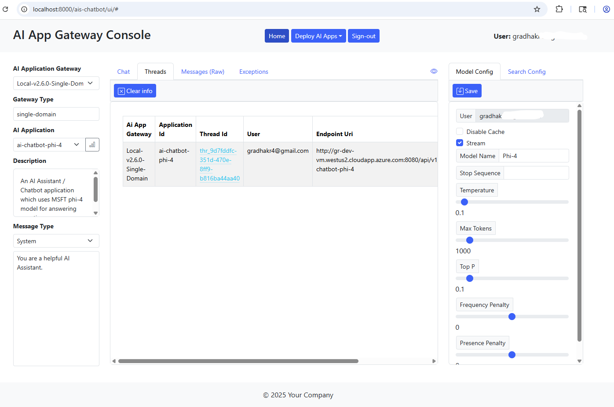

# Single Page AI Chat Application (SPA/Frontend)

This application provides a thin client (browser) based chat interface for the Azure AI Services API Gateway. It's meant to be a starting point, and you're welcome to use it as is or customize and integrate the user interface components into your own web applications.

The sections below detail the following steps -

1. Running the chat application on a Azure Linux virtual machine (Standalone server)
2. Containerizing the chat application and running it on a Azure Linux VM
3. Deploying and running the chat application as a containerized microservice on Kubernetes (AKS)

Option #3 is highly recommended for production deployments.

### A. Configure the AI Chat Application

1. Review the program files in root directory `./frontend`.

   The application server is a light weight Nodejs **ExpressJS** application.  The source code for the application server is contained within `server.js`. The HTML files are located under sub-directory `public` and javascript files are located under `jscripts`.

   The Javascript framework used to implement and render user interface components (HTML) is [Bootstrap] (https://getbootstrap.com/docs/5.1/getting-started/introduction/) 

2. Configure environment variables.

   Set environment variables to appropriate values.  Refer to the table below.

   Variable Name | Description
   ------------- | -----------
   AIS_API_GATEWAY_URI | Set this environment variable to point to the Azure AI Services API Gateway load balancer URI. Example - `http://{host:port}/api/v1/{env}/apirouter/lb`.
   FRONTEND_SRV_CONFIG_FILE | Set this env variable to the path/location of AI Chat Application configuration file.
   FRONTEND_SRV_HOST | (Optional) Set this env variable to the hostname/IP address.  Defaults to `localhost`.
   FRONTEND_SRV_PORT | (Optional) Set this env variable to the application server listen port.  Defaults to 8000.

3. Configure AI chat applications.

   The AI Chat Application can be used to interact with multiple AI Applications which have been configured with the AI Services Gateway (a.k.a backend).

   Update default parameter values in the provided sample application configuration file - `app-config.json`. Configure AI chat applications as per your needs.

   Most of the parameters configured for each AI application and which are passed to the backend are identical to parameters passed to Azure OpenAI REST API.  Hence refer to the [Azure OpenAI API documentation](https://learn.microsoft.com/en-us/azure/ai-services/openai/reference) for description and usage information on *model_params* and *search_params*.

   Required parameters that are unique to the AI Chat Application are described in the table below.

   Parameter Name | Required (Yes/No) | Description | 
   -------------- | ----------------- | ----------- |
   ai_app_name | Yes | Set this to the name of an AI Application.  This name should map and correspond to one of the AI Applications (App ID's) configured in the backend!
   sysPrompt | No | This parameter is used to set the default system prompt.
   user | No | This parameter can be used to specify the user principal / identity, making the Azure OpenAI API call.
   search_params.ai_search_app | No | This is a required parameter for Azure OpenAI OYD (On Your Data) API calls.  Specify the name of the AI Search application.  This name should map and correspond to one of the AI Applications (App ID's) configured in the backend.

### B. Run the AI Chat Application on a Azure Linux Virtual Machine

1. Run the AI Chat Application.

   Open a terminal window.  Connect to the Linux VM where you have cloned this repository.  If you haven't already, switch to the `frontend` directory.  Issue the command shown in the snippet below.

   ```bash
   # Use the node package manager (npm) to install the server dependencies
   $ npm install
   #
   # Start the AI Services Gateway Server
   $ npm start
   #
   ```

   You will see the application server startup message as shown in the snippet below.

   ```bash
   > ais-gateway-frontend@1.0.0 start
   > node ./src/server.js

   [2024/07/01 18:47:36.161] [LOG] Server(): Azure AI Services Gateway URI: [http://localhost:8000/api/v1/dev/apirouter/lb/]
   [2024/07/01 18:47:36.162] [LOG] Server(): Server configuration file: [./app-config.json]
   [2024/07/01 18:47:36.166] [LOG] Server(): AI Services API Gateway frontend server is listening on localhost:8000.
   ```

   Leave this terminal window open.

2. Access the AI Chat Application.

   Use a web browser to access the AI Chat Application. Point the browser to the application server URI as shown below.

   http://locahost:8000/index.html

   See screenshot below.

   

   Select an AI Application in the dropdown field under **AI Application**.  This will populate the default application parameter values as configured in the application configuration file.  You can update the system prompt as well as model and search parameters displayed in the right panel.  Remember to save the model and search parameter values.  Input the *Prompt* in the field located at the bottom of the middle column.  Hit **Send**.  You should be able to view the results in the chat panel right above the Prompt field.  See screenshot below.

   

3. Access and review the application panels.

   The AI Chat Application uses the thread ID returned by the backend AI Application to maintain conversational state. To view the *Thread ID* for the current session, click on the **Info** tab in the middle column.  You can also clear the current session by clicking on **Clear chat** button. See screenshot below.

   

   Click on the **Messages** tab to view the raw API messages sent to and received from the AI Services API Gateway. Here you can also view the call completion time. See screenshot below.
 
   

   Lastly, you can review any errors returned by the AI Services Gateway in the **Exceptions** tab.  See screenshot below.

   

### C. Run the AI Chat Application as a container on a Azure Linux VM

### D. Deploy and run the AI Chat Application as a microservice on Azure Kubernetes Service (AKS)

   **Congratulations!**

   You have reached the end of this how-to for deploying and scaling the chat application for Azure AI Services API Gateway. Please feel free to customize and use the artifacts posted in this repository to efficiently scale the chat application to support 10's to 1000's of concurrent users.
