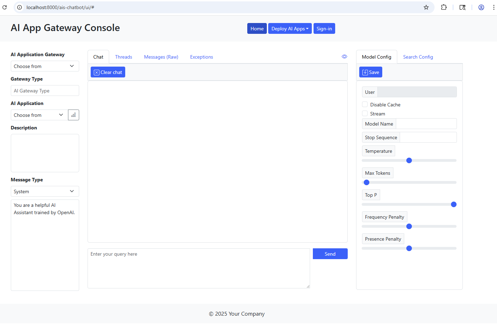
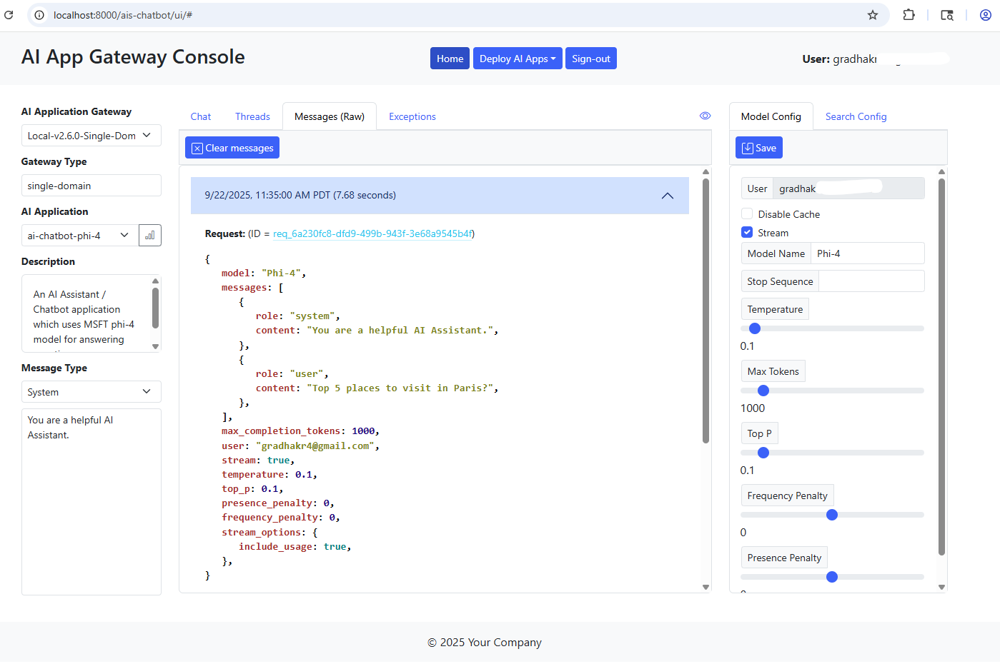
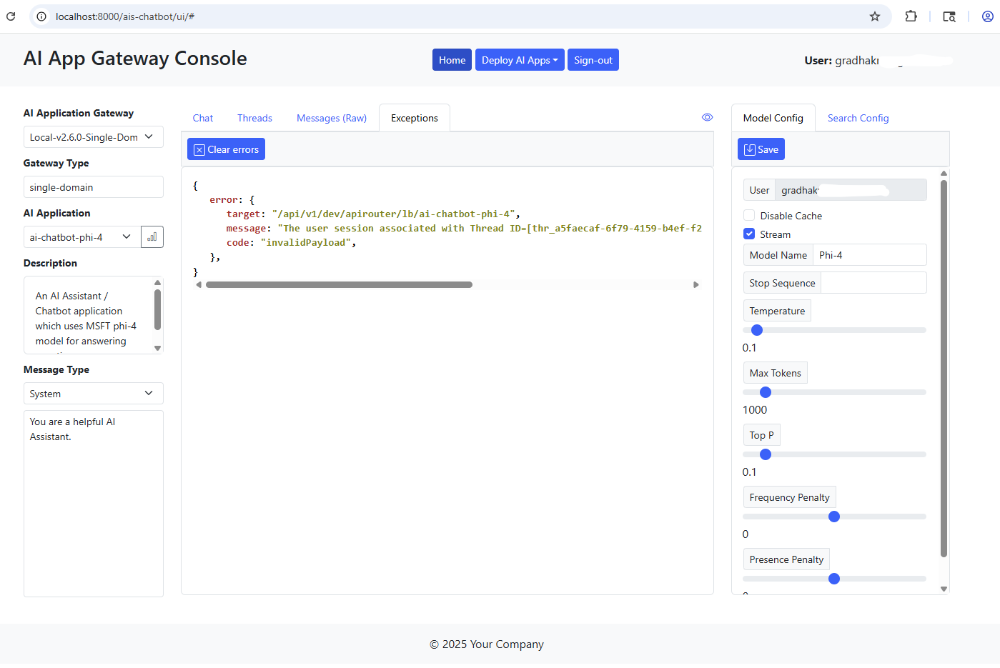
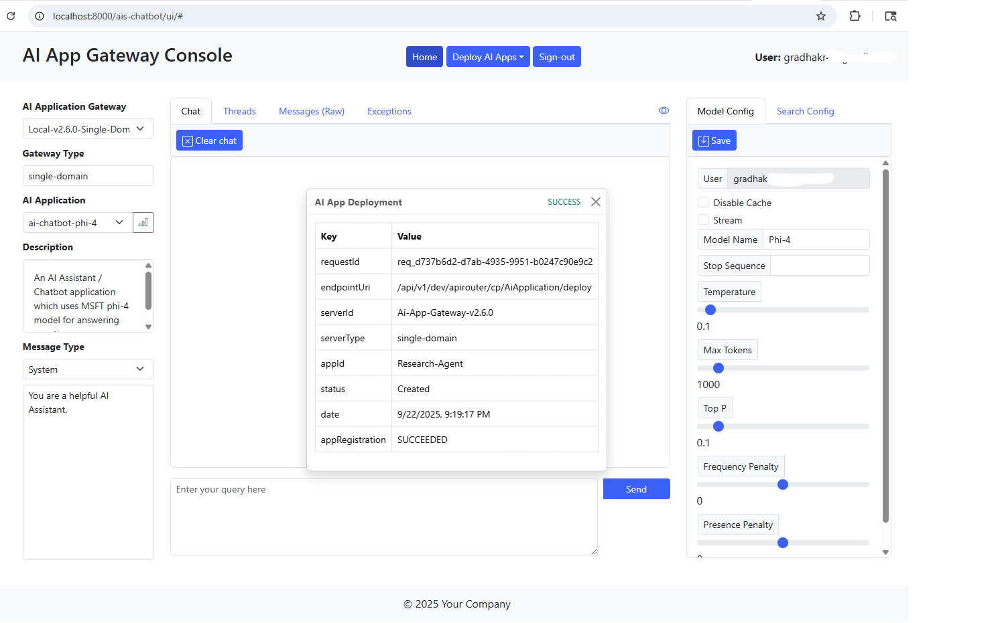
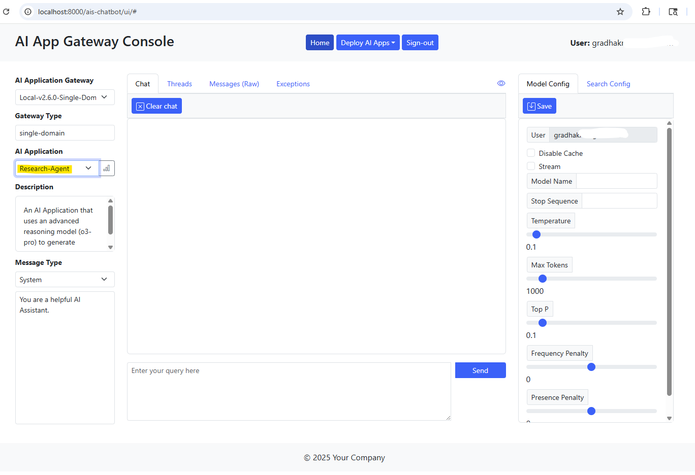

# AI Application Gateway Console (Single Page Application/Frontend)

The AI Gateway console application provides a thin client (browser) based user interface for interacting with AI Applications deployed on Azure AI Application Gateway's. It's meant to be a starting point, and you're welcome to use it as is or customize and integrate the user interface components into your own web applications.

The gateway console application can be used for completing the following tasks -
1. Define and deploy new AI Applications on local/remote AI Application Gateway instances.  These instances could be distributed and running on disparate hosts within the Azure network.
2. Interact with deployed AI Applications using the chat user interface
3. Evaluate and explore value add features supported by the AI Application Gateway such as caching, state management, long term memory, cost tracking, observability, intelligent traffic management, user feedback tracking, LLM response streaming, A/B testing of LLM's ... other features.

The sections below detail the following steps -

1. Running the AI Gateway Console application on a Azure Linux virtual machine (Standalone server)
2. Using the gateway console to define and deploy an AI Application on a AI Application Gateway instance
3. Containerizing the console application and running it on a Azure Linux VM
4. Deploying and running the gateway console application as a containerized microservice on Kubernetes (AKS)

Containerized deployment of AI Application Gateway Console is highly recommended for production deployments.

### A. Configure the AI Application Gateway Console

1. Review the program files in root directory `./frontend`.

   The AI Application Gateway Console is a light weight Nodejs **ExpressJS** application.  The source code for the console is contained within `server.js`. The HTML files are located under sub-directory `public` and javascript files are located under `jscripts`.

   The Javascript framework used to implement and render user interface components (HTML) is [Bootstrap](https://getbootstrap.com/docs/5.1/getting-started/introduction/).

2. Configure environment variables.

   Set environment variables to appropriate values.  Refer to the table below.

   Variable Name | Description
   ------------- | -----------
   FRONTEND_SRV_CONFIG_FILE | Set this env variable to the path/location of AI Application Gateway Console configuration file.
   FRONTEND_SRV_HOST | (Optional) Use this env variable to specify hostname/IP address of AI Application Gateway Console.  Defaults to `localhost`.
   FRONTEND_SRV_PORT | (Optional) Set this env variable to the gateway console listen port.  Defaults to 8000.
   API_GATEWAY_AUTH | Set this environment variable value to *true* to secure the AI Application Gateway Console (SPA).  Default value is true.
   AZURE_TENANT_ID | Set this variable to the Azure Tenant ID. This environment variable must be set when security is enabled for the Chatbot application.
   FRONTEND_CLIENT_ID | This is the client/application ID of AI Application Console registered in MSFT Entra. This env variable must be set when security is enabled.
   API_GATEWAY_APP_ID | This is the Application ID of the AI Application Gateway registered in MSFT Entra. This env variable must be set when security is enabled.

3. Configure AI Application Gateway's and AI Applications.

   The AI Application Gateway Console can be used to interact with AI Applications which are hosted on one or more AI Application Gateway instances (a.k.a backends).

   Update default parameter values in the provided sample gateway console configuration file - `app-config.json`. Configure AI Application Gateways and AI Applications as per your requirements.

   You can configure AI Applications for 1..N AI Application Gateways in the configuration file.  Parameters required for configuring the AI Application Gateways are described in the table below.

   Parameter Name | Required (Yes/No) | Description | 
   -------------- | ----------------- | ----------- |
   name | Yes | Name of the AI Application Gateway.  This can be any name which uniquely identifies the backend AI Application Gateway server/instance.
   type | Yes | Type of the AI Application Gateway.  Currently, two gateway types are supported 1) **Single domain** & 2) **Multi domain**<br>`type` should be set to one of these values - `single-domain`, `multi-domain`
   uri | Yes | AI Application Gateway URI. Should be in the format:<br> http://[host:port]/api/v1/[env]/apirouter<br>**IMP:** Make sure there are no trailing slashes!
   ai_apps | Yes | An array of AI Applications that have been configured in the respective AI Application Gateway.  Refer to the next section for details.

   For each AI application, specify correct values for all required parameters.  Many of the application parameters are identical to parameters exposed by Azure OpenAI Chat Completion REST API.  Hence refer to the [Azure OpenAI API documentation](https://learn.microsoft.com/en-us/azure/ai-services/openai/reference) for description and usage information on *model_params* and *search_params*.

   Required parameters that are unique to the AI Application Gateway Console are described in the table below.

   Parameter Name | Required (Yes/No) | Description | 
   -------------- | ----------------- | ----------- |
   ai_app_name | Yes | Set this value to the name of an AI Application.  This name should match and correspond to one of the AI Applications (App ID's) configured in the backend!
   user | No | This parameter is optional and can be used to specify the user principal / identity invoking the Azure OpenAI API call thru the AI Application Gateway.
   sysPrompt | No | This optional parameter can be used to set the default system prompt.
   search_params.auth_type | Yes | For Azure OpenAI OYD (On Your Data) API calls, this parameter has to be set to one of the values.  See below.<br> **api_key** Set this value when authenticating to AI Search resource using API Key<br> **system_assigned_managed_identity** Set this value when authenticating to AI Search resource using system assigned managed identity<br> **user_assigned_managed_identity** Set this value when authenticating to AI Search resource using user assigned managed identity.
   search_params.mid_resource_id | No | When **search_params.auth_type** is set to `user_assigned_managed_identity`, set this parameter value to the resource ID of the user-assigned managed identity to use for authentication.
   search_params.ai_search_app | No | This is a required parameter for Azure OpenAI OYD (On Your Data) API calls when **search_params.auth_type** is set to `api_key`.  Specify the name of the AI Search application.  This name should map and correspond to one of the AI Applications (App ID's) configured in the backend.

### B. Run the AI Application Gateway Console application on a Azure Linux Virtual Machine

1. Run the AI Application Gateway Console.

   Open a terminal window.  Connect to the Linux VM where you have cloned this repository.  If you haven't already, switch to the `frontend` application directory.  Issue the commands shown in the snippet below.

   ```bash
   # Use the node package manager (npm) to install the server dependencies
   $ npm install
   #
   # Start the AI Application Gateway Console (SPA)
   $ npm start
   #
   ```

   You will see the application server startup message as shown in the snippet below.

   ```bash
   > ai-chatbot-frontend@1.3.5 start
   > node ./src/server.js

   [2026/02/18 10:24:36.670] [LOG] Server(): Server configuration file: [./app-config.json]
   [2026/02/18 10:24:36.674] [LOG] Server(): Azure AI Application Gateway API security: [true]
   [2026/09/18 10:24:36.797] [LOG] Server(): AI Chatbot Application server is listening on localhost:8000.
   ```

   Leave this terminal window open.

2. Access the AI Application Gateway Console.

   Use a web browser to access the console. Point the browser to the URI as shown below.

   http://locahost:8000/ais-chatbot/ui/index.html

   

   If security is turned on for the AI Application Gateway Console, click on the **Sign-in** link at the top and authenticate using Microsoft Entra ID. Refer to the screenshot above.

   First select the AI Application Gateway in the **AI App Gateway** dropdown field. The **Gateway Type** field will be auto populated.

   Use the **AI Application** dropdown field to select an AI Application.  This will populate the description field and default parameter values for the selected AI Application as per the values specified in the gateway console configuration file.  You can update the model and search parameter values displayed in the right panel (**Model Config / Search Config**).

   If the AI Foundry model you are targeting expects a *model* parameter value in the request payload, input the same in the **Model Name** field under the *Model Config* panel on the right.
   
   > **NOTE:** Remember to save the model and search configuration parameter values before proceeding.

   Use the **Message Type** dropdown field to select the appropriate message type (role). This message is usually used to provide a set of instructions to the LLM.  Leave the default value **System** for most if not all gpt models.  For advanced reasoning models such as o1 or o1-mini, the type should be set to **Developer**.  For some LLM's such as *Grok*, where system prompt is not available, select **None**.  Update the system prompt.
   
   Lastly, input the *Prompt* in the field located at the bottom of the middle column.  Hit **Send**.  You should be able to view the results in the content panel right above the Prompt field.  See screenshot below.

   

3. Access and review the chat application panels.

   The Gateway Console uses a thread ID returned by the AI Application Gateway to maintain conversational state for a user's session. To view the *Thread ID* for the current session, click on the **Threads** tab in the middle column.  See screenshot below.

   

   Click on the **Thread ID** (column = `Thread_id`) to view the requests associated with this user session/thread.  You can also clear the current chat session by clicking on **Clear chat** button in the **Chat** tab.
   
   You can update the model and search parameters on the right panel.  Remember to **Save** the values prior to starting a chat session. See screenshots below.

   Model Params | AI Search Params (Only used for Azure AI Foundry OYD calls) |
   ------------ | ---------------------------------------------------- |
    | 
   

   Click on the **Messages** tab to view the raw API messages sent to and received from the AI Application Gateway. Here you can also view call completion times for each user interaction. Click on the **Request ID** to view the API request.  See screenshot below.
 
   

   Click on the **View call metrics** button beside the *AI Application* dropdown field, to view the API metrics information as shown in the screenshot below.

   

   Lastly, you can review any errors returned by the AI Application Gateway in the **Exceptions** tab.  See screenshot below.

   

### C. Define and deploy an *AI Application* on a AI Application Gateway instance

1. Define the AI Application configuration parameters

   Click on the **Deploy AI Apps** menu on the top and select **AI Application** option.  See screenshot below.

    
   
   This action will open the **Single Domain AI Application** modal dialog.  Give the AI Application a suitable **name** and **description**.  Select the **AI Application Type**.  Specify correct configuration parameter values for Semantic cache, State management (memory) & Long term memory (Personalization) features.  See Screenshots below.

   | Semantic Cache | State Management | Long-term Memory |
   | -------------- | ---------------- | ---------------- |
   |  |  |  |

   Under section **Traffic Routing**, specify AI Foundry model deployment endpoints, API keys and RPM limits.  See screenshot below.

   

2. Deploy the AI Application

   Click on the **Deploy** button in the bottom right corner of the dialog.  This action will deploy the application on the AI Application Gateway instance (selected in the console view).  Screenshot shown below.
   
    
   
   The console will display the JSON response (Success / Failed) received from the AI Application Gateway.  See screenshot below.

    

3. Select the deployed AI Application and initiate a chat

   Use the **AI Application** dropdown field in the console view and select the deployed AI Application. See screenshow below.
   
    
   
   You can now start a chat session with this AI Application.

### D. Run the AI Application Gateway Console as a container on a Azure Linux VM

1. Build the AI Gateway Console container image.

   Review the container image build script `./Dockerfile`.  Make any required updates to the environment variables.  The environment variables can also be passed to the container engine at build time.  To do this, you can modify the provided container build script `./scripts/build-container.sh`.  After making the updates to this build shell script, run the script to build the container image.  See command snippet below.

   ```bash
   # Run the container image build
   $ . ./scripts/build-container.sh
   #
   # List the container images.  This command should list the images on the system.
   $ docker images
   #
   ```

2. Run the containerized AI Application Gateway Console.

   Run the Gateway Console container using the provided `./scripts/start-container.sh` shell script.  Refer to the command snippet below.

   ```bash
   # Run the AI App Gateway Console container instance
   $ . ./scripts/start-container.sh
   #
   # Leave this terminal window open
   ```

3. Access the AI Application Gateway Console

   Open a browser window and access the gateway console using the URL as shown below. Substitute correct values for *CONTAINER_HOST* and *CONTAINER_HOST_PORT*.

   http://{CONTAINER_HOST}:{CONTAINER_HOST_PORT}/ais-chatbot/ui/index.html

   Interact with AI Applications using the Console Application as described in the previous section.

### E. Deploy and run the AI Application Gateway Console as a microservice on Azure Kubernetes Service (AKS)

1. Push the AI Application Gateway Console container image into an Azure Container Registry (ACR).

   Refer the script snippet below to push the container image into ACR.  Remember to substitute ACR name with the name of your container registry.

   ```bash
   # Login to the ACR instance. Substitute the correct name of your ACR instance.
   $ az acr login --name [acr-name].azurecr.io
   #
   # Tag the container image so we can push it to ACR repo.
   $ docker tag ai-app-gateway-console [acr-name].azurecr.io/ai-app-gateway-console:v1.2.0.032125
   # 
   # List container images on your VM
   $ docker images
   #
   # Push the Console Application container image to ACR repo.
   $ docker push [acr-name].azurecr.io/ai-app-gateway-console:v1.2.0.032125
   #
   ```

   Use Azure portal to verify the gateway console container image was stored in the respective repository (`ai-app-gateway-console`).

2. Deploy the AI Application Gateway Console configuration map.

   Create a Kubernetes *ConfigMap* resource containing the AI Application configurations for the gateway console application.  See command snippet below.

   ```bash
   # Create a ConfigMap containing the AI Application configurations. Substitute the correct location of the
   # application configuration (json) file.
   #
   $ kubectl create configmap ai-app-gtwy-console-cm --from-file=[Path to 'app-config.json' file] -n apigateway
   #
   # List ConfigMaps.
   $ kubectl get cm -n apigateway
   #
   ```

3. Review and update the *Helm* deployment configuration file.

   The Helm chart directory for the Gateway Console is located in `./ais-chat-app-chart`.  In this directory, go thru the variables defined in `values.yaml` file and update them as needed. 

   Review/Update the following variable values.  See table below.

   Variable Name | Description | Default Value
   ----------------- | ----------- | ------------- 
   replicaCount | Number of Pod instances (AI Application Gateway Console instances) | 1
   image.repository | ACR location of the AI Application Gateway Console container image. Specify correct values for `acr-name` and `ai-app-gateway-console-repo-name`. | [acr-name].azurecr.io/[ai-app-gateway-console-repo-name]
   image.tag | AI Gateway Console container image tag. Specify correct value for the image tag. | v1.xxxxxx
   chatapp.host | AI Application Gateway Console container hostname/IP Address | 0.0.0.0
   chatapp.configFile | Path to AI Application Gateway Console configuration file within the container | /home/node/app/files/app-config.json
   container.port | AI Application Gateway Console container listen port | 8000

4. Assign required compute resources to AI Application Gateway Console pods.

   Review/Update the Pod compute resources as needed in the `values.yaml` file.

5. Deploy the AI Application Gateway Console microservice on *Azure Kubernetes Service*.

   Refer to the command snippet below to deploy all Kubernetes resources for the Gateway Console microservice.

   ```bash
   # Make sure you are in the 'project root/frontend' directory!
   # Use helm chart to deploy the gateway console application. Substitute the correct value for the image tag.
   #
   $ helm upgrade --install ai-app-gateway-console ./ais-chat-app-chart --set image.tag=[image-tag-name] --namespace apigateway
   #
   ```

6. Verify deployment.

   First, confirm the AI Application Gateway Console Pod is running. Refer to the command snippet below.

   ```bash
   # Make sure the AI Application Gateway Console pod(s) are up and running. Output is shown below the command.
   #
   $ kubectl get pods -n apigateway
   NAME                                                  READY   STATUS    RESTARTS   AGE
   ais-api-gateway-v1-645cb7496d-fjptl                   1/1     Running   0          5h41m
   ai-app-gateway-console-app-chart-5bbdd86b45-pctjk     1/1     Running   0          18s
   ```

   Get the public IP of Nginx ingress controller (application routing system).  Refer to the command snippet below.

   ```bash
   # Get public IP (Azure LB IP) assigned to Nginx ingress controller service. Save (copy) the IP address listed under
   # column 'EXTERNAL-IP' in the command output. See below.
   #
   $ kubectl get svc -n app-routing-system
   NAME    TYPE           CLUSTER-IP     EXTERNAL-IP     PORT(S)                                      AGE
   nginx   LoadBalancer   10.0.114.112   xx.xx.xx.xx   80:30553/TCP,443:32318/TCP,10254:31744/TCP   2d
   ```

   Use a web browser to access the Gateway Console. Substitute the public IP of the Nginx ingress controller which you copied in the previous step.  See URI below.

   http://{NGINX_PUBLIC_IP}/ais-chatbot/ui/index.html

   **Congratulations!**

   You have reached the end of this how-to for deploying the AI Application Gateway Console. Feel free to customize the artifacts posted in this repository to implement a production grade Gateway Console or AI Chat Application for your Chatbot/Information Assistant use cases.
