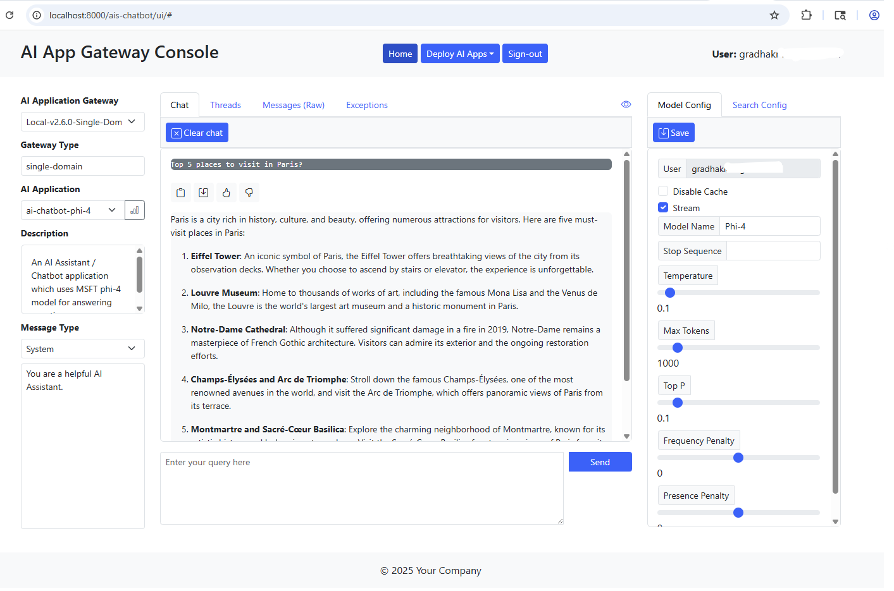

# AI Chat Application (Single Page Application/Frontend)

This application provides a thin client (browser) based chat interface for the Azure AI Application Gateway. It's meant to be a starting point, and you're welcome to use it as is or customize and integrate the user interface components into your own web applications.

The sections below detail the following steps -

1. Running the chat application on a Azure Linux virtual machine (Standalone server)
2. Containerizing the chat application and running it on a Azure Linux VM
3. Deploying and running the chat application as a containerized microservice on Kubernetes (AKS)

Option #3 is highly recommended for production deployments.

### A. Configure the AI Chat Application

1. Review the program files in root directory `./frontend`.

   The application server is a light weight Nodejs **ExpressJS** application.  The source code for the application server is contained within `server.js`. The HTML files are located under sub-directory `public` and javascript files are located under `jscripts`.

   The Javascript framework used to implement and render user interface components (HTML) is [Bootstrap](https://getbootstrap.com/docs/5.1/getting-started/introduction/).

2. Configure environment variables.

   Set environment variables to appropriate values.  Refer to the table below.

   Variable Name | Description
   ------------- | -----------
   API_GATEWAY_URI | Set this environment variable to point to the Azure AI Application (API) Gateway load balancer URI. Example - `http://{host:port}/api/v1/{env}/apirouter/lb/`.
   FRONTEND_SRV_CONFIG_FILE | Set this env variable to the path/location of AI Chat Application configuration file.
   FRONTEND_SRV_HOST | (Optional) Use this env variable to specify hostname/IP address of application server.  Defaults to `localhost`.
   FRONTEND_SRV_PORT | (Optional) Set this env variable to the application server listen port.  Defaults to 8000.
   API_GATEWAY_AUTH | Set this environment variable value to *true* to secure the AI Chatbot (SPA) application.  Default value is true.
   AZURE_TENANT_ID | Set this variable to the Azure Tenant ID. This environment variable must be set when security is enabled for the Chatbot application.
   FRONTEND_CLIENT_ID | This is the client/application ID of AI Chatbot Application registered in MSFT Entra. This env variable must be set when security is enabled.
   API_GATEWAY_APP_ID | This is the Application ID of the AI Application Gateway registered in MSFT Entra. This env variable must be set when security is enabled.

3. Configure AI Applications.

   The AI Chat Application can be used to interact with one or more AI Applications which have been configured with the AI Application Gateway (a.k.a backend).

   Update default parameter values in the provided sample application configuration file - `app-config.json`. Configure AI Applications as per your requirements.

   For each AI application, specify correct values for all required parameters.  Many of the application parameters are identical to parameters exposed by Azure OpenAI Chat Completion REST API.  Hence refer to the [Azure OpenAI API documentation](https://learn.microsoft.com/en-us/azure/ai-services/openai/reference) for description and usage information on *model_params* and *search_params*.

   Required parameters that are unique to the AI Chat Application are described in the table below.

   Parameter Name | Required (Yes/No) | Description | 
   -------------- | ----------------- | ----------- |
   ai_app_name | Yes | Set this value to the name of an AI Application.  This name should match and correspond to one of the AI Applications (App ID's) configured in the backend!
   user | No | This parameter is optional and can be used to specify the user principal / identity invoking the Azure OpenAI API call thru the AI Application Gateway.
   sysPrompt | No | This optional parameter can be used to set the default system prompt.
   search_params.ai_search_app | No | This is a required parameter for Azure OpenAI OYD (On Your Data) API calls.  Specify the name of the AI Search application.  This name should map and correspond to one of the AI Applications (App ID's) configured in the backend.

### B. Run the AI Chat Application on a Azure Linux Virtual Machine

1. Run the AI Chat Application.

   Open a terminal window.  Connect to the Linux VM where you have cloned this repository.  If you haven't already, switch to the `frontend` application directory.  Issue the commands shown in the snippet below.

   ```bash
   # Use the node package manager (npm) to install the server dependencies
   $ npm install
   #
   # Start the AI Chatbot Application (SPA)
   $ npm start
   #
   ```

   You will see the application server startup message as shown in the snippet below.

   ```bash
   > ai-chatbot-frontend@1.0.0 start
   > node ./src/server.js

   [2024/07/01 18:47:36.161] [LOG] Server(): Azure AI Application Gateway URI: [http://localhost:8000/api/v1/dev/apirouter/lb/]
   [2024/07/01 18:47:36.162] [LOG] Server(): Server configuration file: [./app-config.json]
   [2024/07/01 18:47:36.163] [LOG] Server(): Azure AI Application Gateway API security: [true]
   [2024/07/01 18:47:36.166] [LOG] Server(): AI Chatbot Application server is listening on localhost:8000.
   ```

   Leave this terminal window open.

2. Access the AI Chat Application.

   Use a web browser to access the AI Chat Application. Point the browser to the AI Chat Application URI as shown below.

   http://locahost:8000/ais-chatbot/ui/index.html

   

   If security is turned on for the AI Chatbot Application, click on the **Sign-in** link at the top and authenticate using Microsoft Entra ID. Refer to the screenshot above.

   Use the **AI Application** dropdown field to select an AI Application.  This will populate the default parameter values for the selected AI Application as per the values specified in the application configuration file.  You can update the system prompt as well as model and search parameters displayed in the right panel.  Remember to save the model and search parameter values.  Input the *Prompt* in the field located at the bottom of the middle column.  Hit **Send**.  You should be able to view the results in the chat panel right above the Prompt field.  See screenshot below.

   

3. Access and review the chat application panels.

   The AI Chat Application uses a thread ID returned by the backend AI Application to maintain conversational state for a user's session. To view the *Thread ID* for the current session, click on the **Info** tab in the middle column.  You can also clear the current session by clicking on **Clear chat** button in the **Chat** tab. See screenshot below.

   

   You can update the model and search parameters on the right panel.  Remember to save the values prior to starting a chat session. See screenshots below.

   Model Params | AI Search Params (Only used for Azure OpenAI OYD calls) |
   ------------ | ---------------------------------------------------- |
    | 
   

   Click on the **Messages** tab to view the raw API messages sent to and received from the AI Application Gateway. Here you can also view call completion times for each user interaction. See screenshot below.
 
   

   Lastly, you can review any errors returned by the AI Application Gateway in the **Exceptions** tab.  See screenshot below.

   

### C. Run the AI Chat Application as a container on a Azure Linux VM

1. Build the AI Chat Application container image.

   Review the container image build script `./Dockerfile`.  Make any required updates to the environment variables.  The environment variables can also be passed to the container engine at build time.  To do this, you can modify the provided container build script `./scripts/build-container.sh`.  After making the updates to this build shell script, run the script to build the container image.  See command snippet below.

   ```bash
   # Run the container image build
   $ . ./scripts/build-container.sh
   #
   # List the container images.  This command should list the images on the system.
   $ docker images
   #
   ```

2. Run the containerized AI Chat Application.

   Run the Chat Application container using the provided `./scripts/start-container.sh` shell script.  Refer to the command snippet below.

   ```bash
   # Run the AI Chat Application container instance
   $ . ./scripts/start-container.sh
   #
   # Leave this terminal window open
   ```

3. Access the AI Chat Application.

   Open a browser window and access the AI Chat Application using the URL as shown below. Substitute correct values for *CONTAINER_HOST* and *CONTAINER_HOST_PORT*.

   http://{CONTAINER_HOST}:{CONTAINER_HOST_PORT}/ais-chatbot/ui/index.html

   Interact with AI Applications using the Chat Application as described in the previous section.

### D. Deploy and run the AI Chat Application as a microservice on Azure Kubernetes Service (AKS)

1. Push the AI Chat Application container image into an Azure Container Registry (ACR).

   Refer the script snippet below to push the container image into ACR.  Remember to substitute ACR name with the name of your container registry.

   ```bash
   # Login to the ACR instance. Substitute the correct name of your ACR instance.
   $ az acr login --name [acr-name].azurecr.io
   #
   # Tag the container image so we can push it to ACR repo.
   $ docker tag ais-chat-app [acr-name].azurecr.io/ais-chat-app:v1.0.0.062824
   # 
   # List container images on your VM
   $ docker images
   #
   # Push the AI Chatbot Application container image to ACR repo.
   $ docker push [acr-name].azurecr.io/ais-chat-app:v1.0.0.062824
   #
   ```

   Use Azure portal to verify the chat application container image was stored in the respective repository (`ais-chat-app`).

2. Deploy the AI Chat Application configuration map.

   Create a Kubernetes *ConfigMap* resource containing the AI Application configurations for the chat application.  See command snippet below.

   ```bash
   # Create a ConfigMap containing the AI Application configurations. Substitute the correct location of the
   # application configuration (json) file.
   #
   $ kubectl create configmap ais-chat-app-config-cm --from-file=[Path to 'api-router-config.json' file] -n apigateway
   #
   # List ConfigMaps.
   $ kubectl get cm -n apigateway
   #
   ```

3. Review and update the *Helm* deployment configuration file.

   The Helm chart directory for the AI Chat Application is located in `./ais-chat-app-chart`.  In this directory, go thru the variables defined in `values.yaml` file and update them as needed. 

   Review/Update the following variable values.  See table below.

   Variable Name | Description | Default Value
   ----------------- | ----------- | ------------- 
   replicaCount | Number of Pod instances (AI Chat Application instances) | 1
   image.repository | ACR location of the AI Chat Application container image. Specify correct values for `acr-name` and `ais-chat-app-repo-name`. | [acr-name].azurecr.io/[ais-chat-app-repo-name]
   image.tag | Chat Application container image tag. Specify correct value for the image tag. | v1.xxxxxx
   chatapp.host | AI Chat Application container hostname/IP Address | 0.0.0.0
   chatapp.configFile | Path to AI Chat Application configuration file within the container | /home/node/app/files/app-config.json
   chatapp.aisGatewayEndpoint | Load balancer URI/Endpoint of the Azure AI Application Gateway | None
   container.port | AI Chat Application container listen port | 8000

4. Assign required compute resources to AI Chat Application pods.

   Review/Update the Pod compute resources as needed in the `values.yaml` file.

5. Deploy the AI Chat Application microservice on *Azure Kubernetes Service*.

   Refer to the command snippet below to deploy all Kubernetes resources for the Chat Application.

   ```bash
   # Make sure you are in the 'project root/frontend' directory!
   # Use helm chart to deploy the chat application. Substitute the correct value for the image tag.
   #
   $ helm upgrade --install ais-chat-app ./ais-chat-app-chart --set image.tag=[image-tag-name] --namespace apigateway
   #
   ```

6. Verify deployment.

   First, confirm the AI Chat Application Pod is running. Refer to the command snippet below.

   ```bash
   # Make sure the AI Chat Application pod(s) are up and running. Output is shown below the command.
   #
   $ kubectl get pods -n apigateway
   NAME                                               READY   STATUS    RESTARTS   AGE
   ais-api-gateway-v1-645cb7496d-fjptl                1/1     Running   0          5h41m
   ais-chat-app-ais-chat-app-chart-5bbdd86b45-pctjk   1/1     Running   0          18s
   ```

   Get the public IP of Nginx ingress controller (application routing system).  Refer to the command snippet below.

   ```bash
   # Get public IP (Azure LB IP) assigned to Nginx ingress controller service. Save (copy) the IP address listed under
   # column 'EXTERNAL-IP' in the command output. See below.
   #
   $ kubectl get svc -n app-routing-system
   NAME    TYPE           CLUSTER-IP     EXTERNAL-IP     PORT(S)                                      AGE
   nginx   LoadBalancer   10.0.114.112   xx.xx.xx.xx   80:30553/TCP,443:32318/TCP,10254:31744/TCP   2d
   ```

   Use a web browser to access the AI Chat Application. Substitute the public IP of the Nginx ingress controller which you copied in the previous step.  See URI below.

   http://{NGINX_PUBLIC_IP}/ais-chatbot/ui/index.html

   **Congratulations!**

   You have reached the end of this how-to for deploying the AI Chat Application. Feel free to customize the artifacts posted in this repository to implement a production grade AI chat application for your Chatbot/Information Assistant use cases.
